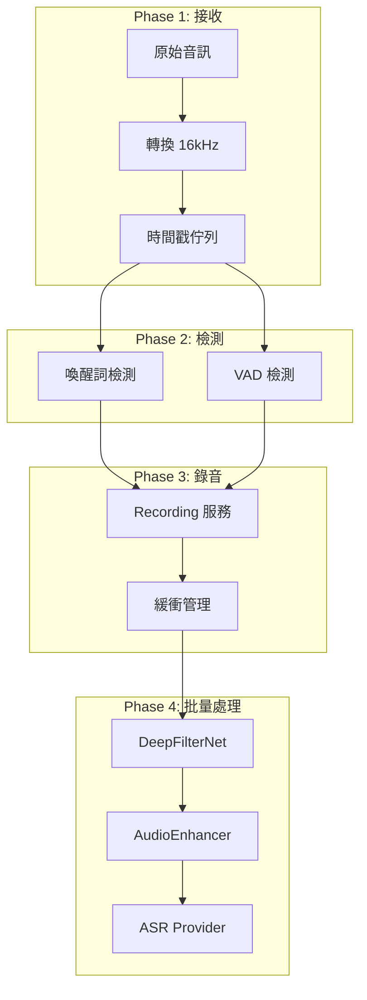

# ASRHub 完整架構設計文件

本文件整合音訊處理管線與 FSM/PyStoreX 狀態管理系統的完整架構設計。

## 目錄

1. [架構總覽](#架構總覽)
2. [核心設計原則](#核心設計原則)
3. [系統組件架構](#系統組件架構)
4. [音訊處理管線](#音訊處理管線)
5. [狀態管理系統](#狀態管理系統)
6. [時間戳協調機制](#時間戳協調機制)
7. [實作細節](#實作細節)
8. [配置管理](#配置管理)
9. [架構優勢](#架構優勢)
10. [實施狀態](#實施狀態)

## 架構總覽

ASRHub 採用**事件驅動架構**結合**有限狀態機（FSM）**和**響應式狀態管理（PyStoreX）**，實現可預測、可擴展的語音識別中介系統。

```
┌──────────────────────────────────────────────────────────┐
│                     客戶端應用層                          │
├──────────────────────────────────────────────────────────┤
│                    API 協議層                             │
│         (HTTP SSE / WebSocket / Socket.IO)               │
├──────────────────────────────────────────────────────────┤
│                  狀態管理層 (PyStoreX)                    │
│    ┌─────────────┐  ┌─────────────┐  ┌─────────────┐   │
│    │FSM Validator│  │   Effects   │  │   Reducer   │   │
│    └─────────────┘  └─────────────┘  └─────────────┘   │
├──────────────────────────────────────────────────────────┤
│                  音訊處理管線層                           │
│    ┌─────────────┐  ┌─────────────┐  ┌─────────────┐   │
│    │ AudioQueue  │  │   Services  │  │  Providers  │   │
│    │  (時間戳)   │  │  (無狀態)   │  │   (Pool)    │   │
│    └─────────────┘  └─────────────┘  └─────────────┘   │
└──────────────────────────────────────────────────────────┘
```

## 核心設計原則

### 1. KISS (Keep It Simple, Stupid)
- 避免過度設計和不必要的抽象
- 優先使用簡單直接的解決方案
- 減少系統複雜度

### 2. 無狀態服務 (Stateless Services)
- 所有服務保持無狀態，可並行處理多個 session
- 狀態集中由 PyStoreX Store 管理
- 服務間透過明確介面通訊

### 3. 單一職責原則
- 每個組件只負責一個明確的功能
- FSM 定義規則、Validator 驗證、Effects 執行、Reducer 更新
- 服務職責清晰分離

### 4. 組合優於繼承
- 使用服務組合構建複雜功能
- 直接調用服務方法，避免額外抽象層
- 模組級單例暴露服務實例

## 系統組件架構

### 組件關係圖

```
┌─────────────────┐                      ┌────────────────────────┐
│  FSM Transitions│─────────────────────▶│  SessionEffectsV2      │
│  (狀態定義)     │                      │ (業務邏輯+FSM驗證)  │
└─────────────────┘                      └────────────────────────┘
                                                          │
                                                          ▼
┌─────────────────┐     ┌──────────────┐     ┌─────────────┐
│     Reducer     │◀────│   Actions    │◀────│   Services  │
│  (狀態更新)     │     │  (事件)      │     │  (無狀態)   │
└─────────────────┘     └──────────────┘     └─────────────┘
```

### 核心組件職責

#### 1. FSM Transitions (`src/core/fsm_transitions.py`)
**職責**：定義合法的狀態轉換規則

```python
NonStreamingPlugin = StrategyPlugin(
    name=Strategy.NON_STREAMING,
    states=[State.IDLE, State.PROCESSING, State.ACTIVATED, State.RECORDING],
    transitions=[
        make_transition(Action.START_LISTENING, State.IDLE, State.PROCESSING),
        make_transition(Action.WAKE_ACTIVATED, State.PROCESSING, State.ACTIVATED),
        make_transition(Action.RECORD_STARTED, State.ACTIVATED, State.RECORDING),
    ]
)
```

**Transitions Library 提供的 API**：
- `may_trigger(action)` - 檢查是否可以觸發轉換（不改變狀態）
- `get_triggers(state)` - 獲取當前狀態的可用轉換
- `trigger(action)` - 執行狀態轉換
- `MachineError` - 當嘗試非法轉換時抛出

#### 2. SessionEffectsV2 (`src/store/sessions/sessions_effect_v2.py`)
**職責**：處理副作用、調用服務、dispatch actions、管理 FSM 實例

- 監聽 Actions 並執行業務邏輯
- 調用無狀態服務處理音訊
- 發送新的 Actions 更新狀態
- **為每個 session 管理獨立的 FSM 實例**
- 直接使用 transitions library API

**FSM 管理方法**：
```python
def _get_or_create_fsm(self, session_id: str) -> Optional[SessionFSM]:
    """為每個 session 創建獨立的 FSM 實例"""
    if session_id not in self._fsm_instances:
        strategy = self._session_strategies.get(session_id)
        # 根據策略創建對應的 FSM
        self._fsm_instances[session_id] = SessionFSM(PluginForStrategy)
    return self._fsm_instances.get(session_id)

def _trigger_transition(self, session_id: str, action: str) -> bool:
    """觸發 FSM 狀態轉換"""
    fsm = self._get_or_create_fsm(session_id)
    return fsm.machine.trigger(action) if fsm else False

def _can_transition(self, session_id: str, action: str) -> bool:
    """檢查狀態轉換是否合法"""
    fsm = self._get_or_create_fsm(session_id)
    return fsm.machine.may_trigger(action) if fsm else False
```

#### 3. Reducer (`src/store/sessions/sessions_reducer.py`)
**職責**：純函數狀態更新

- 接收 Actions 並更新狀態
- 支援時間戳欄位
- 保證狀態更新的可預測性

## 音訊處理管線

### 處理流程圖



### 處理階段詳解

#### Phase 1: 音頻接收與轉換
```python
def _process_audio_chunk(self, action):
    audio_data = action.payload.get('audio_data')
    
    # 轉換到統一格式 16kHz
    if audio_converter.get_sample_rate(audio_data) != 16000:
        audio_16k = audio_converter.convert_to_16khz_mono(audio_data)
    else:
        audio_16k = audio_data
    
    # 推送到時間戳隊列
    timestamp = audio_queue.push(session_id, audio_16k)
```

#### Phase 2: 喚醒詞與 VAD 檢測
```python
def monitor_wake_word():
    while state == WAITING_WAKE_WORD:
        # 非破壞性讀取
        timestamped = audio_queue.pull_blocking_timestamp(
            session_id, 
            reader_id="wake_word",
            timeout=0.1
        )
        
        if timestamped and openwakeword.detect(timestamped.audio):
            wake_time = timestamped.timestamp
            _on_wake_word_detected(session_id, wake_time)
```

#### Phase 3: 錄音服務整合
```python
def _on_wake_word_detected(self, session_id: str, timestamp: float):
    # Pre-roll: 往前回溯 500ms
    recording_start = timestamp - self.pre_roll_duration
    
    # 使用現有 Recording 服務
    recording.start_recording(
        session_id,
        filename=f"{session_id}_{int(timestamp * 1000)}",
        metadata={'wake_time': timestamp, 'pre_roll': self.pre_roll_duration}
    )
```

#### Phase 4: 批量後處理
```python
def _batch_process_audio(self, session_id, audio_chunks):
    """批量處理音頻 - 錄音結束後統一處理"""
    # 1. 合併音頻
    combined_audio = self._combine_audio_chunks(audio_chunks)
    
    # 2. 降噪（可選）
    if config.services.denoiser.enabled:
        denoised_audio = denoiser.denoise(combined_audio)
    
    # 3. 增強（可選）
    if config.services.audio_enhancer.enabled:
        enhanced_audio, report = audio_enhancer.auto_enhance(
            denoised_audio, preset="asr"
        )
    
    # 4. ASR 處理
    with provider_pool.lease(session_id) as provider:
        result = provider.transcribe(enhanced_audio)
```

## 狀態管理系統

### 完整狀態轉換流程

```
1. 用戶操作 → Action
   ↓
2. Effects 接收 Action
   ↓
3. FSM Validator 驗證（可選）
   ↓
4. 調用無狀態服務
   ↓
5. Dispatch 新 Actions
   ↓
6. Reducer 更新狀態
```

### 狀態流程範例

```python
# 1. 用戶說話觸發
user_speech → receive_audio_chunk action

# 2. Effects 處理
class SessionEffectsV2:
    def _process_audio_chunk(self, action):
        # 轉換並存儲
        audio_16k = audio_converter.convert_to_16khz_mono(audio_data)
        timestamp = audio_queue.push(session_id, audio_16k)

# 3. 服務檢測事件
if openwakeword.detect(timestamped.audio):
    # 4. 驗證（可選）
    if self._can_transition(session_id, "wake_activated"):
        # 5. Dispatch Action
        self.store.dispatch(wake_activated({
            "session_id": session_id,
            "timestamp": timestamp
        }))

# 6. Reducer 更新
def handle_wake_activated(state: Map, action) -> Map:
    return update_session(state, session_id, {
        "is_wake_active": True,
        "wake_timestamp": timestamp,
        "status": SessionStatus.LISTENING
    })
```

## 時間戳協調機制

### 核心設計：非破壞性多讀取器

```python
@dataclass
class TimestampedAudio:
    timestamp: float  # Unix timestamp
    audio: AudioChunk
    duration: float
```

### 關鍵特性

#### 1. 多服務並行讀取
```python
# 喚醒詞服務
wake_chunks = audio_queue.pull_from_timestamp(
    session_id, reader_id="wake_word", from_timestamp=start
)

# VAD 服務（同時）
vad_chunks = audio_queue.pull_from_timestamp(
    session_id, reader_id="vad", from_timestamp=start
)

# 錄音服務（同時）
rec_chunks = audio_queue.pull_from_timestamp(
    session_id, reader_id="recording", from_timestamp=start
)
```

#### 2. Pre-roll 和 Tail Padding
```python
class SessionEffectsV2:
    def __init__(self):
        self.pre_roll_duration = 0.5      # 預錄 500ms
        self.tail_padding_duration = 0.3  # 尾部填充 300ms
        
    def _on_wake_word_detected(self, session_id, timestamp):
        # Pre-roll: 確保捕獲完整首字
        recording_start = max(0, timestamp - self.pre_roll_duration)
        
    def _on_silence_timeout(self, session_id, timestamp):
        # Tail padding: 確保不截斷尾音
        recording_end = timestamp + self.tail_padding_duration
```

#### 3. 時間範圍查詢
```python
# 獲取特定時間範圍的音頻
audio_chunks = audio_queue.get_audio_between_timestamps(
    session_id, 
    start_timestamp=wake_time - 0.5,  # Pre-roll
    end_timestamp=silence_time + 0.3   # Tail padding
)
```

## 實作細節

### 服務調用模式

```python
# 直接 import 服務（模組級單例）
from src.service.recording.recording import recording
from src.service.denoise.deepfilternet_denoiser import denoiser
from src.service.audio_enhancer import audio_enhancer
from src.provider.provider_manager import provider_pool

# 在 Effects 中直接調用
class SessionEffectsV2:
    def _on_wake_word_detected(self, session_id, timestamp):
        # 直接調用服務方法
        recording.start_recording(session_id, filename, metadata)
        
    def _batch_process_audio(self, session_id, audio_chunks):
        # 串連服務調用
        denoised = denoiser.denoise(audio)
        enhanced = audio_enhancer.auto_enhance(denoised)
        
        # 使用 Provider Pool
        with provider_pool.lease(session_id) as provider:
            result = provider.transcribe(enhanced)
```

### FSM 驗證整合

```python
# 在 Effects 中直接使用 transitions
def _on_some_event(self, session_id):
    # 檢查可用動作
    valid_actions = self._get_valid_actions(session_id)
    logger.debug(f"Valid actions: {valid_actions}")
    
    # 驗證轉換
    if not self._can_transition(session_id, "some_action"):
        logger.error(f"Invalid transition for action: some_action")
        # transitions 會拋出 MachineError 如果強制觸發無效轉換
        return
```

## 配置管理

### 完整配置結構

```yaml
# SessionEffectsV2 配置
session_effects_v2:
  pre_roll_duration: 0.5      # 預錄緩衝
  tail_padding_duration: 0.3  # 尾部填充
  silence_threshold: 2.0      # 靜音閾值
  
  # 處理策略
  processing_strategy:
    denoise_before_detection: false  # 檢測使用原始音頻
    batch_processing: true           # 批量處理

# 服務配置
services:
  # 音頻轉換
  audio_converter:
    target_sample_rate: 16000
    target_channels: 1
    
  # 喚醒詞
  wakeword:
    enabled: true
    use_raw_audio: true
    
  # VAD
  vad:
    enabled: true
    use_raw_audio: true
    
  # 錄音
  recording:
    output_dir: "./recordings"
    file_format: "wav"
    save_raw: true
    
  # 降噪
  denoiser:
    enabled: true
    type: "deepfilternet"
    mode: "post_process"
    strength: 0.7
    
  # 增強
  audio_enhancer:
    enabled: true
    mode: "post_process"
    preset: "asr"
```

## 架構優勢

### 1. 職責分離
- **FSM**: 定義規則，不執行
- **Validator**: 驗證，不修改狀態
- **Effects**: 執行副作用，不直接更新狀態
- **Reducer**: 純函數更新狀態
- **Services**: 無狀態處理邏輯

### 2. 可測試性
- FSM 規則可獨立測試
- Services 無狀態，易於單元測試
- Reducer 純函數，測試簡單
- Effects 可透過 mock services 測試
- 時間戳機制可精確測試時序

### 3. 可維護性
- 狀態轉換規則集中管理
- 服務職責單一
- 狀態更新邏輯統一
- 配置驅動，易於調整
- 清晰的錯誤追蹤

### 4. 擴展性
- 新增策略只需定義新的 StrategyPlugin
- 新增服務不影響狀態管理
- 可輕鬆添加新的 Actions 和 Reducers
- 時間戳機制支援新的讀取器

### 5. 性能優勢
- Audio Queue 只存一種格式，減少轉換
- 批量處理降噪和增強，效率更高
- 非破壞性讀取避免競爭
- Provider Pool 並行處理

## 實施狀態

### ✅ 已完成項目

#### 1. 核心架構
- ✅ FSM 狀態機定義（`fsm_transitions.py`）
- ✅ FSM 驗證整合到 SessionEffectsV2（使用 transitions library）
- ✅ PyStoreX Store 整合
- ✅ Reducer 時間戳支援

#### 2. 音訊處理
- ✅ AudioQueueManager 時間戳支援
- ✅ 非破壞性多讀取器機制
- ✅ Pre-roll 和 Tail Padding 實作
- ✅ 批量後處理管線

#### 3. 服務整合
- ✅ Recording 服務整合
- ✅ DeepFilterNet 降噪整合
- ✅ AudioEnhancer 增強整合
- ✅ Provider Pool 管理

#### 4. SessionEffectsV2
- ✅ 完整的事件處理流程
- ✅ 服務調用整合
- ✅ 狀態管理整合
- ✅ 時間戳協調

### 🔄 進行中項目

- 🔄 端到端測試套件
- 🔄 性能優化調校
- 🔄 監控和日誌增強

### 📋 待實作項目

- 📋 自動化測試覆蓋率提升
- 📋 效能基準測試
- 📋 生產環境部署腳本

## 關鍵設計決策

### 1. 為什麼不實時降噪？
- **檢測準確性**：OpenWakeWord 模型用原始音頻訓練
- **性能考量**：實時降噪增加延遲
- **品質優先**：批量處理效果更好

### 2. 為什麼 Audio Queue 只存 16kHz？
- **統一格式**：所有服務都支援 16kHz
- **減少轉換**：只在必要時轉換
- **節省空間**：16kHz 對語音識別足夠

### 3. 為什麼使用時間戳機制？
- **解決競爭**：多服務可同時讀取
- **精確控制**：支援 Pre-roll 和 Tail Padding
- **可追溯性**：精確的時間定位

### 4. 為什麼批量後處理？
- **品質更高**：可使用更複雜的算法
- **資源效率**：避免重複處理
- **簡化邏輯**：檢測和處理分離

## 風險管理

### 風險評估與緩解策略

| 風險 | 影響 | 可能性 | 緩解策略 |
|------|------|--------|----------|
| 批量處理延遲 | 用戶體驗 | 中 | 顯示處理狀態、優化算法 |
| 記憶體使用 | 系統穩定性 | 低 | 設置最大時長、分段處理 |
| 降噪影響識別 | 準確率 | 低 | 可配置強度、保留原始備份 |
| 服務故障 | 系統可用性 | 中 | 健康檢查、自動恢復 |

## 架構決策與理由

### 為什麼每個 session 需要獨立的 FSM 實例？

1. **狀態隔離**：transitions library 將狀態儲存在 model 實例上，共享實例會造成狀態混淆
2. **並行安全**：每個 session 有獨立 FSM，避免並行存取問題
3. **生命週期管理**：session 結束時可以清理對應的 FSM 實例

### 為什麼移除 FSMValidator？

1. **避免重複包裝**：transitions 已提供完整的驗證 API
   - `may_trigger()` - 檢查是否可以轉換
   - `get_triggers()` - 獲取可用動作
   - `MachineError` - 非法轉換時拋出異常
2. **遵循 KISS 原則**：減少不必要的抽象層
3. **維護更簡單**：直接使用原生 API，減少維護成本

### FSM 與 PyStoreX 的職責分離

| 組件 | 職責 | 狀態管理 |
|------|------|----------|
| transitions FSM | 定義合法狀態轉換規則 | 管理 FSM 內部狀態 |
| SessionEffectsV2 | 業務邏輯、服務調用 | 管理 session 狀態、FSM 實例 |
| PyStoreX Reducer | 純函數狀態更新 | 管理應用層狀態 |
| Services | 具體業務處理 | 無狀態 |

### 狀態同步策略

```python
# 動作流程
User Action → SessionEffectsV2 
    → 觸發 FSM 轉換 (trigger)
    → 調用服務
    → Dispatch Action 到 Reducer
    → 更新 PyStoreX 狀態
```

關鍵點：
- FSM 狀態轉換在 Effects 中觸發
- PyStoreX 狀態在 Reducer 中更新
- 兩者通過 Actions 保持同步

## 監控與調試

### 監控指標
```python
# 性能指標
- 音訊處理延遲
- 佇列大小
- 記憶體使用
- CPU 使用率

# 品質指標
- 喚醒詞準確率
- VAD 準確率
- ASR 識別率
- 降噪效果

# 系統健康
- 服務可用性
- 錯誤率
- 狀態轉換成功率
```

### 調試工具
```bash
# 生成 FSM 狀態圖
python -m src.core.fsm_transitions

# 查看佇列狀態
python -m src.core.audio_queue_manager --status

# 驗證配置
python -m src.config.validator
```

## 總結

ASRHub 的架構設計實現了以下目標：

1. ✅ **清晰的職責分離** - 每個組件有明確的單一職責
2. ✅ **狀態一致性** - FSM 確保狀態轉換的合法性和可預測性
3. ✅ **服務重用** - 善用現有的無狀態服務，避免重複實作
4. ✅ **時間戳協調** - 優雅解決多服務競爭問題
5. ✅ **批量處理** - 平衡處理品質與系統性能
6. ✅ **可測試性** - 每個組件都易於獨立測試
7. ✅ **可維護性** - 清晰的架構易於理解和擴展
8. ✅ **配置驅動** - 靈活的配置管理，易於調整

這個設計既保持了架構的簡潔性（KISS原則），又提供了企業級的可靠性和高品質的語音識別體驗。透過時間戳機制和批量處理的創新組合，成功解決了實時性和品質之間的平衡問題。