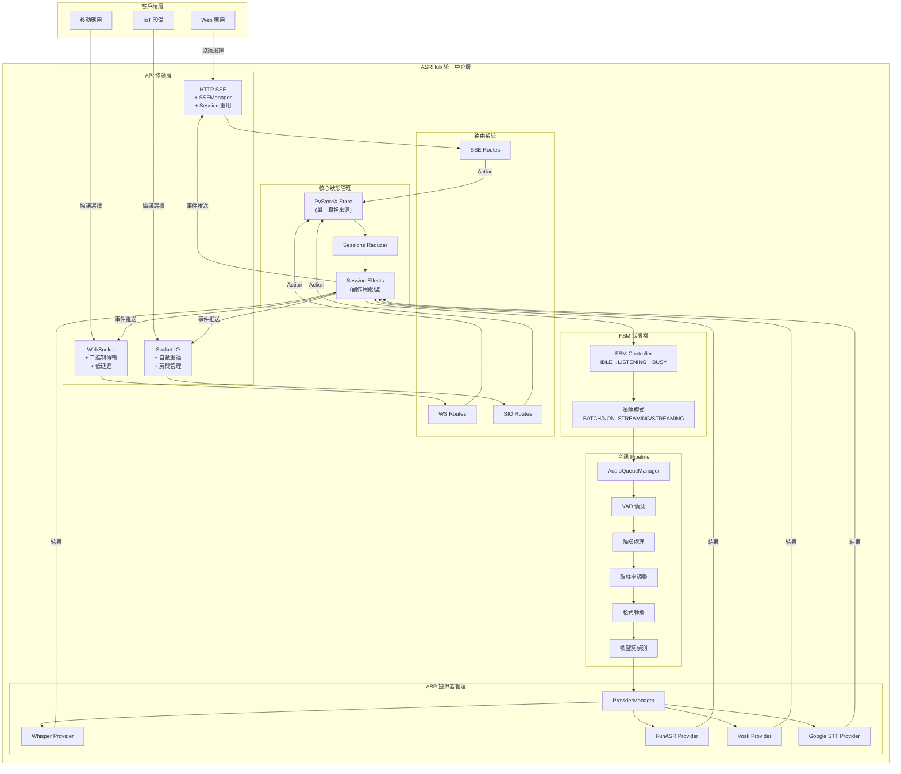

# ASRHub

<div align="center">

# 🎙️ ASRHub - 統一語音識別中介軟體系統

[](https://www.python.org/downloads/)
[](LICENSE)
[]()
[]()

**整合多家 ASR 服務提供者 | 支援多種通訊協議 | 事件驅動架構**

[English](README.en.md) | **繁體中文**

</div>

## 📋 專案概述

ASRHub 是一個企業級的統一語音識別中介軟體系統，旨在簡化語音識別服務的整合與使用。透過單一的 API 介面，開發者可以輕鬆切換並使用不同的 ASR 服務提供者，而無需修改應用程式碼。

### 🎯 核心價值

- **統一的 ASR API 介面**：透過標準化的 API，整合多家語音識別服務，降低切換成本
- **多協議支援**：支援現代 Web 應用所需的各種通訊協議，滿足不同場景需求
- **事件驅動架構**：採用 PyStoreX 狀態管理，確保系統狀態的可預測性和可追蹤性
- **模組化設計**：Pipeline 架構設計，可靈活組合音訊處理運算子

## ✨ 主要特性

### 🔌 多 ASR 提供者支援
- **Local Whisper** - OpenAI Whisper 本地部署版本
- **FunASR** - 阿里巴巴開源語音識別
- **Vosk** - 離線語音識別引擎
- **Google Speech-to-Text** - Google 雲端語音識別服務
- **OpenAI Whisper API** - OpenAI 官方 API 服務

### 📡 多協議支援
- **HTTP SSE (Server-Sent Events)** - 實時串流，Session 重用機制
- **WebSocket** - 雙向實時通訊
- **Socket.IO** - 強化的 WebSocket，支援自動重連
- **gRPC** - 高效能 RPC 框架（規劃中）
- **Redis Pub/Sub** - 分散式訊息傳遞（規劃中）

### 🎨 音訊處理 Pipeline
- **VAD (Voice Activity Detection)** - 語音活動偵測
- **降噪處理** - 環境噪音過濾
- **取樣率調整** - 自動適配不同 ASR 需求
- **格式轉換** - 支援多種音訊格式
- **喚醒詞偵測** - 自訂喚醒詞觸發

### 🔄 進階功能
- **FSM 狀態管理** - IDLE、LISTENING、BUSY 三態管理
- **Session 重用機制** - 減少連線開銷，提升效能
- **實時串流支援** - 低延遲音訊處理
- **自動重連機制** - 網路異常自動恢復
- **錯誤處理與重試** - 穩定可靠的服務

### 🚀 最新架構改進 (v0.2.0)
- **路由系統重構** - 每個協議獨立的路由模組，降低耦合度
- **SSEManager 引入** - 完整的 SSE 連接生命週期管理
- **Session 智能管理** - 前端自動判斷是否需要新 Session
- **Metadata 差異化處理** - 各協議根據特性優化傳輸方式
- **統一路由移除** - 刪除過度設計的 unified_router，簡化架構

## 🏗️ 系統架構

### 事件驅動架構設計

ASRHub 採用**事件驅動架構 (Event-Driven Architecture)** 結合 **Redux-like 狀態管理模式**，確保系統狀態的可預測性和可追蹤性。



### 📁 專案結構

```
ASRHub/
├── src/
│   ├── core/                    # 🎯 核心系統
│   │   ├── asr_hub.py          # 系統入口點與初始化
│   │   ├── fsm.py              # FSM 狀態機控制器
│   │   └── exceptions.py       # 自定義例外處理
│   │
│   ├── api/                     # 📡 API 協議層
│   │   ├── base.py             # API 基類定義
│   │   ├── http_sse/           # HTTP SSE 實現
│   │   │   ├── server.py       # SSE 伺服器
│   │   │   ├── handlers.py     # 請求處理器
│   │   │   ├── routes.py       # 路由定義（新）
│   │   │   └── sse_manager.py  # SSE 連接管理（新）
│   │   ├── websocket/          # WebSocket 實現
│   │   │   ├── server.py       # WS 伺服器
│   │   │   ├── handlers.py     # 消息處理器
│   │   │   └── routes.py       # 路由定義（新）
│   │   └── socketio/           # Socket.IO 實現
│   │       ├── server.py       # SIO 伺服器
│   │       ├── __init__.py     # 事件註冊
│   │       └── routes.py       # 路由定義（新）
│   │
│   ├── store/                   # 🗄️ PyStoreX 狀態管理
│   │   ├── __init__.py         # Store 初始化
│   │   ├── sessions/           # Session 管理
│   │   │   ├── sessions_actions.py    # Action 定義
│   │   │   ├── sessions_reducer.py    # Reducer 邏輯
│   │   │   ├── sessions_effects.py    # Effects 處理
│   │   │   └── sessions_selectors.py  # 狀態選擇器
│   │   └── global_store.py     # 全域 Store 實例
│   │
│   ├── operators/               # ⚙️ 音訊處理運算子
│   │   ├── base.py             # Operator 基類
│   │   ├── vad/                # VAD 偵測
│   │   │   ├── silero_vad.py  # Silero VAD 實現
│   │   │   └── webrtc_vad.py  # WebRTC VAD 實現
│   │   ├── denoiser.py         # 降噪處理
│   │   ├── sample_rate.py      # 取樣率調整
│   │   ├── format_converter.py # 格式轉換
│   │   ├── recording.py        # 錄音功能
│   │   └── wakeword.py         # 喚醒詞偵測
│   │
│   ├── providers/               # 🎙️ ASR 提供者
│   │   ├── base.py             # Provider 基類
│   │   ├── whisper.py          # Whisper 本地實現
│   │   ├── funasr.py           # FunASR 實現
│   │   ├── vosk.py             # Vosk 實現
│   │   ├── google_stt.py       # Google STT
│   │   └── openai.py           # OpenAI API
│   │
│   ├── stream/                  # 🌊 串流處理
│   │   ├── audio_queue.py      # 音訊佇列管理
│   │   ├── buffer_manager.py   # 緩衝區管理
│   │   └── stream_controller.py # 串流控制器
│   │
│   ├── utils/                   # 🛠️ 工具模組
│   │   ├── logger.py           # pretty-loguru 日誌
│   │   ├── audio_format_detector.py # 格式檢測
│   │   └── validators.py       # 資料驗證
│   │
│   └── models/                  # 📦 資料模型
│       ├── audio.py            # 音訊資料模型
│       ├── transcript.py       # 轉譯結果模型
│       └── session.py          # Session 模型
│
├── frontend/                    # 🖥️ 前端應用
│   ├── protocol-test/          # 協議測試工具
│   │   ├── index.html          # 主頁面
│   │   ├── app.js              # 主應用邏輯
│   │   └── modules/            # 模組化元件
│   │       ├── protocol-adapters.js  # 協議適配器
│   │       ├── ui-manager.js         # UI 管理
│   │       ├── audio-recorder.js     # 錄音功能
│   │       └── audio-uploader.js     # 上傳功能
│   │
│   └── realtime-streaming/     # 實時串流應用
│       ├── index.html          # 主頁面
│       ├── app.js              # 主應用邏輯
│       └── modules/            # 模組化元件
│           ├── protocol-adapters.js     # 擴展協議適配器
│           ├── realtime-ui-manager.js   # 實時 UI 管理
│           ├── audio-stream-manager.js  # 音訊串流管理
│           ├── vad-display.js          # VAD 視覺化
│           └── wakeword-manager.js     # 喚醒詞管理
│
├── config/                      # ⚙️ 配置管理
│   ├── config.yaml             # 主配置檔（不納入版控）
│   └── config.sample.yaml      # 配置範例
│
├── models/                      # 🧠 AI 模型檔案
│   ├── whisper/                # Whisper 模型
│   ├── vosk/                   # Vosk 模型
│   └── wakeword/               # 喚醒詞模型
│
└── tests/                       # 🧪 測試檔案
    ├── test_whisper_sse.py     # Whisper SSE 測試
    └── test_http_sse_session_reuse.html # Session 重用測試
```

## 🚀 快速開始

### 系統需求

- **Python 3.8+**
- **作業系統**：Linux、macOS、Windows
- **記憶體**：建議 4GB 以上（依 ASR 模型而定）
- **儲存空間**：至少 2GB（Whisper 模型需額外空間）

### 安裝步驟

1. **克隆專案**
```bash
git clone https://github.com/yourusername/ASRHub.git
cd ASRHub
```

2. **建立虛擬環境**
```bash
python -m venv venv
source venv/bin/activate  # Linux/macOS
# 或
venv\Scripts\activate  # Windows
```

3. **安裝依賴套件**
```bash
pip install -r requirements.txt
pip install -e .  # 開發模式安裝
```

4. **配置設定**
```bash
# 複製範例配置檔
cp config/config.sample.yaml config/config.yaml

# 編輯配置檔，設定您的 ASR 服務金鑰
nano config/config.yaml
```

5. **生成配置類別**
```bash
# 使用 yaml2py 生成類型安全的配置類別
yaml2py --config config/config.yaml --output ./src/config
```

6. **啟動服務**
```bash
# 啟動主服務
python -m src.core.asr_hub

# 或使用 Makefile
make run
```

### 🧪 測試前端介面

1. **協議測試介面**
```bash
# 開啟瀏覽器訪問
http://localhost:8080/protocol-test/
```

2. **實時串流介面**
```bash
# 開啟瀏覽器訪問
http://localhost:8080/realtime-streaming/
```

## 📖 詳細使用說明

### 後端 API 端點

#### HTTP SSE API (Port: 8000)

**Session 管理端點**
```http
# 創建 Session
POST /control/create-session
Content-Type: application/json
{
    "session_id": "unique-session-id",
    "strategy": "batch"  # batch/non_streaming/streaming
}

# 銷毀 Session
POST /control/destroy-session
Content-Type: application/json
{
    "session_id": "unique-session-id"
}
```

**音訊上傳端點**
```http
# 上傳音訊檔案（自動觸發辨識）
POST /audio/{session_id}
Content-Type: multipart/form-data

FormData:
  - audio: [音訊檔案]
  - session_id: "unique-session-id"

# 分塊上傳開始
POST /upload/chunk-start/{session_id}

# 分塊上傳結束
POST /upload/chunk-done/{session_id}
```

**SSE 事件串流**
```http
GET /events/{session_id}

# 事件類型
event: session/create
data: {"session_id": "...", "timestamp": "..."}

event: transcript
data: {"text": "識別結果", "is_final": true, "confidence": 0.95}

event: status
data: {"state": "LISTENING", "message": "正在處理..."}

event: error
data: {"error": "錯誤訊息", "code": "ERROR_CODE"}
```

#### WebSocket API (Port: 8765)

```javascript
// 連線
const ws = new WebSocket('ws://localhost:8765/ws');

// 創建 Session
ws.send(JSON.stringify({
    type: 'session/create',
    payload: {
        session_id: 'unique-session-id',
        strategy: 'batch'
    }
}));

// 發送音訊 Metadata（必須）
ws.send(JSON.stringify({
    type: 'audio/metadata',
    payload: {
        session_id: 'unique-session-id',
        audio_metadata: {
            format: 'webm',
            sampleRate: 48000,
            channels: 1
        }
    }
}));

// 發送音訊資料
ws.send(audioBlob);  // 二進制數據

// 接收事件
ws.onmessage = (event) => {
    const data = JSON.parse(event.data);
    switch(data.type) {
        case 'transcript':
            console.log('識別結果:', data.text);
            break;
        case 'status':
            console.log('狀態:', data.state);
            break;
        case 'error':
            console.error('錯誤:', data.error);
            break;
    }
};
```

#### Socket.IO API (Port: 8766)

```javascript
// 連線
const socket = io('http://localhost:8766');

// 創建 Session
socket.emit('session/create', {
    session_id: 'unique-session-id',
    strategy: 'batch'
});

// 發送音訊 Metadata（必須）
socket.emit('audio/metadata', {
    session_id: 'unique-session-id',
    audio_metadata: {
        format: 'webm',
        sampleRate: 48000,
        channels: 1
    }
});

// 上傳音訊檔案
socket.emit('file/upload', {
    session_id: 'unique-session-id',
    audio_data: audioBase64,  // Base64 編碼
    filename: 'audio.webm'
});

// 監聽事件
socket.on('transcript', (data) => {
    console.log('識別結果:', data.text, '最終:', data.is_final);
});

socket.on('status', (data) => {
    console.log('狀態更新:', data.state, data.message);
});

socket.on('error', (error) => {
    console.error('錯誤:', error.message);
});

// 房間功能（Socket.IO 特有）
socket.emit('join_room', { room: 'transcription_room_1' });
socket.emit('leave_room', { room: 'transcription_room_1' });
```

### 📊 協議選擇指南

選擇適合的協議對系統性能和用戶體驗至關重要。以下是詳細的對比和選擇建議：

| 特性 | HTTP SSE | WebSocket | Socket.IO |
|------|----------|-----------|-----------|
| **連接模式** | 單向推送 | 雙向通信 | 雙向+房間管理 |
| **Session 管理** | 自動創建與重用 | 手動管理 | 事件驅動 |
| **音訊傳輸** | Base64 JSON | 二進制分塊 | Base64 事件 |
| **Metadata 處理** | 內嵌傳輸 | 單獨發送 | 單獨事件 |
| **重連機制** | 瀏覽器自動 | 手動實現 | 內建支援 |
| **延遲** | 中等 | 最低 | 低 |
| **資源消耗** | 低 | 中 | 較高 |
| **複雜度** | 簡單 | 中等 | 較複雜 |

#### 使用建議

**選擇 HTTP SSE 當：**
- ✅ 需要簡單的服務器推送
- ✅ 客戶端主要是瀏覽器
- ✅ 不需要頻繁的雙向通信
- ✅ 希望簡化實現和維護
- 📝 範例：簡單的語音轉文字應用

**選擇 WebSocket 當：**
- ✅ 需要低延遲的雙向通信
- ✅ 傳輸大量二進制數據
- ✅ 需要自定義通信協議
- ✅ 對性能要求較高
- 📝 範例：實時對話系統、即時翻譯

**選擇 Socket.IO 當：**
- ✅ 需要房間/命名空間功能
- ✅ 需要可靠的自動重連
- ✅ 需要廣播和群組功能
- ✅ 跨瀏覽器兼容性重要
- 📝 範例：多人協作平台、會議系統

### 前端測試介面

#### 協議測試介面功能
- 支援三種協議切換測試
- 即時音訊錄製與傳送
- 識別結果即時顯示
- 連線狀態監控
- 錯誤訊息顯示

#### 實時串流介面功能
- 連續語音識別
- VAD 狀態顯示
- 喚醒詞偵測
- 倒數計時器
- 實時轉譯結果

### 協議選擇指南

| 協議 | 適用場景 | 優點 | 缺點 |
|------|---------|------|------|
| HTTP SSE | Web 應用、單向串流 | 簡單、防火牆友好、Session 重用 | 單向通訊 |
| WebSocket | 即時雙向通訊 | 低延遲、全雙工 | 需要特殊配置 |
| Socket.IO | 需要高可靠性 | 自動重連、房間功能 | 額外開銷 |

## ⚙️ 配置管理

### yaml2py 配置系統

本專案使用 yaml2py 實現類型安全的配置管理：

1. **編輯配置檔** `config/config.yaml`
2. **生成配置類別** `yaml2py --config config/config.yaml --output ./src/config`
3. **在程式中使用**：
```python
from src.config.manager import ConfigManager

config = ConfigManager()
port = config.api.http_sse.port
model = config.providers.whisper.model
```

### 配置檔案結構

```yaml
# config/config.yaml
app:
  name: "ASRHub"
  version: "1.0.0"
  debug: true

api:
  http_sse:
    host: "0.0.0.0"
    port: 8080
    cors_enabled: true
  
  websocket:
    host: "0.0.0.0"
    port: 8081
    
  socketio:
    host: "0.0.0.0"
    port: 8082

providers:
  whisper:
    model: "base"
    device: "cpu"
    language: "zh"
    
  funasr:
    model_dir: "./models/funasr"
    
  google:
    credentials_path: "./credentials/google.json"

pipeline:
  vad:
    enabled: true
    threshold: 0.5
    
  denoiser:
    enabled: false
    level: "medium"
    
  sample_rate:
    target: 16000
```

### ASR 提供者設定

#### Whisper 配置
```yaml
providers:
  whisper:
    model: "base"  # tiny, base, small, medium, large
    device: "cuda"  # cpu, cuda
    compute_type: "float16"
    language: "zh"
    initial_prompt: "以下是中文語音內容"
```

#### FunASR 配置
```yaml
providers:
  funasr:
    model_dir: "./models/funasr"
    use_gpu: true
    batch_size: 1
```

### 協議參數調整

```yaml
api:
  http_sse:
    max_connections: 100
    timeout: 30
    buffer_size: 8192
    
  websocket:
    ping_interval: 25
    ping_timeout: 5
    max_message_size: 10485760  # 10MB
```

## 🛠️ 開發指南

### 專案結構說明

- **src/core**: 核心系統，包含 ASRHub 主類別和 FSM 狀態機
- **src/api**: 各種通訊協議的實現
- **src/operators**: Pipeline 運算子，處理音訊串流
- **src/providers**: ASR 服務提供者的適配器
- **src/store**: PyStoreX 事件驅動狀態管理
- **src/stream**: 音訊串流控制和緩衝管理

### 開發流程

1. **設定開發環境**
```bash
# 安裝開發依賴
pip install -r requirements-dev.txt

# 安裝 pre-commit hooks
pre-commit install
```

2. **執行測試**
```bash
# 執行所有測試
make test

# 執行測試並生成覆蓋率報告
make test-cov

# 執行特定測試
pytest tests/test_whisper.py
```

3. **程式碼品質檢查**
```bash
# 執行 linting
make lint

# 格式化程式碼
make format

# 類型檢查
make type-check
```

4. **新增 ASR 提供者**
```python
# src/providers/custom_provider.py
from src.providers.base import ProviderBase

class CustomProvider(ProviderBase):
    def initialize(self, config):
        # 初始化提供者
        pass
    
    def transcribe(self, audio_data):
        # 實現轉譯邏輯
        return transcript
```

5. **新增 Pipeline 運算子**
```python
# src/operators/custom_operator.py
from src.operators.base import OperatorBase

class CustomOperator(OperatorBase):
    def process(self, audio_stream):
        # 處理音訊串流
        return processed_stream
```

### 測試方法

```bash
# HTTP SSE 測試
python test_http_sse_fixed.py

# WebSocket 測試
python test_websocket.py

# 整合測試
python -m pytest tests/integration/

# 壓力測試
locust -f tests/performance/locustfile.py
```

### 貢獻指南

1. Fork 專案
2. 建立功能分支 (`git checkout -b feature/amazing-feature`)
3. 遵循程式碼規範
4. 撰寫測試案例
5. 提交變更 (`git commit -m 'feat: 新增驚人功能'`)
6. 推送分支 (`git push origin feature/amazing-feature`)
7. 開啟 Pull Request

#### Commit 訊息規範
- `feat:` 新功能
- `fix:` 錯誤修復
- `docs:` 文件更新
- `style:` 程式碼格式調整
- `refactor:` 重構
- `test:` 測試相關
- `chore:` 建構流程或輔助工具的變更

## 📚 API 文件

### HTTP SSE API 詳細文件

完整的 HTTP SSE API 文件請參考 [HTTP SSE API 文件](./docs/api/http_sse.md)

主要端點：
- `/api/sse/control` - 控制命令（開始/停止/配置）
- `/api/sse/audio` - 音訊資料上傳
- `/api/sse/events` - SSE 事件串流
- `/api/sse/status` - 系統狀態查詢

### WebSocket API 詳細文件

完整的 WebSocket API 文件請參考 [WebSocket API 文件](./docs/api/websocket.md)

訊息類型：
- `control` - 控制訊息
- `audio` - 音訊資料
- `transcript` - 識別結果
- `metadata` - 中繼資料
- `error` - 錯誤訊息

### Socket.IO API 詳細文件

完整的 Socket.IO API 文件請參考 [Socket.IO API 文件](./docs/api/socketio.md)

事件：
- `start_recognition` - 開始識別
- `stop_recognition` - 停止識別
- `audio_data` - 音訊資料
- `transcript` - 識別結果
- `state_change` - 狀態變更

## 🚢 部署說明

### 生產環境配置

1. **環境變數設定**
```bash
export ASR_HUB_ENV=production
export ASR_HUB_CONFIG=/path/to/production/config.yaml
export ASR_HUB_LOG_LEVEL=INFO
```

2. **使用 Docker 部署**
```dockerfile
FROM python:3.8-slim

WORKDIR /app
COPY . .

RUN pip install -r requirements.txt
RUN pip install gunicorn

EXPOSE 8080 8081 8082

CMD ["gunicorn", "-w", "4", "-b", "0.0.0.0:8080", "src.core.asr_hub:app"]
```

3. **使用 Docker Compose**
```yaml
version: '3.8'

services:
  asrhub:
    build: .
    ports:
      - "8080:8080"
      - "8081:8081"
      - "8082:8082"
    environment:
      - ASR_HUB_ENV=production
    volumes:
      - ./config:/app/config
      - ./models:/app/models
    restart: unless-stopped
```

### 效能優化

1. **ASR 模型優化**
   - 使用 GPU 加速（CUDA）
   - 選擇適當的模型大小
   - 啟用批次處理

2. **網路優化**
   - 啟用 HTTP/2
   - 配置適當的緩衝區大小
   - 使用 CDN 加速靜態資源

3. **系統優化**
   - 調整 Python GIL 設定
   - 使用多程序架構
   - 配置適當的記憶體限制

### 監控設定

1. **日誌配置**
```yaml
logging:
  level: INFO
  format: json
  output: 
    - file: /var/log/asrhub/app.log
    - stdout
```

2. **指標收集**
```python
# 整合 Prometheus
from prometheus_client import Counter, Histogram

request_count = Counter('asrhub_requests_total', 'Total requests')
request_duration = Histogram('asrhub_request_duration_seconds', 'Request duration')
```

3. **健康檢查**
```http
GET /health
Response: {"status": "healthy", "version": "1.0.0"}
```

## ❓ 常見問題

### Q1: 如何選擇合適的 ASR 提供者？

**A:** 選擇 ASR 提供者時考慮以下因素：
- **Whisper**: 最佳的中文識別效果，支援多語言
- **FunASR**: 中文優化，速度快，適合即時應用
- **Vosk**: 離線識別，隱私保護，資源消耗低
- **Google STT**: 雲端服務，高準確率，需要網路
- **OpenAI API**: 最新模型，最高準確率，需要付費

### Q2: Session 重用機制如何運作？

**A:** HTTP SSE 的 Session 重用機制：
1. 首次連線時建立 Session
2. Session ID 儲存在記憶體中
3. 後續請求使用相同 Session ID
4. 自動清理過期 Session（預設 30 分鐘）

### Q3: 如何處理大檔案音訊？

**A:** 大檔案處理建議：
1. 使用串流上傳，避免記憶體溢出
2. 啟用分塊處理（chunk processing）
3. 配置適當的超時時間
4. 考慮使用非同步處理

### Q4: 如何提升識別準確率？

**A:** 提升準確率的方法：
1. 啟用 VAD 過濾靜音片段
2. 使用降噪處理環境音
3. 調整取樣率至 16kHz
4. 選擇適合的 ASR 模型
5. 提供語言提示（initial_prompt）

### Q5: 支援哪些音訊格式？

**A:** 支援的音訊格式：
- WAV（推薦）
- MP3
- FLAC
- OGG
- M4A
- WebM（瀏覽器錄音）

## 📝 更新日誌

### v1.0.0-beta (2024-01)
- ✅ HTTP SSE Session 重用機制實現
- ✅ 修復所有協議的 metadata 發送問題
- ✅ API 路由系統重構完成
- ✅ 前端協議測試介面完善
- ✅ WebSocket 和 Socket.IO 協議實現
- ✅ PyStoreX 狀態管理整合

### v0.9.0-alpha (2023-12)
- ✅ 基礎架構建立
- ✅ Whisper 提供者整合
- ✅ HTTP SSE 協議實現
- ✅ Pipeline 運算子框架

## 📄 授權條款

本專案採用 MIT 授權條款 - 詳見 [LICENSE](LICENSE) 檔案

## 🙏 致謝

感謝以下開源專案和貢獻者：

- [OpenAI Whisper](https://github.com/openai/whisper) - 強大的語音識別模型
- [FunASR](https://github.com/alibaba-damo-academy/FunASR) - 阿里巴巴語音識別
- [Vosk](https://github.com/alphacep/vosk-api) - 離線語音識別
- [PyStoreX](https://github.com/pytorchx/pystorex) - 狀態管理框架
- [yaml2py](https://pypi.org/project/yaml2py/) - YAML 配置管理
- [pretty-loguru](https://pypi.org/project/pretty-loguru/) - 美化日誌輸出

特別感謝所有貢獻者的努力和支持！

## 📧 聯絡我們

- **問題回報**: [GitHub Issues](https://github.com/yourusername/ASRHub/issues)
- **功能建議**: [GitHub Discussions](https://github.com/yourusername/ASRHub/discussions)
- **安全問題**: security@asrhub.io

---

<div align="center">

**[⬆ 回到頂部](#asrhub)**

Made with ❤️ by ASRHub Team

Copyright © 2024 ASRHub. All rights reserved.

</div>