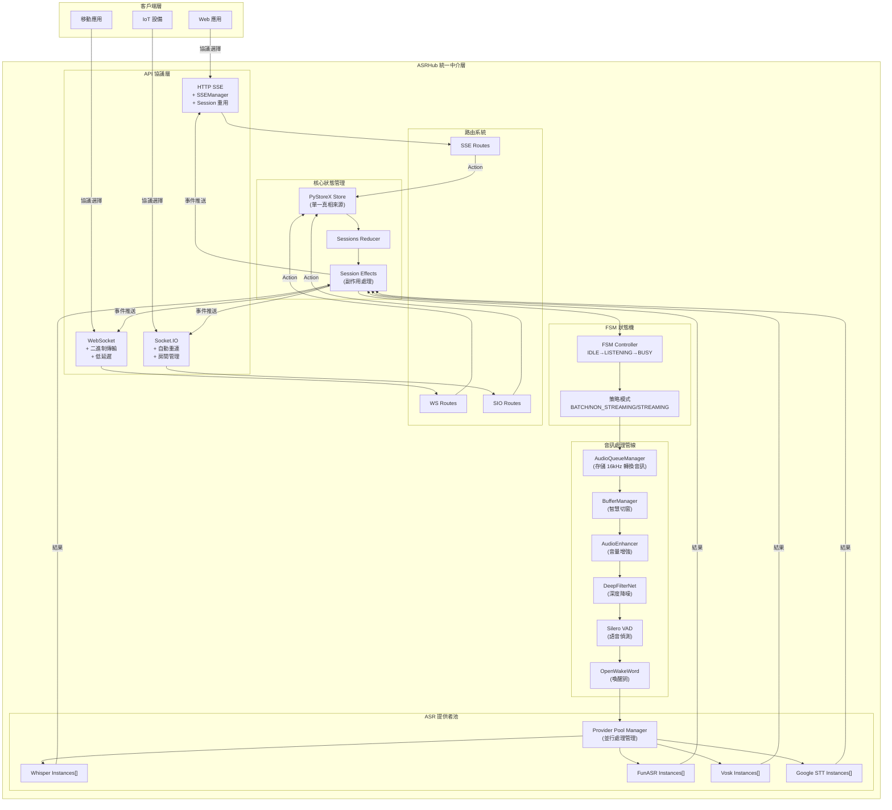
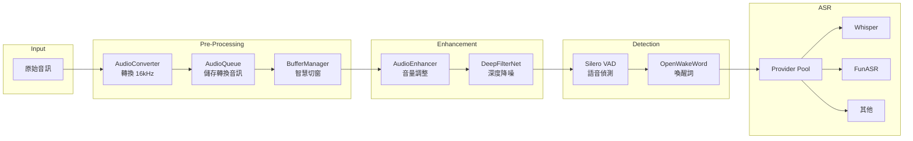
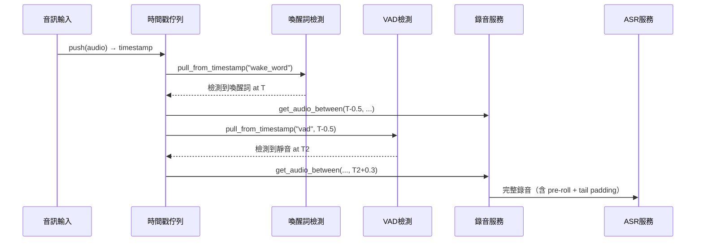

# ASRHub

<div align="center">

# 🎙️ ASRHub - 統一語音識別中介軟體系統

[](https://www.python.org/downloads/)
[](LICENSE)
[]()
[]()

**整合多家 ASR 服務提供者 | 支援多種通訊協議 | 事件驅動架構**

[English](README.en.md) | **繁體中文**

</div>

## 📋 專案概述

ASRHub 是一個企業級的統一語音識別中介軟體系統，旨在簡化語音識別服務的整合與使用。透過單一的 API 介面，開發者可以輕鬆切換並使用不同的 ASR 服務提供者，而無需修改應用程式碼。

### 🎯 核心價值

- **統一的 ASR API 介面**：透過標準化的 API，整合多家語音識別服務，降低切換成本
- **多協議支援**：支援現代 Web 應用所需的各種通訊協議，滿足不同場景需求
- **事件驅動架構**：採用 PyStoreX 狀態管理，確保系統狀態的可預測性和可追蹤性
- **模組化設計**：無狀態服務（Stateless Services）架構，簡單清晰的功能組合

## ✨ 主要特性

### 🔌 多 ASR 提供者支援
- **Local Whisper** - OpenAI Whisper 本地部署版本
- **FunASR** - 阿里巴巴開源語音識別
- **Vosk** - 離線語音識別引擎
- **Google Speech-to-Text** - Google 雲端語音識別服務
- **OpenAI Whisper API** - OpenAI 官方 API 服務

### 📡 多協議支援
- **HTTP SSE (Server-Sent Events)** - 實時串流，Session 重用機制
- **WebSocket** - 雙向實時通訊
- **Socket.IO** - 強化的 WebSocket，支援自動重連
- **gRPC** - 高效能 RPC 框架（規劃中）
- **Redis Pub/Sub** - 分散式訊息傳遞（規劃中）

### 🎨 音訊處理服務
- **音訊佇列管理** - 儲存轉換後的 16kHz 音訊，供下游服務使用
- **緩衝區管理** - 智慧音訊切窗，支援 fixed/sliding/dynamic 三種模式
- **音訊增強** - 自動調整音量、動態壓縮、軟限幅，解決麥克風音量問題
- **深度降噪** - DeepFilterNet 深度學習降噪，消除白噪音、增強人聲
- **VAD (Voice Activity Detection)** - Silero VAD 語音活動偵測
- **喚醒詞偵測** - OpenWakeWord 自訂喚醒詞觸發
- **格式轉換** - FFmpeg/SciPy 雙引擎，支援 GPU 加速

### 🔄 進階功能
- **Provider 池化管理** - 並行處理多個 Session，最大化硬體資源利用
- **FSM 狀態管理** - IDLE、LISTENING、BUSY 三態管理
- **Session 重用機制** - 減少連線開銷，提升效能  
- **實時串流支援** - 低延遲音訊處理
- **智慧資源分配** - 租借機制、老化防止、配額管理
- **健康檢查機制** - 自動移除不健康的 Provider 實例
- **錯誤處理與重試** - 穩定可靠的服務

### 🚀 最新架構改進 (v0.4.0)
- **FSM + PyStoreX 整合** - 狀態機驗證結合響應式狀態管理，確保狀態轉換合法性
- **時間戳協調機制** - 非破壞性多讀取器，解決服務競爭問題  
- **SessionEffects 實作** - 整合現有服務，遵循 KISS 原則
- **批量後處理管線** - 錄音結束後統一降噪增強，提升品質
- **Pre-roll 與 Tail Padding** - 喚醒前 500ms 預錄，靜音後 300ms 延續
- **服務職責分離** - FSM 定義規則、Validator 驗證、Effects 處理副作用、Reducer 純函數更新

### 🎯 時間戳音訊佇列系統 (v0.3.1)
- **非破壞性多讀取器** - 多個服務可同時讀取相同音訊，避免競爭
- **Pre-roll 預錄緩衝** - 喚醒詞檢測後回溯 500ms，確保完整捕獲第一個字
- **Tail Padding 尾部填充** - 靜音檢測後延續 300ms，確保不截斷最後字尾
- **獨立讀取位置** - 每個服務（喚醒詞、VAD、錄音）維護獨立的讀取進度
- **時間戳索引** - 精確的音訊片段時間定位，支援範圍查詢
- **向後相容** - 保留原有 pop() 介面，新增 pull_from_timestamp() 等時間戳介面

## 🏗️ 系統架構

### 事件驅動架構設計

ASRHub 採用**事件驅動架構 (Event-Driven Architecture)** 結合 **Redux-like 狀態管理模式**，確保系統狀態的可預測性和可追蹤性。



### 📁 專案結構

```
ASRHub/
├── src/
│   ├── core/                    # 🎯 核心系統
│   │   ├── asr_hub.py          # 系統入口點與初始化
│   │   ├── audio_queue_manager.py  # 音訊佇列管理（應移至 service/）
│   │   ├── buffer_manager.py       # 緩衝區管理（應移至 service/）
│   │   ├── fsm_transitions.py      # FSM 狀態轉換定義（StrategyPlugin）
│   │   └── exceptions.py           # 自定義例外處理
│   │
│   ├── api/                     # 📡 API 協議層
│   │   ├── base.py             # API 基類定義
│   │   ├── http_sse/           # HTTP SSE 實現
│   │   │   ├── server.py       # SSE 伺服器
│   │   │   ├── handlers.py     # 請求處理器
│   │   │   ├── routes.py       # 路由定義（新）
│   │   │   └── sse_manager.py  # SSE 連接管理（新）
│   │   ├── websocket/          # WebSocket 實現
│   │   │   ├── server.py       # WS 伺服器
│   │   │   ├── handlers.py     # 消息處理器
│   │   │   └── routes.py       # 路由定義（新）
│   │   └── socketio/           # Socket.IO 實現
│   │       ├── server.py       # SIO 伺服器
│   │       ├── __init__.py     # 事件註冊
│   │       └── routes.py       # 路由定義（新）
│   │
│   ├── store/                   # 🗄️ PyStoreX 狀態管理
│   │   ├── __init__.py         # Store 初始化
│   │   ├── sessions/           # Session 管理
│   │   │   ├── sessions_actions.py    # Action 定義
│   │   │   ├── sessions_reducer.py    # Reducer 邏輯（支援時間戳）
│   │   │   ├── sessions_effects.py    # Effects 處理（原版）
│   │   │   ├── sessions_effect_v2.py  # SessionEffects（時間戳版+FSM驗證）
│   │   │   └── sessions_selectors.py  # 狀態選擇器
│   │   └── global_store.py     # 全域 Store 實例
│   │
│   ├── service/                 # ⚙️ 無狀態服務層（Stateless Services）
│   │   ├── audio_converter/        # 音訊格式轉換
│   │   │   ├── scipy_converter.py  # SciPy 轉換器（GPU 支援）
│   │   │   └── ffmpeg_converter.py # FFmpeg 轉換器
│   │   ├── audio_enhancer.py       # 音訊增強（音量調整、動態壓縮）
│   │   ├── denoise/                 # 降噪服務
│   │   │   └── deepfilternet_denoiser.py # DeepFilterNet 深度降噪
│   │   ├── vad/                     # VAD 偵測服務
│   │   │   └── silero_vad.py       # Silero VAD 實現
│   │   ├── wakeword/                # 喚醒詞偵測
│   │   │   └── openwakeword.py     # OpenWakeWord 實現
│   │   └── recording/               # 錄音服務
│   │
│   ├── provider/                # 🎙️ ASR 提供者 (注意：是 provider 不是 providers)
│   │   ├── provider_manager.py # Provider Pool 管理器（並行處理）
│   │   ├── whisper/            # Whisper 實現
│   │   ├── funasr/             # FunASR 實現
│   │   ├── vosk/               # Vosk 實現
│   │   ├── google_stt/         # Google STT
│   │   └── openai/             # OpenAI API
│   │
│   ├── interface/               # 📐 服務介面定義
│   │   ├── audio_queue.py      # 音訊佇列介面
│   │   ├── buffer.py           # 緩衝區管理介面
│   │   ├── audio_converter.py  # 音訊轉換介面
│   │   ├── asr_provider.py     # ASR Provider 基礎介面
│   │   └── provider_pool_interfaces.py # Provider Pool 相關介面
│   │
│   ├── utils/                   # 🛠️ 工具模組
│   │   ├── logger.py           # pretty-loguru 日誌
│   │   ├── audio_format_detector.py # 格式檢測
│   │   └── validators.py       # 資料驗證
│   │
│   └── models/                  # 📦 資料模型
│       ├── audio.py            # 音訊資料模型
│       ├── transcript.py       # 轉譯結果模型
│       └── session.py          # Session 模型
│
├── config/                      # ⚙️ 配置管理
│   ├── config.yaml             # 主配置檔（不納入版控）
│   └── config.sample.yaml      # 配置範例
│
└── models/                      # 🧠 AI 模型檔案
    ├── whisper/                # Whisper 模型
    ├── vosk/                   # Vosk 模型
    └── wakeword/               # 喚醒詞模型
```

## 🔧 音訊處理流程

### 完整處理管線



### 關鍵組件說明

1. **AudioQueueManager**: 
   - 儲存已轉換的 16kHz 音訊
   - Thread-safe 佇列操作
   - 支援多 Session 並行

2. **BufferManager**:
   - Fixed 模式：固定大小窗口（VAD 使用）
   - Sliding 模式：滑動窗口（Whisper 使用）
   - Dynamic 模式：動態聚合

3. **AudioEnhancer**:
   - 自動音量調整（解決麥克風音量過小）
   - 動態壓縮、軟限幅
   - 智慧處理系統 auto_enhance()

4. **DeepFilterNet**:
   - 深度學習降噪
   - 消除背景噪音
   - 增強人聲品質

5. **Provider Pool Manager**:
   - 租借機制（Lease）分配 provider
   - 老化機制防止飢餓
   - 配額管理防止壟斷
   - 健康檢查自動修復

## 📚 核心設計文件

- **[AUDIO_PROCESSING_PIPELINE_DESIGN.md](./AUDIO_PROCESSING_PIPELINE_DESIGN.md)** - 音訊處理管線設計與實作狀態
- **[FSM_PYSTOREX_INTEGRATION.md](./FSM_PYSTOREX_INTEGRATION.md)** - FSM 與 PyStoreX 整合架構詳解
- **[CLAUDE.md](./CLAUDE.md)** - Claude Code 開發指引與架構原則

## 🚀 快速開始

### 系統需求

- **Python 3.8+**
- **作業系統**：Linux、macOS、Windows
- **記憶體**：建議 4GB 以上（依 ASR 模型而定）
- **儲存空間**：至少 2GB（Whisper 模型需額外空間）

### 安裝步驟

1. **克隆專案**
```bash
git clone https://github.com/yourusername/ASRHub.git
cd ASRHub
```

2. **建立虛擬環境**
```bash
python -m venv venv
source venv/bin/activate  # Linux/macOS
# 或
venv\Scripts\activate  # Windows
```

3. **安裝依賴套件**
```bash
pip install -r requirements.txt
pip install -e .  # 開發模式安裝
```

4. **配置設定**
```bash
# 複製範例配置檔
cp config/config.sample.yaml config/config.yaml

# 編輯配置檔，設定您的 ASR 服務金鑰
nano config/config.yaml
```

5. **生成配置類別**
```bash
# 使用 yaml2py 生成類型安全的配置類別
yaml2py --config config/config.yaml --output ./src/config
```

6. **啟動服務**
```bash
# 啟動主服務
python -m src.core.asr_hub

# 或使用 Makefile
make run
```

### 🕐 時間戳音訊佇列使用

#### 啟用方式

```bash
# 方式一：環境變數
export USE_TIMESTAMP_EFFECTS=true
python -m src.core.asr_hub

# 方式二：使用專用啟動腳本
python run_with_timestamp.py
```

#### 程式碼使用範例

```python
from src.core.audio_queue_manager import audio_queue

# 推送音訊並獲取時間戳
timestamp = audio_queue.push(session_id, audio_chunk)

# 多讀取器非破壞性讀取
wake_chunks = audio_queue.pull_from_timestamp(
    session_id, 
    reader_id="wake_word",
    from_timestamp=start_time
)

# 獲取時間範圍內的音訊（用於錄音）
recording = audio_queue.get_audio_between_timestamps(
    session_id,
    start_timestamp=wake_time - 0.5,  # Pre-roll
    end_timestamp=silence_time + 0.3   # Tail padding
)

# 阻塞式讀取（用於實時處理）
timestamped = audio_queue.pull_blocking_timestamp(
    session_id,
    reader_id="vad",
    timeout=1.0
)
```

#### 處理流程




## ⚙️ 配置管理

### yaml2py 配置系統

本專案使用 yaml2py 實現類型安全的配置管理：

1. **編輯配置檔** `config/config.yaml`
2. **生成配置類別** `yaml2py --config config/config.yaml --output ./src/config`
3. **在程式中使用**：
```python
from src.config.manager import ConfigManager

config = ConfigManager()
port = config.api.http_sse.port
model = config.providers.whisper.model
```

### 配置檔案結構

```yaml
# config/config.yaml
app:
  name: "ASRHub"
  version: "1.0.0"
  debug: true

api:
  http_sse:
    host: "0.0.0.0"
    port: 8080
    cors_enabled: true
  
  websocket:
    host: "0.0.0.0"
    port: 8081
    
  socketio:
    host: "0.0.0.0"
    port: 8082

providers:
  whisper:
    model: "base"
    device: "cpu"
    language: "zh"
    
  funasr:
    model_dir: "./models/funasr"
    
  google:
    credentials_path: "./credentials/google.json"

operators:
  vad:
    enabled: true
    threshold: 0.5
    
  denoiser:
    enabled: false
    level: "medium"
    
  sample_rate:
    target: 16000
```

### ASR 提供者設定

#### Whisper 配置
```yaml
providers:
  whisper:
    model: "base"  # tiny, base, small, medium, large
    device: "cuda"  # cpu, cuda
    compute_type: "float16"
    language: "zh"
    initial_prompt: "以下是中文語音內容"
```

#### FunASR 配置
```yaml
providers:
  funasr:
    model_dir: "./models/funasr"
    use_gpu: true
    batch_size: 1
```

### 協議參數調整

```yaml
api:
  http_sse:
    max_connections: 100
    timeout: 30
    buffer_size: 8192
    
  websocket:
    ping_interval: 25
    ping_timeout: 5
    max_message_size: 10485760  # 10MB
```

## 🛠️ 開發指南

### 專案結構說明

- **src/core**: 核心系統，包含 ASRHub 主類別和 FSM 狀態機
- **src/api**: 各種通訊協議的實現
- **src/operators**: 音訊處理運算子，由 SessionEffects 管理
- **src/providers**: ASR 服務提供者的適配器
- **src/store**: PyStoreX 事件驅動狀態管理
- **src/stream**: 音訊串流控制和緩衝管理

### 開發流程

1. **設定開發環境**
```bash
# 安裝開發依賴
pip install -r requirements-dev.txt

# 安裝 pre-commit hooks
pre-commit install
```

2. **執行測試**
```bash
# 執行所有測試
make test

# 執行測試並生成覆蓋率報告
make test-cov

# 執行特定測試
pytest tests/test_whisper.py
```

3. **新增 ASR 提供者**
```python
# src/providers/custom_provider.py
from src.providers.base import ProviderBase

class CustomProvider(ProviderBase):
    def initialize(self, config):
        # 初始化提供者
        pass
    
    def transcribe(self, audio_data):
        # 實現轉譯邏輯
        return transcript
```

4. **新增音訊處理運算子**
```python
# src/operators/custom_operator.py
from src.operators.base import OperatorBase

class CustomOperator(OperatorBase):
    def process(self, audio_stream):
        # 處理音訊串流
        return processed_stream
```


## ❓ 常見問題

### Q1: 如何選擇合適的 ASR 提供者？

**A:** 選擇 ASR 提供者時考慮以下因素：
- **Whisper**: 最佳的中文識別效果，支援多語言
- **FunASR**: 中文優化，速度快，適合即時應用
- **Vosk**: 離線識別，隱私保護，資源消耗低
- **Google STT**: 雲端服務，高準確率，需要網路
- **OpenAI API**: 最新模型，最高準確率，需要付費

### Q2: Session 重用機制如何運作？

**A:** HTTP SSE 的 Session 重用機制：
1. 首次連線時建立 Session
2. Session ID 儲存在記憶體中
3. 後續請求使用相同 Session ID
4. 自動清理過期 Session（預設 30 分鐘）

### Q3: 如何處理大檔案音訊？

**A:** 大檔案處理建議：
1. 使用串流上傳，避免記憶體溢出
2. 啟用分塊處理（chunk processing）
3. 配置適當的超時時間
4. 考慮使用非同步處理

### Q4: 如何提升識別準確率？

**A:** 提升準確率的方法：
1. 啟用 VAD 過濾靜音片段
2. 使用降噪處理環境音
3. 調整取樣率至 16kHz
4. 選擇適合的 ASR 模型
5. 提供語言提示（initial_prompt）

### Q5: 支援哪些音訊格式？

**A:** 支援的音訊格式：
- WAV（推薦）
- MP3
- FLAC
- OGG
- M4A
- WebM（瀏覽器錄音）

## 🎯 開發原則

### 核心設計理念
- **KISS (Keep It Simple, Stupid)**: 保持簡單，避免過度設計
- **無狀態服務**: 所有服務都是無狀態的，可並行處理多個 session
- **單一職責**: 每個服務只做一件事，並把它做好
- **組合優於繼承**: 使用組合模式構建複雜功能

### 架構準則
- **簡單工具**: 撰寫簡單、獨立的工具，之後再進行組合
- **明確介面**: 定義清晰的服務介面，確保可測試性
- **避免智能化**: 不做自動判斷，由調用者明確指定行為
- **錯誤透明**: 錯誤應該明確且易於理解

### 程式碼規範
- **模組級單例**: 使用 `__new__` 實現單例，模組級變數直接使用
- **直接調用**: 在 Effects 中直接 import 並調用服務方法
- **避免 Action 濫用**: 只在必要時創建新的 Action
- **設計模式適度**: 可以使用設計模式，但不要過度設計

## 📝 更新日誌

## 📄 授權條款

本專案採用 MIT 授權條款 - 詳見 [LICENSE](LICENSE) 檔案

## 🙏 致謝

感謝以下開源專案和貢獻者：

- [OpenAI Whisper](https://github.com/openai/whisper) - 強大的語音識別模型
- [FunASR](https://github.com/alibaba-damo-academy/FunASR) - 阿里巴巴語音識別
- [Vosk](https://github.com/alphacep/vosk-api) - 離線語音識別
- [PyStoreX](https://github.com/pytorchx/pystorex) - 狀態管理框架
- [yaml2py](https://pypi.org/project/yaml2py/) - YAML 配置管理
- [pretty-loguru](https://pypi.org/project/pretty-loguru/) - 美化日誌輸出

特別感謝所有貢獻者的努力和支持！

## 📧 聯絡我們

- **問題回報**: [GitHub Issues](https://github.com/yourusername/ASRHub/issues)
- **功能建議**: [GitHub Discussions](https://github.com/yourusername/ASRHub/discussions)
- **安全問題**: security@asrhub.io

---

<div align="center">

**[⬆ 回到頂部](#asrhub)**

Made with ❤️ by ASRHub Team

Copyright © 2025 ASRHub. All rights reserved.

</div>