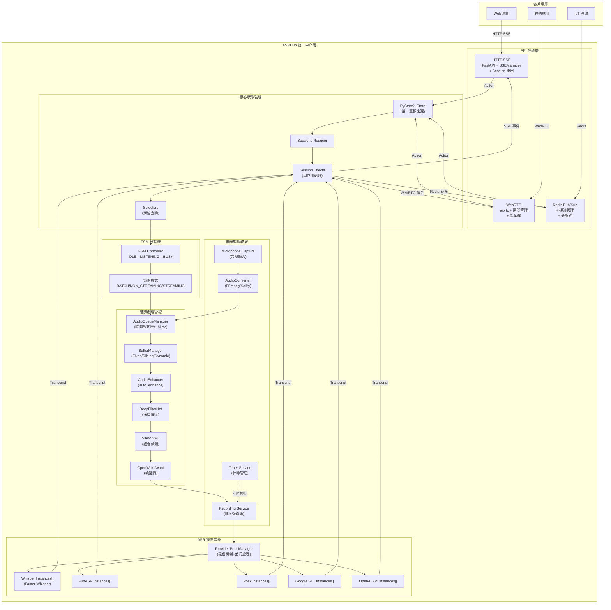

# ASRHub

<div align="center">

# 🎙️ ASRHub - 統一語音識別中介軟體系統

[](https://www.python.org/downloads/)
[](LICENSE)
[]()
[]()

**整合多家 ASR 服務提供者 | 支援多種通訊協議 | 事件驅動架構**

[English](README.en.md) | **繁體中文**

</div>

## 📋 專案概述

ASRHub 是一個企業級的統一語音識別中介軟體系統，旨在簡化語音識別服務的整合與使用。透過單一的 API 介面，開發者可以輕鬆切換並使用不同的 ASR 服務提供者，而無需修改應用程式碼。

### 🎯 核心價值

- **統一的 ASR API 介面**：透過標準化的 API，整合多家語音識別服務，降低切換成本
- **多協議支援**：支援現代 Web 應用所需的各種通訊協議，滿足不同場景需求
- **事件驅動架構**：採用 PyStoreX 狀態管理，確保系統狀態的可預測性和可追蹤性
- **模組化設計**：無狀態服務（Stateless Services）架構，簡單清晰的功能組合

## ✨ 主要特性

### 🔌 多 ASR 提供者支援
- **Local Whisper** - OpenAI Whisper 本地部署版本
- **FunASR** - 阿里巴巴開源語音識別
- **Vosk** - 離線語音識別引擎
- **Google Speech-to-Text** - Google 雲端語音識別服務
- **OpenAI Whisper API** - OpenAI 官方 API 服務

### 📡 多協議支援
- **HTTP SSE (Server-Sent Events)** - 實時串流，Session 重用機制
- **WebSocket** - 雙向實時通訊
- **Socket.IO** - 強化的 WebSocket，支援自動重連
- **gRPC** - 高效能 RPC 框架（規劃中）
- **Redis Pub/Sub** - 分散式訊息傳遞（規劃中）

### 🎨 音訊處理服務
- **音訊佇列管理** - 儲存轉換後的 16kHz 音訊，供下游服務使用
- **緩衝區管理** - 智慧音訊切窗，支援 fixed/sliding/dynamic 三種模式
- **音訊增強** - 自動調整音量、動態壓縮、軟限幅，解決麥克風音量問題
- **深度降噪** - DeepFilterNet 深度學習降噪，消除白噪音、增強人聲
- **VAD (Voice Activity Detection)** - Silero VAD 語音活動偵測
- **喚醒詞偵測** - OpenWakeWord 自訂喚醒詞觸發
- **格式轉換** - FFmpeg/SciPy 雙引擎，支援 GPU 加速

### 🔄 進階功能
- **Provider 池化管理** - 並行處理多個 Session，最大化硬體資源利用
- **FSM 狀態管理** - IDLE、LISTENING、BUSY 三態管理
- **Session 重用機制** - 減少連線開銷，提升效能  
- **實時串流支援** - 低延遲音訊處理
- **智慧資源分配** - 租借機制、老化防止、配額管理
- **健康檢查機制** - 自動移除不健康的 Provider 實例
- **錯誤處理與重試** - 穩定可靠的服務

### 🚀 最新架構改進 (v0.4.0)
- **FSM + PyStoreX 整合** - 狀態機驗證結合響應式狀態管理，確保狀態轉換合法性
- **時間戳協調機制** - 非破壞性多讀取器，解決服務競爭問題  
- **SessionEffects 實作** - 整合現有服務，遵循 KISS 原則
- **批量後處理管線** - 錄音結束後統一降噪增強，提升品質
- **Pre-roll 與 Tail Padding** - 喚醒前 500ms 預錄，靜音後 300ms 延續
- **服務職責分離** - FSM 定義規則、Validator 驗證、Effects 處理副作用、Reducer 純函數更新

### 🎯 時間戳音訊佇列系統 (v0.3.1)
- **非破壞性多讀取器** - 多個服務可同時讀取相同音訊，避免競爭
- **Pre-roll 預錄緩衝** - 喚醒詞檢測後回溯 500ms，確保完整捕獲第一個字
- **Tail Padding 尾部填充** - 靜音檢測後延續 300ms，確保不截斷最後字尾
- **獨立讀取位置** - 每個服務（喚醒詞、VAD、錄音）維護獨立的讀取進度
- **時間戳索引** - 精確的音訊片段時間定位，支援範圍查詢
- **向後相容** - 保留原有 pop() 介面，新增 pull_from_timestamp() 等時間戳介面

## 🏗️ 系統架構

### 事件驅動架構設計

ASRHub 採用**事件驅動架構 (Event-Driven Architecture)** 結合 **Redux-like 狀態管理模式**，確保系統狀態的可預測性和可追蹤性。



### 📁 專案結構

```
ASRHub/
├── src/
│   ├── core/                    # 🎯 核心系統
│   │   ├── asr_hub.py          # 系統入口點與初始化
│   │   ├── audio_queue_manager.py  # 音訊佇列管理（時間戳支援）
│   │   ├── buffer_manager.py       # 緩衝區管理（智慧切窗）
│   │   └── fsm_transitions.py      # FSM 狀態機轉換定義
│   │
│   ├── api/                     # 📡 API 協議層
│   │   ├── http_sse/           # HTTP SSE 實現
│   │   │   ├── server.py       # SSE 伺服器（FastAPI）
│   │   │   ├── endpoints.py    # 端點定義
│   │   │   └── models.py       # 請求/回應模型
│   │   ├── webrtc/             # WebRTC 實現
│   │   │   ├── server.py       # WebRTC 伺服器（aiortc）
│   │   │   ├── room_manager.py # 房間管理
│   │   │   ├── signals.py      # 信令處理
│   │   │   └── models.py       # WebRTC 資料模型
│   │   ├── redis/              # Redis Pub/Sub 實現
│   │   │   ├── server.py       # Redis 服務
│   │   │   ├── channels.py     # 頻道定義
│   │   │   └── models.py       # Redis 消息模型
│   │   ├── websocket/          # WebSocket 實現（規劃中）
│   │   ├── socketio/           # Socket.IO 實現（規劃中）
│   │   └── grpc/               # gRPC 實現（規劃中）
│   │       └── proto/          # Protocol Buffer 定義
│   │
│   ├── store/                   # 🗄️ PyStoreX 狀態管理
│   │   ├── main_store.py       # 全域 Store 實例
│   │   └── sessions/           # Session 管理
│   │       ├── sessions_state.py    # 狀態定義
│   │       ├── sessions_action.py   # Action 類型
│   │       ├── sessions_reducer.py  # Reducer 純函數
│   │       ├── sessions_effect.py   # Effects 副作用處理
│   │       ├── sessions_selector.py # 選擇器
│   │       └── handlers/            # 事件處理器（規劃中）
│   │
│   ├── service/                 # ⚙️ 無狀態服務層（Stateless Services）
│   │   ├── audio_converter/        # 音訊格式轉換
│   │   │   ├── service.py          # 轉換服務入口
│   │   │   ├── scipy_converter.py  # SciPy 轉換器（GPU 支援）
│   │   │   └── ffmpeg_converter.py # FFmpeg 轉換器
│   │   ├── audio_enhancer.py       # 音訊增強（自動音量、動態壓縮）
│   │   ├── denoise/                 # 降噪服務
│   │   │   └── deepfilternet_denoiser.py # DeepFilterNet 深度降噪
│   │   ├── vad/                     # 語音活動偵測
│   │   │   ├── silero_vad.py       # Silero VAD 實現
│   │   │   └── usage_example.py    # 使用範例
│   │   ├── wakeword/                # 喚醒詞偵測
│   │   │   ├── openwakeword.py     # OpenWakeWord 實現
│   │   │   └── usage_example.py    # 使用範例
│   │   ├── recording/               # 錄音服務
│   │   │   └── recording.py        # 錄音管理
│   │   ├── microphone_capture/      # 麥克風擷取
│   │   │   └── microphone_capture.py # 音訊輸入
│   │   ├── timer/                   # 計時服務
│   │   │   ├── timer.py            # 計時器實現
│   │   │   ├── timer_service.py    # 計時服務
│   │   │   └── usage_example.py    # 使用範例
│   │   └── service_loader.py       # 服務載入器
│   │
│   ├── provider/                # 🎙️ ASR 提供者（注意：單數形式）
│   │   ├── provider_manager.py # Provider Pool 管理器（並行處理）
│   │   ├── whisper/            # Whisper 本地模型
│   │   │   ├── whisper_provider.py        # 原始 Whisper
│   │   │   ├── faster_whisper_provider.py # Faster Whisper
│   │   │   └── model_loader.py           # 模型載入器
│   │   ├── funasr/             # FunASR 實現
│   │   ├── vosk/               # Vosk 實現
│   │   ├── google_stt/         # Google STT API
│   │   └── openai/             # OpenAI Whisper API
│   │
│   ├── interface/               # 📐 服務介面定義
│   │   ├── action.py           # Action 基礎介面
│   │   ├── asr_provider.py     # ASR Provider 介面
│   │   ├── audio.py            # 音訊資料介面
│   │   ├── audio_converter.py  # 音訊轉換介面
│   │   ├── audio_metadata.py   # 音訊元資料
│   │   ├── audio_queue.py      # 音訊佇列介面
│   │   ├── buffer.py           # 緩衝區介面
│   │   ├── exceptions.py       # 例外定義
│   │   ├── microphone.py       # 麥克風介面
│   │   ├── provider_pool_interfaces.py # Provider Pool 介面
│   │   ├── recording.py        # 錄音介面
│   │   ├── state.py            # 狀態介面
│   │   ├── strategy.py         # 策略模式介面
│   │   ├── timer.py            # 計時器介面
│   │   ├── vad.py              # VAD 介面
│   │   └── wake.py             # 喚醒詞介面
│   │
│   ├── utils/                   # 🛠️ 工具模組
│   │   ├── logger.py           # pretty-loguru 日誌系統
│   │   ├── id_provider.py      # UUID v7 ID 生成器
│   │   ├── model_downloader.py # 模型下載器
│   │   ├── rxpy_async.py       # RxPY 非同步工具
│   │   ├── singleton.py        # 單例模式
│   │   ├── string_case.py      # 字串轉換工具
│   │   └── visualization/      # 視覺化工具
│   │       ├── base.py         # 基礎視覺化
│   │       ├── panels.py       # 面板元件
│   │       └── waveform_visualizer.py # 波形視覺化
│   │
│   └── config/                  # 📦 配置類別（自動生成）
│       ├── manager.py          # ConfigManager 單例
│       └── schema.py           # 配置結構定義
│
├── config/                      # ⚙️ 配置檔案
│   ├── config.yaml             # 主配置檔（不納入版控）
│   └── config.sample.yaml      # 配置範例
│
└── models/                      # 🧠 AI 模型檔案
    ├── whisper/                # Whisper 模型
    ├── vosk/                   # Vosk 模型
    └── wakeword/               # 喚醒詞模型
```

## 🔧 音訊處理流程

### 完整處理管線


### 關鍵組件說明

1. **AudioQueueManager**: 
   - 儲存已轉換的 16kHz 音訊
   - Thread-safe 佇列操作
   - 支援多 Session 並行

2. **BufferManager**:
   - Fixed 模式：固定大小窗口（VAD 使用）
   - Sliding 模式：滑動窗口（Whisper 使用）
   - Dynamic 模式：動態聚合

3. **AudioEnhancer**:
   - 自動音量調整（解決麥克風音量過小）
   - 動態壓縮、軟限幅
   - 智慧處理系統 auto_enhance()

4. **DeepFilterNet**:
   - 深度學習降噪
   - 消除背景噪音
   - 增強人聲品質

5. **Provider Pool Manager**:
   - 租借機制（Lease）分配 provider
   - 老化機制防止飢餓
   - 配額管理防止壟斷
   - 健康檢查自動修復


## 🚀 快速開始

### 系統需求

- **Python 3.8+**
- **作業系統**：Linux、macOS、Windows
- **記憶體**：建議 4GB 以上（依 ASR 模型而定）
- **儲存空間**：至少 2GB（Whisper 模型需額外空間）
- **GPU（選用）**：NVIDIA GPU with CUDA 11.8+ for acceleration

### 安裝步驟

1. **克隆專案**
```bash
git clone https://github.com/yourusername/ASRHub.git
cd ASRHub
```

2. **建立虛擬環境**
```bash
python -m venv venv
source venv/bin/activate  # Linux/macOS
# 或
venv\Scripts\activate  # Windows
```

3. **安裝依賴套件**
```bash
pip install -r requirements.txt
pip install -e .  # 開發模式安裝
```

1. **安裝 PyTorch**
```bash
pip install torch==2.6.0+cu126 torchvision==0.21.0+cu126 torchaudio==2.6.0 --extra-index-url https://download.pytorch.org/whl/cu126

```


1. **配置設定**
```bash
# 複製範例配置檔
cp config/config.sample.yaml config/config.yaml

# 編輯配置檔，設定您的 ASR 服務金鑰
nano config/config.yaml
```

6. **生成配置類別**
```bash
# 使用 yaml2py 生成類型安全的配置類別
yaml2py --config config/config.yaml --output ./src/config
```

7. **啟動服務**
```bash
# 啟動主系統
python main.py
```

**系統依賴**：
```bash
# Ubuntu/Debian
sudo apt-get install ffmpeg portaudio19-dev

# macOS
brew install ffmpeg portaudio

# Windows
# 下載 FFmpeg: https://ffmpeg.org/download.html
# PyAudio 需要 Visual C++ Build Tools
```

### 驗證安裝

```bash
# 檢查 PyTorch 是否正確安裝
python -c "import torch; print(f'PyTorch: {torch.__version__}')"

# 檢查 CUDA 是否可用（如果有 GPU）
python -c "import torch; print(f'CUDA Available: {torch.cuda.is_available()}')"

# 檢查 FFmpeg
ffmpeg -version
```


#### 處理流程


## ⚙️ 配置管理

### yaml2py 配置系統

本專案使用 yaml2py 實現類型安全的配置管理：

1. **編輯配置檔** `config/config.yaml`
2. **生成配置類別** `yaml2py --config config/config.yaml --output ./src/config`
3. **在程式中使用**：
```python
from src.config.manager import ConfigManager

config = ConfigManager()
port = config.api.http_sse.port
model = config.providers.whisper.model
```


## ❓ 常見問題

### Q1: 如何選擇合適的 ASR 提供者？

**A:** 選擇 ASR 提供者時考慮以下因素：
- **Whisper**: 最佳的中文識別效果，支援多語言
- **FunASR**: 中文優化，速度快，適合即時應用
- **Vosk**: 離線識別，隱私保護，資源消耗低
- **Google STT**: 雲端服務，高準確率，需要網路
- **OpenAI API**: 最新模型，最高準確率，需要付費

### Q2: Session 重用機制如何運作？

**A:** HTTP SSE 的 Session 重用機制：
1. 首次連線時建立 Session
2. Session ID 儲存在記憶體中
3. 後續請求使用相同 Session ID
4. 自動清理過期 Session（預設 30 分鐘）

### Q3: 如何處理大檔案音訊？

**A:** 大檔案處理建議：
1. 使用串流上傳，避免記憶體溢出
2. 啟用分塊處理（chunk processing）
3. 配置適當的超時時間
4. 考慮使用非同步處理

### Q4: 如何提升識別準確率？

**A:** 提升準確率的方法：
1. 啟用 VAD 過濾靜音片段
2. 使用降噪處理環境音
3. 調整取樣率至 16kHz
4. 選擇適合的 ASR 模型
5. 提供語言提示（initial_prompt）

### Q5: 支援哪些音訊格式？

**A:** 支援的音訊格式：
- WAV（推薦）
- MP3
- FLAC
- OGG
- M4A
- WebM（瀏覽器錄音）

## 🎯 開發原則

### 核心設計理念
- **KISS (Keep It Simple, Stupid)**: 保持簡單，避免過度設計
- **無狀態服務**: 所有服務都是無狀態的，可並行處理多個 session
- **單一職責**: 每個服務只做一件事，並把它做好
- **組合優於繼承**: 使用組合模式構建複雜功能

### 架構準則
- **簡單工具**: 撰寫簡單、獨立的工具，之後再進行組合
- **明確介面**: 定義清晰的服務介面，確保可測試性
- **避免智能化**: 不做自動判斷，由調用者明確指定行為
- **錯誤透明**: 錯誤應該明確且易於理解

### 程式碼規範
- **模組級單例**: 使用 `__new__` 實現單例，模組級變數直接使用
- **直接調用**: 在 Effects 中直接 import 並調用服務方法
- **避免 Action 濫用**: 只在必要時創建新的 Action
- **設計模式適度**: 可以使用設計模式，但不要過度設計

## 📝 更新日誌

## 📄 授權條款

本專案採用 MIT 授權條款 - 詳見 [LICENSE](LICENSE) 檔案

## 🙏 致謝

感謝以下開源專案和貢獻者：

- [OpenAI Whisper](https://github.com/openai/whisper) - 強大的語音識別模型
- [FunASR](https://github.com/alibaba-damo-academy/FunASR) - 阿里巴巴語音識別
- [Vosk](https://github.com/alphacep/vosk-api) - 離線語音識別
- [PyStoreX](https://github.com/pytorchx/pystorex) - 狀態管理框架
- [yaml2py](https://pypi.org/project/yaml2py/) - YAML 配置管理
- [pretty-loguru](https://pypi.org/project/pretty-loguru/) - 美化日誌輸出

特別感謝所有貢獻者的努力和支持！

## 📧 聯絡我們

- **問題回報**: [GitHub Issues](https://github.com/yourusername/ASRHub/issues)
- **功能建議**: [GitHub Discussions](https://github.com/yourusername/ASRHub/discussions)
- **安全問題**: security@asrhub.io

---

<div align="center">

**[⬆ 回到頂部](#asrhub)**

Made with ❤️ by ASRHub Team

Copyright © 2025 ASRHub. All rights reserved.

</div>