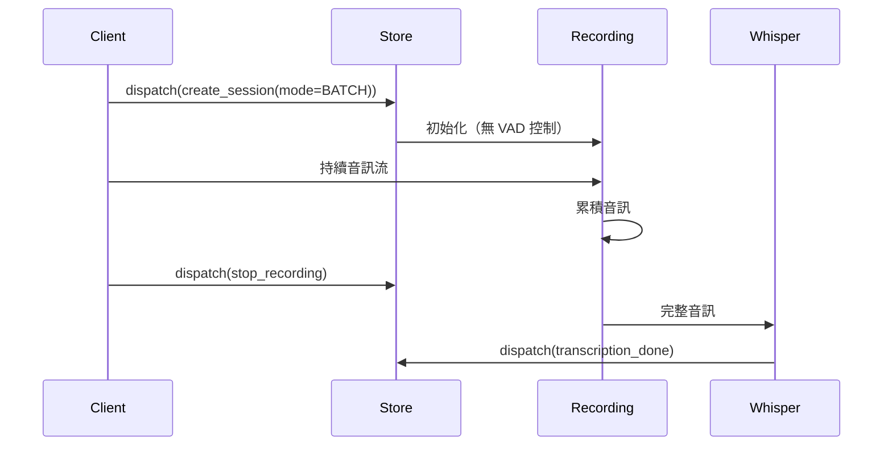
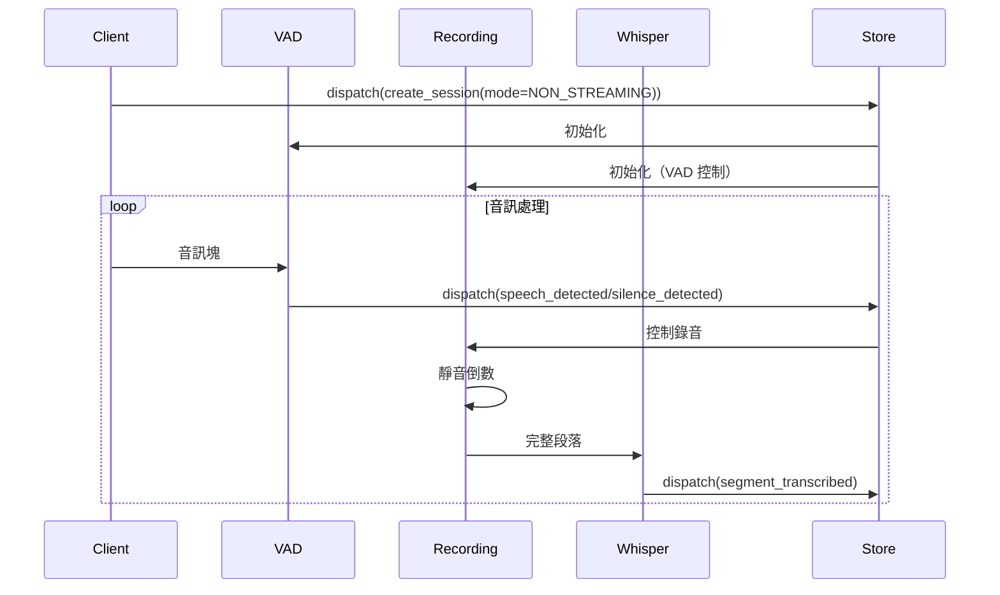
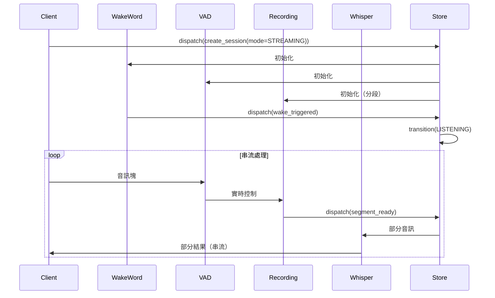
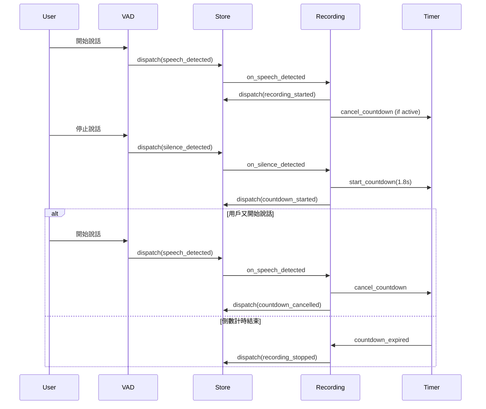

# ASRHub + PyStoreX 純事件驅動架構整合計畫

## 📋 項目概述
實現純事件驅動架構，使用 PyStoreX Effects 模式完全取代現有 SessionManager，所有 operators 直接與 store 互動，透過 Effects 驅動整個音訊處理管線。

**最後更新**: 2025-08-16
**狀態**: Phase 0-1 完成，Phase 2 準備開始
**預計完成**: 10 個工作天

## 🎯 整合目標
1. **完全取代 SessionManager** - PyStoreX 成為唯一的狀態管理中心
2. **純事件驅動** - 從 API 請求到音訊處理完全由事件驅動
3. **Effects 層驅動** - 使用 Effects 管理所有副作用和 operator 生命週期
4. **直接 Store 注入** - Operators 直接持有 store 引用並 dispatch actions
5. **Session 隔離** - 所有 actions 的 payload 包含 session_id 確保隔離

## ✅ 現有組件狀態

### 已完成組件
- ✅ **PyStoreX Store 架構** (`src/store/`)
  - Sessions 域：FSM 狀態管理
  - Stats 域：統計資訊追蹤
  - POC 驗證成功

- ✅ **OpenWakeWord Operator** (`src/pipeline/operators/wakeword/openwakeword.py`)
  - 支援回調函數：`set_detection_callback()`
  - 準備好接受 store 注入

- ✅ **Silero VAD Operator** (`src/pipeline/operators/vad/silero_vad.py`)
  - 支援語音事件回調：`set_speech_callbacks()`
  - 準備好接受 store 注入

- ✅ **Recording Operator** (`src/pipeline/operators/recording/recording_operator.py`)
  - 支援 VAD 控制錄音
  - 準備好接受 store 注入

- ✅ **Whisper Provider** (`src/providers/whisper/provider.py`)
  - 支援批次轉譯
  - 準備好接受 store 注入

### 需要擴展和創建的核心組件
- ⚠️ **SessionEffects** (`src/store/sessions/sessions_effects.py`) - **已存在，需擴展**
  - 現有：基礎 Effects 架構和模擬實現
  - 需要：擴展以驅動真實 operators
- ❌ **AudioQueueManager** - 管理音訊數據流（與 PyStoreX 信號分離）

### 架構決策
- ✅ **不需要 operators/ 或 providers/ 域** - 它們是無狀態執行器
- ✅ **所有 operator Effects 整合到 SessionEffects** - 單一 Effects 類管理所有副作用

## 📝 整合任務清單

### Phase 0: 移除舊架構 ⏱️ 0.5 天 ✅ 完成
- [x] **移除 SessionManager**
  - [x] 標記 `src/core/session_manager.py` 為 deprecated
  - [x] 移除所有 SessionManager 依賴關係
- [x] **清理 ASRHub 引用**
  - [x] 更新 `src/core/asr_hub.py` 改用 PyStoreX store
  - [x] 更新所有 import 語句
- [x] **創建 SessionMode 枚舉**
  - [x] 創建 `src/models/session_mode.py`
  - [x] 實現 BATCH, NON_STREAMING, STREAMING 三種模式
- [x] **額外完成：重構所有使用 SessionManager 的檔案**
  - [x] 擴展 `src/store/sessions/sessions_actions.py` - 新增 create_session, update_session_state, wake_session 等 actions
  - [x] 擴展 `src/store/sessions/sessions_selectors.py` - 新增 session_exists, get_session_state, get_session_metadata 等 selectors
  - [x] 重構 `src/core/asr_hub.py` - 使用 store 替代 SessionManager
  - [x] 重構 `src/api/base.py` - 使用 store 和 selectors
  - [x] 重構 `src/api/http_sse/server.py` - 完全移轉到 PyStoreX
  - [x] 重構 `src/api/websocket/server.py` - 使用 store dispatch 和 selectors
  - [x] 重構 `src/api/socketio/server.py` - 完全移轉到 PyStoreX
  - [x] 重構 `src/stream/stream_controller.py` - 使用 store dispatch 和 selectors
  - [x] 更新 `tools/wakeword_monitor.py` - 移除 SessionManager 依賴
  - [x] 更新 `tests/integration/visual/test_wakeword_visual.py` - 使用 store 替代

### Phase 0.5: FSM 依賴完全移除 ⏱️ 0.5 天 ✅ 完成（2025-08-16）
- [x] **核心系統 FSM 依賴替換**
  - [x] `src/core/asr_hub.py` - 移除 FSM imports，改用 PyStoreX sessions_actions 和 SessionState
  - [x] `src/core/timer_service.py` - 替換 FSMController 為 session_id，使用 store.dispatch
  - [x] `src/core/system_listener.py` - 完整重寫，移除 StateMachine，使用 PyStoreX store
  - [x] `src/stream/buffer_manager.py` - 替換 FSMController 為 session_id，使用 store 查詢狀態
  - [x] `src/pipeline/realtime_pipeline.py` - 替換 FSMController 為 session_id，使用 store.dispatch
- [x] **FSM 狀態查詢方法更新**
  - [x] 實現 helper 方法：`_is_idle()`, `_is_activated()`, `_can_wake()`
  - [x] 使用 store.state 查詢 session 狀態
  - [x] 替換所有 fsm.is_xxx() 調用為 PyStoreX 查詢
- [x] **事件處理機制更新**
  - [x] 替換 FSMEvent 為 PyStoreX actions
  - [x] 使用 store.dispatch 替代 fsm.trigger
  - [x] 實現 state_stream 訂閱替代回調

### Phase 1: Effects 層架構 ⏱️ 2 天 ✅ 框架完成（2024-08-16）

#### 1.1 擴展 SessionEffects ✅ 完成
- [x] 基礎 SessionEffects 架構已存在
- [x] **添加核心 Effects**
  - [x] `create_session$` - 初始化 session 和 operators（已實現基礎版本）
  - [x] `destroy_session$` - 清理資源和狀態（已實現基礎版本）
  - [x] `fsm_transition$` - 管理狀態轉換邏輯（已實現基礎版本）
- [x] **SessionMode 整合**
  - [x] 支援三種模式：BATCH, NON_STREAMING, STREAMING
  - [x] 使用 WeakValueDictionary 管理 operators 生命週期
  - [x] 實現 _setup_batch_mode, _setup_non_streaming_mode, _setup_streaming_mode

#### 1.2 整合 Operator Effects ✅ 框架完成
- [x] **語音處理 Effects**（基礎配置邏輯已實現）
  - [x] `wake_word_detection$` - 喚醒詞檢測管理（配置檢查邏輯）
  - [x] `vad_activity$` - VAD 語音活動處理（配置檢查邏輯）
  - [x] `recording_control$` - 錄音邏輯控制（配置檢查邏輯）
  - [x] `countdown_management$` - 靜音倒數計時管理（完整實現）
- [x] **轉譯處理 Effect**
  - [x] `transcription_processing$` - Whisper 轉譯調度（模擬實現）
  - [ ] 替換 mock_transcription_result 為真實實現（Phase 3）

#### 1.3 創建 AudioQueueManager ✅ 完成
- [x] **實現音訊佇列管理器** `src/core/audio_queue_manager.py`
  - [x] 基於 asyncio.Queue 的異步佇列
  - [x] Session 隔離機制 (session_id mapping)
  - [x] Push/Pull API 介面
  - [x] 環形緩衝區實現 (pre-recording)
  - [x] 獨立於 PyStoreX (數據/信號分離)

#### Phase 1 完成說明
**2024-08-16 完成 Phase 1 框架實現：**
- ✅ 所有 Operator Effects 框架已建立
- ✅ countdown_management_effect 完整實現（新增）
- ✅ 三種模式設置方法已添加配置邏輯
- ✅ 所有 Effects 都有基礎配置檢查邏輯
- ⚠️ 實際 Operator 類別實現推遲到 Phase 2
- ⚠️ 真實轉譯實現推遲到 Phase 3

**主要成就：**
1. 完成了事件驅動架構的核心框架
2. 實現了完整的倒數計時管理邏輯
3. 為每個模式設計了詳細的 operator 配置
4. 保持了架構的彈性和可擴展性

### Phase 2: Operator Store 注入 ⏱️ 2 天

#### 2.1 OpenWakeWord Operator ✅ 準備就緒
- [ ] **Store 注入支援**
  - [ ] 添加 store 參數到 `__init__`
  - [ ] 實現直接 dispatch wake_triggered action
  - [ ] 保留回調介面 (向後相容)

#### 2.2 Silero VAD Operator ✅ 準備就緒
- [ ] **Store 注入支援**
  - [ ] 添加 store 參數到 `__init__`
  - [ ] Dispatch speech_detected action
  - [ ] Dispatch silence_detected action
  - [ ] 確保只負責偵測，不控制錄音

#### 2.3 Recording Operator ✅ 準備就緒
- [ ] **雙重注入支援**
  - [ ] 注入 store 和 audio_queue_manager
  - [ ] 訂閱 VAD actions (speech/silence)
- [ ] **倒數計時邏輯**
  - [ ] 語音開始：dispatch recording_started 或取消倒數
  - [ ] 靜音開始：啟動 1.8 秒倒數計時
  - [ ] 倒數結束：dispatch recording_stopped
- [ ] **音訊數據管理**
  - [ ] 推送音訊到 AudioQueueManager

### Phase 3: Provider 整合與 API 層 ⏱️ 1.5 天

#### 3.1 Whisper Provider ✅ 準備就緒
- [ ] **Store 注入支援**
  - [ ] 添加 store 參數
  - [ ] Dispatch begin_transcription (開始)
  - [ ] Dispatch transcription_done (完成)

#### 3.2 API 層事件觸發
- [ ] **HTTP SSE API** (`src/api/http_sse.py`)
  - [ ] 連接時 dispatch create_session
  - [ ] 斷開時 dispatch destroy_session
  - [ ] 控制命令 dispatch control_command
- [ ] **其他協議支援** (視需要)
  - [ ] WebSocket
  - [ ] Socket.io

### Phase 4: Effects 註冊與啟動 ⏱️ 1 天

#### 4.1 Effects 註冊配置
- [ ] **更新 store_config.py**
  - [ ] 註冊 SessionEffects
  - [ ] 注入 AudioQueueManager
  - [ ] 注入 operator 實例
  - [ ] 驗證 Effects 啟動

#### 4.2 Store 初始化流程
- [ ] **更新 configure_global_store()**
  - [ ] 創建 AudioQueueManager 單例
  - [ ] 註冊所有 Effects
  - [ ] 注入 operators 和 providers

### Phase 5: 整合測試 ⏱️ 2 天

#### 5.1 單元測試
- [ ] **SessionEffects 測試**
  - [ ] Session 生命週期測試
  - [ ] Operator 管理測試
  - [ ] 錯誤處理測試
- [ ] **Operator Effects 測試**
  - [ ] 各 Effect 邏輯驗證
  - [ ] Action 鏈路測試
  - [ ] 併發場景測試

#### 5.2 端到端測試
- [ ] **事件驅動流程測試**
  - [ ] 完整處理鏈驗證
  - [ ] 狀態同步檢查
  - [ ] Action 序列驗證
- [ ] **Session 隔離測試**
  - [ ] 多會話並發測試
  - [ ] Session ID 追蹤
  - [ ] 資源隔離驗證

#### 5.3 性能測試
- [ ] **Store 性能測試**
  - [ ] Action dispatch 效能
  - [ ] 狀態查詢速度
  - [ ] 高併發處理能力
- [ ] **AudioQueue 性能測試**
  - [ ] 緩衝區 I/O 效能
  - [ ] 記憶體使用分析
  - [ ] 並發存取測試

### Phase 6: 演示和文檔 ⏱️ 1 天

#### 6.1 演示程式
- [ ] **互動式演示** (`examples/pystorex_demo.py`)
  - [ ] 狀態變化展示
  - [ ] 視覺化狀態流
- [ ] **實時監控** (`examples/real_time_monitor.py`)
  - [ ] 即時狀態顯示
  - [ ] 統計資訊面板
  - [ ] 性能指標追蹤

#### 6.2 文檔更新
- [ ] **README.md 更新**
  - [ ] PyStoreX 整合說明
  - [ ] 架構圖更新
  - [ ] 使用範例
- [ ] **整合指南** (`docs/pystorex_integration.md`)
  - [ ] 詳細實施指南
  - [ ] API 參考文檔
  - [ ] 最佳實踐
- [ ] **狀態管理文檔** (`docs/state_management.md`)
  - [ ] 狀態結構
  - [ ] Actions 清單
  - [ ] Selectors 指南

### Phase 7: Store 封裝優化 ⏱️ 0.5 天 ✅ 完成（2025-08-16）

#### 7.1 Store 封裝分析 ✅ 完成
- [x] **使用 zen thinkdeep 分析 Store 封裝設計**
  - [x] 評估當前 ASRHubStore 過度封裝問題
  - [x] 識別出 60% 不必要的 API 轉發代碼
  - [x] 建議最小封裝方案（50 行 vs 152 行）

#### 7.2 最小化封裝實現 ✅ 完成
- [x] **重構 store_config.py**
  - [x] 移除不必要的 API 轉發方法
  - [x] 保留必要功能：延遲初始化、測試隔離、集中配置
  - [x] 實現全局 Store 直接返回 PyStoreX Store 實例
  - [x] 添加向後兼容層（ASRHubStore 已標記為棄用）

#### 7.3 架構決策記錄 ✅ 完成
- [x] **最小封裝原則**
  - [x] 防止循環依賴（延遲初始化）
  - [x] 測試隔離（reset_global_store）
  - [x] 集中配置（單一註冊點）
  - [x] 不做 API 轉發（直接使用 PyStoreX）

## 🔧 技術細節

### FSM 策略模式整合

#### SessionMode 定義
```python
# src/models/session_mode.py
from enum import Enum

class SessionMode(Enum):
    """會話處理模式"""
    BATCH = "batch"                # 批次模式：收集完整音訊後一次處理
    NON_STREAMING = "non_streaming" # 非串流實時：逐塊處理但等待完整結果
    STREAMING = "streaming"         # 串流實時：逐塊處理並串流輸出

# src/store/sessions/session_actions.py 擴展
def create_session(session_id: str, mode: SessionMode, client_info: dict = None):
    """創建會話時指定處理模式"""
    return {
        'type': 'sessions/create_session',
        'payload': {
            'session_id': session_id,
            'mode': mode.value,  # 傳遞模式到 Effects
            'client_info': client_info
        }
    }
```

#### SessionEffects 策略路由
```python
# src/store/sessions/sessions_effects.py 擴展
class SessionEffects:
    """根據模式路由到不同的處理策略"""
    
    async def _handle_create_session(self, action):
        session_id = action.payload['session_id']
        mode = SessionMode(action.payload.get('mode', 'streaming'))
        
        # 根據模式配置不同的 operator 行為
        if mode == SessionMode.BATCH:
            return await self._setup_batch_mode(session_id)
        elif mode == SessionMode.NON_STREAMING:
            return await self._setup_non_streaming_mode(session_id)
        else:  # STREAMING
            return await self._setup_streaming_mode(session_id)
    
    async def _setup_batch_mode(self, session_id: str):
        """批次模式：收集完整音訊"""
        # 1. 不啟動實時 VAD，只做事後分析
        # 2. Recording operator 持續錄製直到手動停止
        # 3. 完整音訊送入 Whisper 一次轉譯
        
        recording = RecordingOperator(store=self.store)
        recording.vad_controlled = False  # 關閉 VAD 控制
        recording.max_duration = 300  # 5 分鐘上限
        
        await recording.initialize()
        _operator_instances['recording'][session_id] = recording
        
        # 不啟動 VAD
        logger.info(f"Session {session_id} 配置為批次模式")
        return session_id
    
    async def _setup_non_streaming_mode(self, session_id: str):
        """非串流實時模式：逐塊處理但等待完整結果"""
        # 1. 啟動 VAD 進行實時偵測
        # 2. Recording 根據 VAD 自動分段
        # 3. 每段完成後送 Whisper，但等待完整結果
        
        vad = SileroVADOperator(store=self.store)
        recording = RecordingOperator(
            store=self.store,
            audio_queue_manager=self.audio_queue_manager
        )
        recording.vad_controlled = True
        recording.silence_countdown_duration = 1.8
        
        # 設定 VAD 回調來控制錄音
        vad.set_speech_callbacks(
            start_callback=lambda _: recording.start_recording(session_id),
            end_callback=lambda _: recording.stop_recording(session_id)
        )
        
        await vad.initialize()
        await recording.initialize()
        
        _operator_instances['vad'][session_id] = vad
        _operator_instances['recording'][session_id] = recording
        
        logger.info(f"Session {session_id} 配置為非串流實時模式")
        return session_id
    
    async def _setup_streaming_mode(self, session_id: str):
        """串流實時模式：逐塊處理並串流輸出"""
        # 1. 啟動所有 operators（VAD, WakeWord, Recording）
        # 2. 使用較短的靜音閾值快速分段
        # 3. 支援部分結果串流輸出
        
        wakeword = OpenWakeWordOperator(store=self.store)
        vad = SileroVADOperator(store=self.store)
        recording = RecordingOperator(
            store=self.store,
            audio_queue_manager=self.audio_queue_manager
        )
        
        # 串流模式配置
        vad.min_silence_duration = 0.5  # 更短的靜音閾值
        recording.vad_controlled = True
        recording.silence_countdown_duration = 1.0  # 更快的分段
        recording.segment_duration = 10  # 10 秒自動分段
        
        # 設定串流回調鏈
        await self._setup_streaming_callbacks(
            session_id, wakeword, vad, recording
        )
        
        await wakeword.initialize()
        await vad.initialize()
        await recording.initialize()
        
        _operator_instances['wakeword'][session_id] = wakeword
        _operator_instances['vad'][session_id] = vad
        _operator_instances['recording'][session_id] = recording
        
        logger.info(f"Session {session_id} 配置為串流實時模式")
        return session_id
    
    async def _setup_streaming_callbacks(self, session_id, wakeword, vad, recording):
        """配置串流模式的回調鏈"""
        # 喚醒詞觸發開始監聽
        wakeword.set_detection_callback(
            lambda detection: self.store.dispatch(wake_triggered(
                session_id=session_id,
                **detection
            ))
        )
        
        # VAD 控制錄音和分段
        vad.set_speech_callbacks(
            start_callback=lambda _: self.store.dispatch(speech_detected(
                session_id=session_id,
                timestamp=time.time()
            )),
            end_callback=lambda _: self.store.dispatch(silence_detected(
                session_id=session_id,
                timestamp=time.time()
            ))
        )
        
        # 錄音段落完成觸發部分轉譯
        recording.segment_complete_callback = lambda segment: self.store.dispatch(
            request_partial_transcription(
                session_id=session_id,
                audio_segment=segment
            )
        )
```

#### 模式切換 Effect
```python
@create_effect
def switch_session_mode$(self, action_stream):
    """動態切換會話模式"""
    return action_stream.pipe(
        ops.filter(lambda a: a.type == switch_mode.type),
        ops.flat_map(self._handle_mode_switch),
        ops.map(lambda result: mode_switched(**result))
    )

async def _handle_mode_switch(self, action):
    session_id = action.payload['session_id']
    new_mode = SessionMode(action.payload['new_mode'])
    
    # 停止現有 operators
    for operator_type in _operator_instances:
        if session_id in _operator_instances[operator_type]:
            operator = _operator_instances[operator_type][session_id]
            await operator.cleanup()
            del _operator_instances[operator_type][session_id]
    
    # 根據新模式重新設定
    if new_mode == SessionMode.BATCH:
        await self._setup_batch_mode(session_id)
    elif new_mode == SessionMode.NON_STREAMING:
        await self._setup_non_streaming_mode(session_id)
    else:
        await self._setup_streaming_mode(session_id)
    
    return {'session_id': session_id, 'new_mode': new_mode.value}
```

#### 模式特定的音訊處理流程

##### 批次模式流程


##### 非串流實時模式流程


##### 串流實時模式流程


### 事件驅動流程圖


### Operator 模型管理架構

#### 設計原則
1. **模型共享，狀態隔離** - ONNX 模型在類別層級共享，operator 實例維護獨立狀態
2. **懶載入** - 模型在首次使用時載入，避免啟動時的資源浪費
3. **自動生命週期** - 使用 WeakValueDictionary 自動管理實例生命週期
4. **去中心化管理** - 每個 operator 類別管理自己的模型

#### BaseOperator 增強
```python
# src/pipeline/operators/base.py 增強
from typing import ClassVar, Optional, Any
from abc import ABC, abstractmethod

class OperatorBase(ABC):
    """增強的 Operator 基礎類別，支援類別層級模型管理"""
    
    # 類別變數：所有實例共享
    _model: ClassVar[Optional[Any]] = None
    _model_loaded: ClassVar[bool] = False
    _model_lock: ClassVar[asyncio.Lock] = asyncio.Lock()
    
    @classmethod
    async def preload_model(cls, force_reload: bool = False) -> None:
        """
        預載入模型到類別層級（所有實例共享）
        
        Args:
            force_reload: 是否強制重新載入
        """
        # 基礎類別不實作，子類別可選擇性覆寫
        pass
    
    @classmethod
    def get_shared_model(cls) -> Optional[Any]:
        """獲取共享模型實例"""
        return cls._model
    
    @classmethod
    def is_model_loaded(cls) -> bool:
        """檢查模型是否已載入"""
        return cls._model_loaded
```

#### Operator 實作範例
```python
# src/pipeline/operators/vad/silero_vad.py
class SileroVADOperator(OperatorBase):
    """使用共享模型的 VAD Operator"""
    
    @classmethod
    async def preload_model(cls, force_reload: bool = False) -> None:
        """預載入 Silero VAD 模型到類別層級"""
        async with cls._model_lock:
            if cls._model_loaded and not force_reload:
                return
            
            logger.info("載入 Silero VAD 模型到類別層級...")
            
            # 載入 ONNX 模型（唯讀，執行緒安全）
            model_path = await ensure_vad_model()
            cls._model = ort.InferenceSession(
                str(model_path),
                providers=['CPUExecutionProvider']
            )
            cls._model_loaded = True
            
            logger.info("✓ Silero VAD 模型已載入（共享）")
    
    def __init__(self):
        super().__init__()
        # 實例狀態（每個 session 獨立）
        self.h = None  # LSTM 隱藏狀態
        self.c = None  # LSTM 細胞狀態
        self.audio_buffer = bytearray()
        self.in_speech = False
        self.speech_start_time = None
    
    async def _initialize(self):
        """初始化實例狀態"""
        # 確保模型已載入
        if not self.__class__.is_model_loaded():
            await self.__class__.preload_model()
        
        # 初始化實例專屬狀態
        self.h = np.zeros((2, 1, 64), dtype=np.float32)
        self.c = np.zeros((2, 1, 64), dtype=np.float32)
        self.audio_buffer.clear()
    
    async def _run_vad_inference(self, audio_chunk: np.ndarray) -> float:
        """執行推論（使用共享模型，獨立狀態）"""
        model = self.__class__.get_shared_model()
        if not model:
            raise PipelineError("VAD 模型未載入")
        
        # 使用共享模型，但傳入實例專屬狀態
        ort_inputs = {
            'input': audio_chunk,
            'sr': np.array(16000, dtype=np.int64),
            'h': self.h,  # 實例專屬狀態
            'c': self.c   # 實例專屬狀態
        }
        
        # 執行推論（ONNX Runtime 內部處理執行緒安全）
        outputs = model.run(None, ort_inputs)
        
        # 更新實例狀態
        self.h = outputs[1]
        self.c = outputs[2]
        
        return outputs[0][0].item()
```

#### SessionEffects 與實例管理
```python
# src/store/sessions/sessions_effects.py
from weakref import WeakValueDictionary
from typing import Dict, Any

# 模組層級的實例管理（自動清理）
_operator_instances: Dict[str, WeakValueDictionary] = {
    'wakeword': WeakValueDictionary(),
    'vad': WeakValueDictionary(),
    'recording': WeakValueDictionary()
}

class SessionEffects:
    """管理 operator 生命週期的 Effects"""
    
    def __init__(self, store, audio_queue_manager):
        self.store = store
        self.audio_queue_manager = audio_queue_manager
        # 不在 Effects 中儲存狀態！
    
    @create_effect
    def create_session$(self, action_stream):
        """監聽 create_session action 並啟動 operators"""
        return action_stream.pipe(
            ops.filter(lambda a: a.type == create_session.type),
            ops.flat_map(self._handle_create_session),
            ops.map(lambda session_id: session_created(session_id))
        )
    
    async def _handle_create_session(self, action):
        session_id = action.payload['session_id']
        
        # 創建輕量級 operator 實例（模型已共享）
        wakeword = OpenWakeWordOperator(store=self.store)
        vad = SileroVADOperator(store=self.store)
        recording = RecordingOperator(
            store=self.store,
            audio_queue_manager=self.audio_queue_manager
        )
        
        # 初始化實例狀態
        await wakeword.initialize()
        await vad.initialize()
        await recording.initialize()
        
        # 儲存到模組層級字典（自動生命週期管理）
        _operator_instances['wakeword'][session_id] = wakeword
        _operator_instances['vad'][session_id] = vad
        _operator_instances['recording'][session_id] = recording
        
        return session_id
    
    @create_effect
    def destroy_session$(self, action_stream):
        """清理 session 資源"""
        return action_stream.pipe(
            ops.filter(lambda a: a.type == destroy_session.type),
            ops.flat_map(self._handle_destroy_session),
            ops.map(lambda session_id: session_destroyed(session_id))
        )
    
    async def _handle_destroy_session(self, action):
        session_id = action.payload['session_id']
        
        # WeakValueDictionary 會自動清理
        # 但我們仍可主動刪除以立即釋放資源
        for operator_type in _operator_instances:
            _operator_instances[operator_type].pop(session_id, None)
        
        return session_id
```

### 系統啟動時的模型預載入
```python
# src/core/asr_hub.py 或應用程式入口
async def initialize_system():
    """系統初始化，預載入所有模型"""
    
    # 預載入模型到類別層級（一次性）
    logger.info("預載入 AI 模型...")
    
    # 並行載入所有模型
    await asyncio.gather(
        SileroVADOperator.preload_model(),
        OpenWakeWordOperator.preload_model(),
        # 其他需要模型的 operators...
    )
    
    logger.info("✓ 所有模型已預載入")
    
    # 初始化 PyStoreX
    configure_global_store()
    
    # 其他系統初始化...
```

### Operator 直接 Dispatch 範例
```python
# 修改後的 OpenWakeWord Operator
class OpenWakeWordOperator(OperatorBase):
    def __init__(self, store=None):
        super().__init__()
        self.store = store  # 直接持有 store 引用
    
    async def process(self, audio_data, session_id=None, **kwargs):
        # 處理音訊...
        if detection_found and self.store:
            # 直接 dispatch action
            self.store.dispatch(wake_triggered(
                session_id=session_id,
                confidence=confidence,
                trigger=model_name
            ))

# 修改後的 VAD Operator（只負責語音活動偵測）
class SileroVADOperator(OperatorBase):
    def __init__(self, store=None):
        super().__init__()
        self.store = store
    
    async def process(self, audio_data, session_id=None, **kwargs):
        # VAD 推論...
        speech_prob = await self._run_vad_inference(audio_chunk)
        
        if speech_prob > self.threshold:
            # 偵測到語音，dispatch 事件
            self.store.dispatch(speech_detected(
                session_id=session_id,
                confidence=speech_prob,
                timestamp=time.time()
            ))
        else:
            # 偵測到靜音，dispatch 事件
            self.store.dispatch(silence_detected(
                session_id=session_id,
                duration=silence_duration,
                timestamp=time.time()
            ))

# 修改後的 Recording Operator（負責錄音邏輯控制）
class RecordingOperator(OperatorBase):
    def __init__(self, store=None):
        super().__init__()
        self.store = store
        self.is_recording = False
        self.countdown_timer = None
    
    def subscribe_to_vad(self):
        """訂閱 VAD 事件"""
        # 監聽 speech_detected action
        self.store.subscribe(speech_detected.type, self.on_speech_detected)
        # 監聽 silence_detected action
        self.store.subscribe(silence_detected.type, self.on_silence_detected)
    
    async def on_speech_detected(self, action):
        """處理語音偵測事件"""
        session_id = action.payload['session_id']
        
        if not self.is_recording:
            # 開始錄音
            self.is_recording = True
            self.store.dispatch(recording_started(
                session_id=session_id,
                trigger="vad_speech"
            ))
        elif self.countdown_timer:
            # 取消倒數計時
            self.countdown_timer.cancel()
            self.store.dispatch(countdown_cancelled(
                session_id=session_id
            ))
    
    async def on_silence_detected(self, action):
        """處理靜音偵測事件"""
        session_id = action.payload['session_id']
        
        if self.is_recording and not self.countdown_timer:
            # 開始倒數計時
            self.countdown_timer = asyncio.create_task(
                self._countdown(session_id, 1.8)
            )
            self.store.dispatch(countdown_started(
                session_id=session_id,
                duration=1.8
            ))
    
    async def _countdown(self, session_id: str, duration: float):
        """倒數計時邏輯"""
        await asyncio.sleep(duration)
        # 倒數結束，停止錄音
        self.is_recording = False
        self.store.dispatch(recording_stopped(
            session_id=session_id,
            reason="silence_timeout"
        ))
```

### AudioQueue 與 PyStoreX 分離
```python
# AudioQueueManager - 管理實際音訊數據
class AudioQueueManager:
    def __init__(self):
        self.queues = {}  # session_id -> asyncio.Queue
    
    async def push(self, session_id: str, audio_chunk: bytes):
        if session_id not in self.queues:
            self.queues[session_id] = asyncio.Queue()
        await self.queues[session_id].put(audio_chunk)
    
    async def pull(self, session_id: str) -> bytes:
        if session_id in self.queues:
            return await self.queues[session_id].get()

# PyStoreX 只存信號
# session.audio_buffer 存的是 {size: 1024, timestamp: ...} 而非實際數據
```

### 架構優勢與資源分析

#### 記憶體使用估算
```yaml
模型共享架構:
  ONNX 模型（共享）:
    Silero_VAD: ~8MB （一次載入）
    OpenWakeWord: ~3MB （一次載入）
    總計: ~11MB （所有 sessions 共享）
  
  每個 Session 實例:
    VAD 狀態:
      LSTM_states: ~20KB （h, c 張量）
      audio_buffer: ~32KB （2秒緩衝）
      metadata: ~1KB
    WakeWord 狀態:
      score_queue: ~1KB （60 幀歷史）
      audio_buffer: ~16KB （1秒緩衝）
    Recording 狀態:
      audio_buffer: 可配置（預設 ~100KB）
    總計: ~170KB/session
  
  100 個並發 sessions:
    模型: 11MB （共享）
    狀態: 17MB （100 × 170KB）
    總計: ~28MB

舊架構（每 session 獨立模型）:
  100 個並發 sessions:
    模型: 1100MB （100 × 11MB）
    狀態: 17MB
    總計: ~1117MB

節省: 97.5% 記憶體使用
```

#### 並發推論分析
```yaml
ONNX Runtime 執行緒安全性:
  特性:
    - InferenceSession.run() 是執行緒安全的
    - 內部使用讀鎖，多執行緒可並行推論
    - 無需外部同步機制
  
  效能影響:
    - CPU: 幾乎線性擴展到核心數
    - GPU: 自動批次處理，提升吞吐量
    - 延遲: 無額外開銷（相比獨立模型）
  
  實測數據（8 核心 CPU）:
    單 session: ~5ms/推論
    10 sessions: ~6ms/推論（並行）
    100 sessions: ~8ms/推論（佇列）
```

#### 關鍵設計決策
1. **為何不集中管理模型？**
   - 每個 Operator 最了解自己的模型需求
   - 避免中央管理器成為瓶頸
   - 支援異質模型（ONNX、PyTorch、TensorFlow）

2. **為何使用 WeakValueDictionary？**
   - 自動垃圾回收未使用的 operator 實例
   - 防止記憶體洩漏
   - 簡化生命週期管理

3. **為何在類別層級管理模型？**
   - Python 類別變數天然共享
   - 避免全域變數污染
   - 支援多種 operator 類型獨立管理

## 📊 預期成果

1. **純事件驅動**：從 API 到音訊處理完全事件驅動
2. **單一狀態源**：PyStoreX 作為唯一的真相來源
3. **Effects 管理副作用**：所有異步操作透過 Effects 管理
4. **Session 完全隔離**：透過 session_id 確保多會話隔離
5. **高度可測試**：Effects 和 Actions 易於單元測試
6. **擴展性強**：新增功能只需添加 Actions 和 Effects

## 🚀 實施計畫

### 執行順序
1. **Day 1**: Phase 0 - 移除舊架構 (0.5 天)
2. **Day 1-3**: Phase 1 - Effects 層架構 (2 天)
3. **Day 3-5**: Phase 2 - Operator Store 注入 (2 天)
4. **Day 5-6**: Phase 3 - Provider & API 整合 (1.5 天)
5. **Day 7**: Phase 4 - Effects 註冊啟動 (1 天)
6. **Day 8-9**: Phase 5 - 整合測試 (2 天)
7. **Day 10**: Phase 6 - 演示和文檔 (1 天)

### 關鍵里程碑
- **Day 3**: SessionManager 完全移除
- **Day 5**: 所有 Operators 支援 Store
- **Day 7**: Effects 系統運作
- **Day 9**: 測試全部通過
- **Day 10**: 文檔完成，可交付

## 📝 關鍵注意事項

### 架構原則
1. **完全替換**: PyStoreX 完全取代 SessionManager，無過渡期
2. **數據分離**: 音訊數據走 AudioQueue，狀態信號走 Store
3. **單一職責**: 每個 Operator 只負責特定功能
4. **修改優先**: 擴展現有組件而非創建新組件

### 技術要點
1. **Session ID**: 所有 actions 必須包含 session_id
2. **Effect 處理**: 使用 flat_map, switch_map 處理異步
3. **錯誤處理**: Effects 需要重試和降級機制
4. **生命週期**: Effects 管理 operators 完整生命週期

### 實施策略
1. **漸進式整合**: 逐步替換，確保穩定性
2. **充分測試**: 每個 Phase 完成後進行驗證
3. **文檔同步**: 實施過程中持續更新文檔
4. **性能監控**: 關注記憶體和 CPU 使用

## 🎯 驗收標準

### 功能要求
- [ ] SessionManager 完全移除
- [ ] PyStoreX 管理所有狀態
- [ ] 完整事件驅動流程
- [ ] Session 完全隔離
- [ ] 三種模式可動態切換

### 性能指標
- [ ] 記憶體節省 > 90%（模型共享）
- [ ] 性能開銷 < 3%
- [ ] 響應延遲 < 10ms
- [ ] 並發支援 > 100 sessions

### 質量標準
- [ ] 測試覆蓋率 > 85%
- [ ] 文檔完整性 100%
- [ ] 錯誤處理率 > 95%
- [ ] 代碼審查通過

## 📊 FSM 模式選擇指南

### 模式特性對比
| 特性 | 批次模式 | 非串流實時 | 串流實時 |
|------|---------|------------|----------|
| 延遲 | 高（等待完整音訊） | 中（等待段落） | 低（即時） |
| 資源使用 | 低（無實時處理） | 中 | 高 |
| 準確度 | 最高（完整上下文） | 高 | 中 |
| 用戶體驗 | 簡單 | 平衡 | 互動性強 |
| 適用場景 | 錄音轉文字 | 會議記錄 | 即時對話 |

### 模式選擇建議
```python
def select_session_mode(use_case: str) -> SessionMode:
    """根據使用場景選擇合適的模式"""
    
    mode_mapping = {
        # 批次模式：完整性優先
        'transcription': SessionMode.BATCH,
        'audio_file': SessionMode.BATCH,
        'voicemail': SessionMode.BATCH,
        
        # 非串流實時：平衡模式
        'meeting': SessionMode.NON_STREAMING,
        'interview': SessionMode.NON_STREAMING,
        'dictation': SessionMode.NON_STREAMING,
        
        # 串流實時：互動優先
        'conversation': SessionMode.STREAMING,
        'assistant': SessionMode.STREAMING,
        'live_caption': SessionMode.STREAMING,
    }
    
    return mode_mapping.get(use_case, SessionMode.STREAMING)
```

### 動態模式切換
系統支援在會話期間動態切換模式：
```python
# 從串流切換到批次（例如：用戶希望更準確的結果）
store.dispatch(switch_mode(
    session_id=session_id,
    new_mode=SessionMode.BATCH
))

# 從批次切換到串流（例如：用戶需要即時回饋）
store.dispatch(switch_mode(
    session_id=session_id,
    new_mode=SessionMode.STREAMING
))
```

## 📅 專案時程表

| 階段 | 工作天 | 依賴關係 | 關鍵交付物 | 風險等級 |
|------|--------|----------|-----------|----------|
| Phase 0 | 0.5 | - | SessionManager 移除 | 低 |
| Phase 1 | 2.0 | Phase 0 | Effects 層架構 | 中 |
| Phase 2 | 2.0 | Phase 1 | Operator Store 注入 | 中 |
| Phase 3 | 1.5 | Phase 2 | Provider & API 整合 | 低 |
| Phase 4 | 1.0 | Phase 3 | Effects 註冊啟動 | 低 |
| Phase 5 | 2.0 | Phase 4 | 測試套件完成 | 高 |
| Phase 6 | 1.0 | Phase 5 | 文檔和演示 | 低 |
| **總計** | **10天** | - | **純事件驅動架構** | - |

## 🔄 後續優化計畫

### 短期優化 (1-2 週)
1. **Effect 組合器** - 複雜 Effect 組合模式
2. **智能重試** - 斷路器和重試機制
3. **性能監控** - 執行時間和資源追蹤

### 中期優化 (1 個月)
1. **狀態持久化** - 關鍵狀態儲存
2. **時間旅行調試** - Redux DevTools 整合
3. **進階測試** - 壓力測試和混沌工程

### 長期優化 (3 個月)
1. **分散式 Effects** - 跨進程執行
2. **雲端整合** - 支援雲端 ASR 服務
3. **AI 優化** - 智能路由和負載均衡