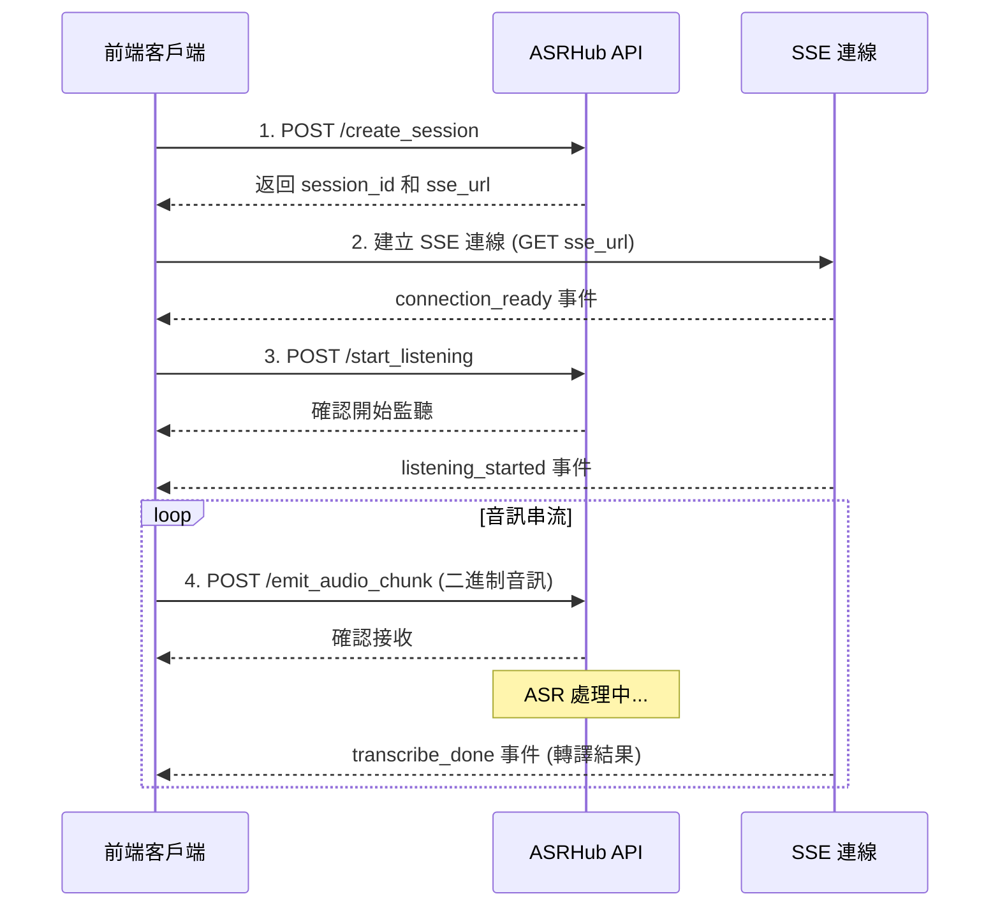

# ASRHub HTTP SSE API 串接指南

## 概述

ASRHub 提供基於 HTTP Server-Sent Events (SSE) 的即時語音識別服務。前端應用程式可以透過 HTTP POST 發送音訊資料，並透過 SSE 接收即時轉譯結果。

## API 基本資訊

- **Base URL**: `http://{host}:{port}/api/v1`
- **預設 Host**: `0.0.0.0`
- **預設 Port**: `8000`
- **協定**: HTTP + SSE (Server-Sent Events)

## 串接流程總覽



## 詳細 API 端點說明

### 1. 建立會話 (Create Session)

建立新的 ASR 會話，取得 session_id 和 SSE 連線 URL。

**端點**: `POST /api/v1/create_session`

**Request Body**:
```json
{
    "strategy": "non_streaming",  // 轉譯策略: "non_streaming" 或 "streaming"
    "request_id": "optional-uuid"  // 選填，追蹤用的請求 ID
}
```

**Response**:
```json
{
    "session_id": "uuid-v7-格式的會話ID",
    "request_id": "請求ID",
    "sse_url": "http://{host}:{port}/api/v1/sessions/{session_id}/events",
    "audio_url": "http://{host}:{port}/api/v1/sessions/{session_id}/audio"
}
```

**重要**: 
- 取得 `sse_url` 後，必須立即建立 SSE 連線以接收事件
- `session_id` 用於後續所有 API 呼叫

### 2. 建立 SSE 連線

使用從 create_session 取得的 `sse_url` 建立 SSE 連線。

**端點**: `GET {sse_url}`

**Headers**:
```http
Accept: text/event-stream
```

**SSE 事件流範例**:
```javascript
const eventSource = new EventSource(sse_url);

eventSource.addEventListener('connection_ready', (event) => {
    const data = JSON.parse(event.data);
    console.log('SSE 連線就緒', data);
});

eventSource.addEventListener('transcribe_done', (event) => {
    const data = JSON.parse(event.data);
    console.log('轉譯結果:', data.text);
});
```

### 3. 開始監聽 (Start Listening)

設定音訊參數並開始監聽。

**端點**: `POST /api/v1/start_listening`

**Request Body**:
```json
{
    "session_id": "從 create_session 取得的 session_id",
    "sample_rate": 16000,      // 取樣率 (Hz)
    "channels": 1,              // 聲道數
    "format": "int16"           // 音訊格式
}
```

**Response**:
```json
{
    "session_id": "會話ID",
    "sample_rate": 16000,
    "channels": 1,
    "format": "int16",
    "status": "listening"
}
```

### 4. 發送音訊資料 (Emit Audio Chunk)

發送二進制音訊資料進行轉譯。使用 metadata + 分隔符 + 二進制資料的格式。

**端點**: `POST /api/v1/emit_audio_chunk`

**Headers**:
```http
Content-Type: application/octet-stream
```

**Request Body 格式**: 
```
[JSON Metadata] + [分隔符 0x00 0x00 0xFF 0xFF] + [二進制音訊資料]
```

**Metadata JSON 結構**:
```json
{
    "session_id": "從 create_session 取得的 session_id",  // 必填
    "chunk_id": "chunk_001"  // 選填，用於追蹤
}
```

**音訊資料規格**:
- 格式: PCM 16-bit signed integer
- 取樣率和聲道數: 使用 start_listening 時設定的參數
- 建議每次發送 0.1-0.5 秒的音訊資料
- 系統會自動根據 session 設定進行格式轉換

**Response**:
```json
{
    "session_id": "會話ID",
    "chunk_id": "chunk_001",
    "bytes_received": 3200,
    "status": "received"
}
```

**JavaScript 範例**:
```javascript
// 從麥克風取得音訊並發送
async function sendAudioChunk(audioBuffer, sessionId) {
    // 準備 metadata
    const metadata = {
        session_id: sessionId,
        chunk_id: `chunk_${Date.now()}`
    };
    
    // 轉換 metadata 為 UTF-8 字節
    const metadataBytes = new TextEncoder().encode(JSON.stringify(metadata));
    
    // 定義分隔符
    const separator = new Uint8Array([0x00, 0x00, 0xFF, 0xFF]);
    
    // 組合完整訊息: metadata + separator + audio
    const fullMessage = new Uint8Array(
        metadataBytes.length + separator.length + audioBuffer.byteLength
    );
    fullMessage.set(metadataBytes, 0);
    fullMessage.set(separator, metadataBytes.length);
    fullMessage.set(new Uint8Array(audioBuffer), metadataBytes.length + separator.length);
    
    // 發送到伺服器
    const response = await fetch('/api/v1/emit_audio_chunk', {
        method: 'POST',
        headers: {
            'Content-Type': 'application/octet-stream'
        },
        body: fullMessage
    });
    
    return response.json();
}
```

## SSE 事件類型

透過 SSE 連線接收的事件：

### connection_ready
SSE 連線建立成功
```json
{
    "session_id": "會話ID",
    "timestamp": "2024-01-20T10:30:00.000Z"
}
```

### session_created
會話建立確認
```json
{
    "session_id": "會話ID",
    "timestamp": "2024-01-20T10:30:00.000Z"
}
```

### listening_started
開始監聽確認
```json
{
    "session_id": "會話ID",
    "sample_rate": 16000,
    "channels": 1,
    "format": "int16",
    "timestamp": "2024-01-20T10:30:00.000Z"
}
```

### transcribe_done
轉譯結果
```json
{
    "session_id": "會話ID",
    "text": "識別出的文字內容",
    "confidence": 0.95,         // 選填，信心度分數
    "language": "zh",           // 選填，語言代碼
    "duration": 2.5,            // 選填，音訊長度（秒）
    "timestamp": "2024-01-20T10:30:00.000Z"
}
```

### play_asr_feedback
ASR 回饋音播放控制
```json
{
    "session_id": "會話ID",
    "command": "play",          // "play" 或 "stop"
    "timestamp": "2024-01-20T10:30:00.000Z"
}
```

### heartbeat
保持連線的心跳訊號（每 30 秒）
```json
{
    "session_id": "會話ID",
    "timestamp": "2024-01-20T10:30:00.000Z",
    "sequence": 1
}
```

### error_reported
錯誤通知
```json
{
    "session_id": "會話ID",
    "error_code": "AUDIO_FORMAT_ERROR",
    "error_message": "不支援的音訊格式",
    "timestamp": "2024-01-20T10:30:00.000Z"
}
```

## 完整前端串接範例

```javascript
class ASRHubClient {
    constructor(baseUrl = 'http://localhost:8000/api/v1') {
        this.baseUrl = baseUrl;
        this.sessionId = null;
        this.eventSource = null;
    }

    // Step 1: 建立會話
    async createSession() {
        const response = await fetch(`${this.baseUrl}/create_session`, {
            method: 'POST',
            headers: { 'Content-Type': 'application/json' },
            body: JSON.stringify({
                strategy: 'non_streaming',
                request_id: crypto.randomUUID()
            })
        });
        
        const data = await response.json();
        this.sessionId = data.session_id;
        
        // Step 2: 建立 SSE 連線
        this.setupSSE(data.sse_url);
        
        return data;
    }

    // 設定 SSE 事件監聽
    setupSSE(sseUrl) {
        this.eventSource = new EventSource(sseUrl);
        
        // 連線就緒
        this.eventSource.addEventListener('connection_ready', (event) => {
            console.log('✅ SSE 連線就緒');
        });
        
        // 轉譯結果
        this.eventSource.addEventListener('transcribe_done', (event) => {
            const data = JSON.parse(event.data);
            this.onTranscriptionReceived(data.text, data.confidence);
        });
        
        // 錯誤處理
        this.eventSource.addEventListener('error_reported', (event) => {
            const data = JSON.parse(event.data);
            console.error(`❌ 錯誤: ${data.error_message}`);
        });
        
        // 心跳
        this.eventSource.addEventListener('heartbeat', (event) => {
            console.log('💓 Heartbeat');
        });
    }

    // Step 3: 開始監聽
    async startListening(sampleRate = 16000) {
        const response = await fetch(`${this.baseUrl}/start_listening`, {
            method: 'POST',
            headers: { 'Content-Type': 'application/json' },
            body: JSON.stringify({
                session_id: this.sessionId,
                sample_rate: sampleRate,
                channels: 1,
                format: 'int16'
            })
        });
        
        return response.json();
    }

    // Step 4: 發送音訊
    async sendAudio(audioBuffer) {
        // 準備 metadata
        const metadata = {
            session_id: this.sessionId,
            chunk_id: `chunk_${Date.now()}`
        };
        
        // 轉換 metadata 為 UTF-8 字節
        const metadataBytes = new TextEncoder().encode(JSON.stringify(metadata));
        
        // 定義分隔符
        const separator = new Uint8Array([0x00, 0x00, 0xFF, 0xFF]);
        
        // 組合完整訊息: metadata + separator + audio
        const fullMessage = new Uint8Array(
            metadataBytes.length + separator.length + audioBuffer.byteLength
        );
        fullMessage.set(metadataBytes, 0);
        fullMessage.set(separator, metadataBytes.length);
        fullMessage.set(new Uint8Array(audioBuffer), metadataBytes.length + separator.length);
        
        // 發送到伺服器
        const response = await fetch(`${this.baseUrl}/emit_audio_chunk`, {
            method: 'POST',
            headers: { 'Content-Type': 'application/octet-stream' },
            body: fullMessage
        });
        
        return response.json();
    }

    // 處理轉譯結果
    onTranscriptionReceived(text, confidence) {
        console.log(`📝 轉譯結果: ${text}`);
        if (confidence) {
            console.log(`   信心度: ${(confidence * 100).toFixed(1)}%`);
        }
    }

    // 清理資源
    disconnect() {
        if (this.eventSource) {
            this.eventSource.close();
            this.eventSource = null;
        }
    }
}

// 使用範例
async function main() {
    const client = new ASRHubClient();
    
    // 1. 建立會話並連接 SSE
    await client.createSession();
    
    // 2. 開始監聽
    await client.startListening();
    
    // 3. 從麥克風取得音訊並發送
    const audioContext = new AudioContext({ sampleRate: 16000 });
    const stream = await navigator.mediaDevices.getUserMedia({ audio: true });
    
    const source = audioContext.createMediaStreamSource(stream);
    const processor = audioContext.createScriptProcessor(4096, 1, 1);
    
    processor.onaudioprocess = async (e) => {
        const inputData = e.inputBuffer.getChannelData(0);
        
        // 轉換為 16-bit PCM
        const pcmData = new Int16Array(inputData.length);
        for (let i = 0; i < inputData.length; i++) {
            pcmData[i] = Math.max(-32768, Math.min(32767, inputData[i] * 32768));
        }
        
        // 發送音訊
        await client.sendAudio(pcmData.buffer);
    };
    
    source.connect(processor);
    processor.connect(audioContext.destination);
}
```

## 音訊格式要求

### 建議格式
- **取樣率**: 16000 Hz (16kHz)
- **聲道數**: 1 (單聲道)
- **位元深度**: 16-bit
- **編碼**: PCM signed integer (int16)

### 自動轉換
- 音訊參數在 `start_listening` 時設定，系統會記住這些設定
- 如果您的音訊格式不是 16kHz 單聲道，ASRHub 會根據 session 設定自動進行轉換
- 建議在前端先行轉換以獲得最佳效能

## 重要注意事項

### 資料流動順序
1. **建立會話** → 取得 session_id 和 SSE URL
2. **建立 SSE 連線** → 接收 connection_ready 事件
3. **開始監聽** → 設定音訊參數（系統會記住這些設定）
4. **持續發送音訊** → 使用 metadata+separator+binary 格式，每 100-500ms 發送一次
5. **接收轉譯結果** → 透過 SSE 事件即時接收

### API 設計優點
- **簡潔的 URL**: 所有參數都在 request body 中，URL 保持乾淨
- **效率優化**: session_id 放在 metadata 中，音訊參數只需設定一次
- **統一格式**: 與 Redis API 保持一致的傳輸格式

### 效能建議
- 音訊片段大小：建議每次發送 0.1-0.5 秒的音訊
- 發送頻率：避免過於頻繁，建議間隔至少 100ms
- 緩衝策略：在前端實作適當的音訊緩衝機制

### 錯誤處理
- SSE 斷線重連：實作自動重連機制
- Session 過期：監聽錯誤事件並重新建立會話
- 網路異常：實作重試邏輯和指數退避

### 安全性考量
- CORS：確保前端域名在伺服器允許的 CORS 清單中
- HTTPS：生產環境建議使用 HTTPS 和 WSS
- Session 管理：適當管理 session 生命週期

## 疑難排解

### 常見問題

**Q: SSE 連線建立失敗**
- 檢查 CORS 設定
- 確認防火牆允許 SSE 長連線
- 檢查 Nginx/Apache 是否正確配置 SSE

**Q: 收不到轉譯結果**
- 確認音訊格式正確
- 檢查音訊音量是否足夠
- 確認 SSE 連線正常

**Q: 轉譯延遲過高**
- 減少音訊片段大小
- 檢查網路延遲
- 考慮使用 streaming 策略

## 聯絡支援

如有任何問題或需要協助，請聯繫技術支援團隊。