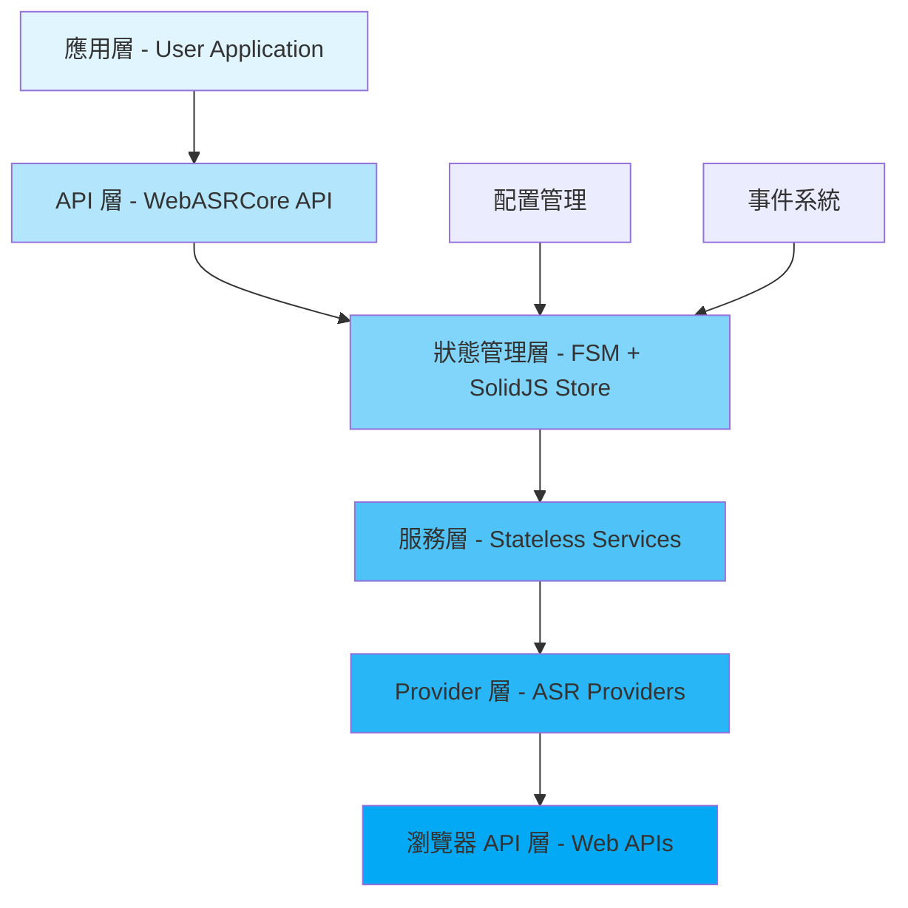
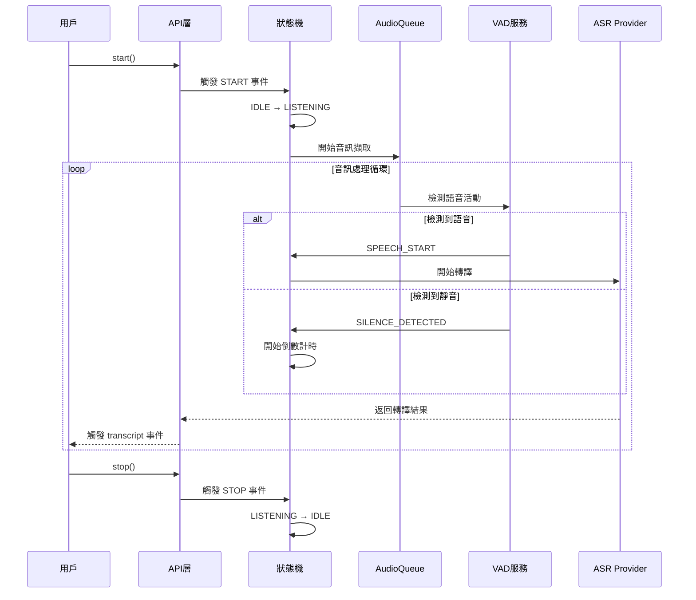
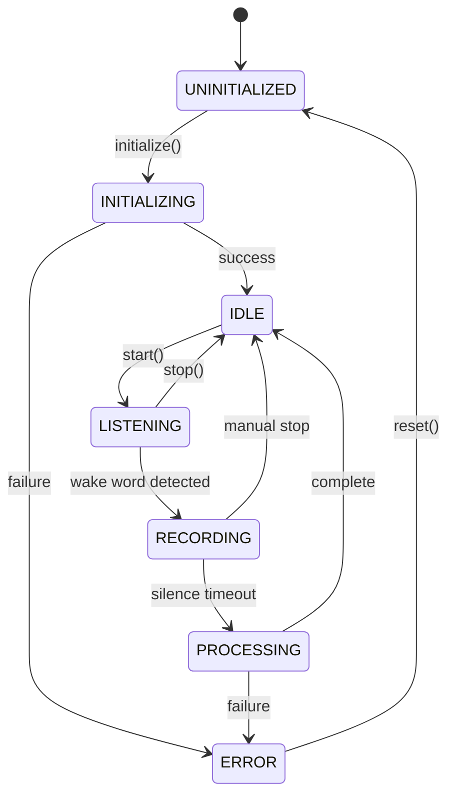

# WebASRCore - 前端語音識別核心庫設計文檔 v2.0

> 版本：2.0.0  
> 更新日期：2024  
> 狀態：重構完成版

## 目錄

### 第一部分：入門指南
- [1. 專案概覽](#1-專案概覽)
  - [1.1 專案介紹與定位](#11-專案介紹與定位)
  - [1.2 核心設計理念](#12-核心設計理念)
  - [1.3 ASR Provider 隱私分級](#13-asr-provider-隱私分級)
  - [1.4 與 ASRHub 的差異](#14-與-asrhub-的差異)
  - [1.5 快速開始指南](#15-快速開始指南)

### 第二部分：架構設計
- [2. 系統架構](#2-系統架構)
  - [2.1 架構總覽](#21-架構總覽)
  - [2.2 技術棧選型](#22-技術棧選型)
  - [2.3 模組結構](#23-模組結構)
  - [2.4 分層架構](#24-分層架構)
  - [2.5 執行流程圖](#25-執行流程圖)
- [3. 狀態機設計](#3-狀態機設計)
  - [3.1 FSM 狀態定義](#31-fsm-狀態定義)
  - [3.2 狀態轉換規則](#32-狀態轉換規則)
  - [3.3 XState 整合](#33-xstate-整合)
  - [3.4 事件驅動架構](#34-事件驅動架構)

### 第三部分：核心組件
- [4. 核心組件實作](#4-核心組件實作)
  - [4.1 AudioQueue（音訊佇列）](#41-audioqueue音訊佇列)
  - [4.2 BufferManager（緩衝管理）](#42-buffermanager緩衝管理)
  - [4.3 SolidJS Store（狀態管理）](#43-solidjs-store狀態管理)
  - [4.4 事件系統](#44-事件系統)

### 第四部分：服務與Provider
- [5. 服務層架構](#5-服務層架構)
  - [5.1 執行模式管理器](#51-執行模式管理器)
  - [5.2 音訊處理服務](#52-音訊處理服務)
  - [5.3 VAD 服務](#53-vad-服務)
  - [5.4 Wake Word 服務](#54-wake-word-服務)
  - [5.5 降噪服務](#55-降噪服務)
  - [5.6 計時器服務](#56-計時器服務)
- [6. ASR Provider 系統](#6-asr-provider-系統)
  - [6.1 Provider 介面定義](#61-provider-介面定義)
  - [6.2 Web Speech Provider](#62-web-speech-provider)
  - [6.3 Whisper Provider](#63-whisper-provider)
  - [6.4 串流 vs 批次的根本差異](#64-串流-vs-批次的根本差異)
- [7. 模型管理系統](#7-模型管理系統)
  - [7.1 模型打包策略](#71-模型打包策略)
  - [7.2 模型載入方式](#72-模型載入方式)
  - [7.3 CDN 與本地載入](#73-cdn-與本地載入)
  - [7.4 IndexedDB 快取](#74-indexeddb-快取)
  - [7.5 模型預載入優化](#75-模型預載入優化)

### 第五部分：Worker 與效能
- [8. Worker 架構](#8-worker-架構)
  - [8.1 Worker 整合設計](#81-worker-整合設計)
  - [8.2 VAD Worker](#82-vad-worker)
  - [8.3 Whisper Worker](#83-whisper-worker)
  - [8.4 AudioWorklet 處理器](#84-audioworklet-處理器)
  - [8.5 Worker 通訊優化](#85-worker-通訊優化)
- [9. 效能優化](#9-效能優化)
  - [9.1 效能基準（RTF 指標）](#91-效能基準rtf-指標)
  - [9.2 記憶體管理](#92-記憶體管理)
  - [9.3 懶載入策略](#93-懶載入策略)
  - [9.4 快取優化](#94-快取優化)

### 第六部分：配置與部署
- [10. 配置管理](#10-配置管理)
  - [10.1 配置系統架構](#101-配置系統架構)
  - [10.2 預設配置](#102-預設配置)
  - [10.3 執行時配置](#103-執行時配置)
  - [10.4 模型配置](#104-模型配置)
  - [10.5 環境適配](#105-環境適配)
- [11. 部署指南](#11-部署指南)
  - [11.1 COOP/COEP 配置手冊](#111-coopcoep-配置手冊)
  - [11.2 CSP 政策配置](#112-csp-政策配置)
  - [11.3 瀏覽器兼容性矩陣](#113-瀏覽器兼容性矩陣)
  - [11.4 CDN 部署策略](#114-cdn-部署策略)
  - [11.5 NPM 發布配置](#115-npm-發布配置)

### 第七部分：開發支援
- [12. 開發指南](#12-開發指南)
  - [12.1 開發環境設置](#121-開發環境設置)
  - [12.2 測試策略](#122-測試策略)
  - [12.3 調試技巧](#123-調試技巧)
  - [12.4 構建配置](#124-構建配置)
- [13. 故障排除](#13-故障排除)
  - [13.1 診斷 API](#131-診斷-api)
  - [13.2 常見問題解答](#132-常見問題解答)
  - [13.3 技術挑戰與解決方案](#133-技術挑戰與解決方案)
  - [13.4 錯誤處理策略](#134-錯誤處理策略)

### 第八部分：參考文檔
- [14. API 參考](#14-api-參考)
  - [14.1 公開 API](#141-公開-api)
  - [14.2 配置選項詳解](#142-配置選項詳解)
  - [14.3 事件列表](#143-事件列表)
  - [14.4 TypeScript 型別定義](#144-typescript-型別定義)
  - [14.5 參數驗證](#145-參數驗證)
- [15. 附錄](#15-附錄)
  - [15.1 開發路線圖](#151-開發路線圖)
  - [15.2 安全性聲明](#152-安全性聲明)
  - [15.3 授權資訊](#153-授權資訊)
  - [15.4 更新日誌](#154-更新日誌)
  - [15.5 參考資源](#155-參考資源)

---

## 第一部分：入門指南

## 1. 專案概覽

### 1.1 專案介紹與定位

WebASRCore 是一個專為瀏覽器環境設計的純前端語音識別核心庫。它繼承了 ASRHub 的成熟架構理念，但針對前端環境進行了全面優化。

**核心定位**：
- 🎯 **純前端方案**：無需後端服務器，完全在瀏覽器中運行
- 🔐 **隱私優先**：支援完全本地處理，音訊不離開用戶設備
- 🚀 **高性能**：利用 Web Worker 和 WebAssembly 實現近原生性能
- 🔧 **模組化設計**：可按需載入，支援 Tree Shaking

**目標用戶**：
- 需要在前端實現語音識別的開發者
- 重視用戶隱私的應用場景
- 離線或低延遲要求的語音應用
- 教育、無障礙等特殊領域應用

### 1.2 核心設計理念

#### KISS 原則（Keep It Simple, Stupid）
- 簡單直接的 API 設計，避免過度抽象
- 清晰的模組邊界和責任劃分
- 最小化外部依賴

#### 無狀態服務架構
- 每個服務獨立運作，專注單一職責
- 服務間通過明確的介面通訊
- 易於測試、維護和擴展

#### 音訊處理管線
```
Microphone → AudioQueue → BufferManager → Enhancement → VAD → ASR Provider
```

#### 配置優先，而非智能決策
- 提供合理的預設值
- 允許用戶完全覆蓋配置
- 避免"過度智能"的自動決策

### 1.3 ASR Provider 隱私分級

```typescript
export enum PrivacyLevel {
  LOCAL = 'local',        // 完全本地處理
  CLOUD_PROXY = 'cloud'   // 使用雲端服務  
}

export const PROVIDER_PRIVACY = {
  whisper: {
    level: PrivacyLevel.LOCAL,
    notice: '音訊完全在您的裝置上處理',
    dataRetention: 'none',
    encryption: 'not-applicable'
  },
  webSpeech: {
    level: PrivacyLevel.CLOUD_PROXY,
    notice: '音訊將上傳至 Google/Apple 伺服器',
    dataRetention: 'varies-by-provider',
    encryption: 'in-transit'
  }
};
```

#### 用戶選擇機制

```typescript
// 初始化時提示用戶選擇
async function initializeASR() {
  const userChoice = await showPrivacyDialog({
    options: [
      {
        provider: 'whisper',
        title: '本地處理（推薦）',
        description: '較慢但完全私密',
        icon: '🔐'
      },
      {
        provider: 'webSpeech',
        title: '雲端處理',
        description: '快速但需要網路',
        icon: '☁️'
      }
    ]
  });
  
  return createProvider(userChoice);
}
```

### 1.4 與 ASRHub 的差異

| 特性 | ASRHub | WebASRCore |
|------|--------|------------|
| **運行環境** | 伺服器端（Python） | 瀏覽器端（JavaScript） |
| **多會話支援** | ✅ 支援多用戶 | ❌ 單用戶設計 |
| **API 層** | HTTP/WebSocket/Redis | 無（直接調用） |
| **狀態管理** | PyStoreX | SolidJS |
| **音訊處理** | Python/NumPy | Web Audio API |
| **ASR 引擎** | 多種本地/雲端 | WebSpeech/Whisper.js |
| **部署方式** | Docker/K8s | CDN/NPM |

### 1.5 快速開始指南

#### 安裝

```bash
# NPM
npm install @webasr/core

# Yarn
yarn add @webasr/core

# CDN
<script src="https://unpkg.com/@webasr/core@latest"></script>
```

#### 基本使用

```typescript
import { WebASRCore } from '@webasr/core';

// 創建實例
const asr = new WebASRCore({
  provider: 'whisper',  // 或 'webspeech'
  language: 'zh-TW',
  continuous: true
});

// 初始化
await asr.initialize();

// 開始識別
asr.on('transcript', (result) => {
  console.log('識別結果：', result.text);
});

await asr.start();
```

#### 完整範例

```html
<!DOCTYPE html>
<html>
<head>
  <title>WebASRCore Demo</title>
</head>
<body>
  <button id="startBtn">開始錄音</button>
  <button id="stopBtn" disabled>停止錄音</button>
  <div id="transcript"></div>
  
  <script type="module">
    import { WebASRCore } from 'https://unpkg.com/@webasr/core@latest';
    
    const asr = new WebASRCore({
      provider: 'whisper',
      language: 'zh-TW',
      vad: {
        enabled: true,
        silenceThreshold: 3000  // 3秒靜音後停止
      }
    });
    
    // 初始化
    await asr.initialize();
    
    // 事件處理
    asr.on('transcript', (result) => {
      document.getElementById('transcript').innerHTML += 
        `<p>${result.text}</p>`;
    });
    
    asr.on('vad', (event) => {
      console.log('VAD 事件：', event.type);
    });
    
    // 按鈕控制
    document.getElementById('startBtn').onclick = async () => {
      await asr.start();
      document.getElementById('startBtn').disabled = true;
      document.getElementById('stopBtn').disabled = false;
    };
    
    document.getElementById('stopBtn').onclick = async () => {
      await asr.stop();
      document.getElementById('startBtn').disabled = false;
      document.getElementById('stopBtn').disabled = true;
    };
  </script>
</body>
</html>
```

---

## 第二部分：架構設計

## 2. 系統架構

### 2.1 架構總覽

WebASRCore 採用分層架構設計，每層職責明確：



### 2.2 技術棧選型

| 類別 | 技術選擇 | 選擇理由 |
|------|----------|----------|
| **狀態機** | XState | 成熟的 FSM 實現，優秀的 TypeScript 支援，可視化工具 |
| **響應式** | SolidJS | 輕量（6KB），細粒度響應性，無虛擬 DOM 開銷 |
| **音訊處理** | Web Audio API | 原生 API，低延遲，硬體加速 |
| **ML 運行時** | ONNX Runtime Web | 跨平台支援，WebAssembly 加速 |
| **ASR 模型** | Transformers.js | Whisper 的 Web 優化版本 |
| **構建工具** | Vite | 快速的開發體驗，優秀的 ESM 支援 |
| **測試框架** | Vitest | Vite 原生支援，快速執行 |

### 2.3 模組結構

```
WebASRCore/
├── src/
│   ├── core/                    # 核心引擎
│   │   ├── fsm/                 # 狀態機
│   │   │   ├── machine.ts       # XState 配置
│   │   │   ├── states.ts        # 狀態定義
│   │   │   └── transitions.ts   # 轉換邏輯
│   │   ├── audio/               # 音訊處理
│   │   │   ├── queue.ts         # AudioQueue
│   │   │   ├── buffer.ts        # BufferManager
│   │   │   └── processor.ts     # 音訊處理器
│   │   └── store/               # 狀態管理
│   │       ├── store.ts         # SolidJS Store
│   │       └── actions.ts       # Store Actions
│   │
│   ├── services/                # 無狀態服務
│   │   ├── execution/           # 執行模式
│   │   │   └── mode-manager.ts  
│   │   ├── vad/                 # VAD 服務
│   │   │   ├── silero-vad.ts
│   │   │   └── vad.worker.ts
│   │   ├── wake-word/           # 喚醒詞
│   │   │   └── openwakeword.ts
│   │   └── audio/               # 音訊服務
│   │       ├── capture.ts       # 麥克風
│   │       └── enhance.ts       # 增強
│   │
│   ├── providers/               # ASR 提供者
│   │   ├── base.ts              # 基礎介面
│   │   ├── whisper/             # Whisper
│   │   └── webspeech/           # Web Speech
│   │
│   ├── config/                  # 配置
│   │   ├── defaults.ts          # 預設值
│   │   └── schema.ts            # 配置架構
│   │
│   └── utils/                   # 工具
│       ├── audio.ts             # 音訊工具
│       └── browser.ts           # 瀏覽器檢測
│
├── workers/                     # Web Workers
│   ├── vad.worker.js
│   └── whisper.worker.js
│
└── models/                      # 預訓練模型
    ├── silero-vad.onnx
    └── whisper-tiny.onnx
```

### 2.4 分層架構

#### 應用層
- 用戶應用程式
- 透過 WebASRCore API 互動

#### API 層
- 統一的公開介面
- 參數驗證
- 錯誤處理

#### 狀態管理層
- XState FSM 控制流程
- SolidJS Store 管理狀態
- 事件發布/訂閱

#### 服務層
- 無狀態的功能服務
- 單一職責原則
- 可獨立測試

#### Provider 層
- ASR 提供者抽象
- 統一介面
- 策略模式實現

#### 瀏覽器 API 層
- Web Audio API
- MediaStream API
- Web Workers API

### 2.5 執行流程圖



## 3. 狀態機設計

### 3.1 FSM 狀態定義

WebASRCore 使用 7 個狀態來管理完整的語音識別流程：

```typescript
export enum State {
  UNINITIALIZED = 'uninitialized',  // 未初始化
  INITIALIZING = 'initializing',    // 初始化中
  IDLE = 'idle',                    // 空閒（已就緒）
  LISTENING = 'listening',          // 監聽中（等待喚醒詞）
  RECORDING = 'recording',          // 錄音中（已觸發）
  PROCESSING = 'processing',        // 處理中（VAD/ASR）
  ERROR = 'error'                   // 錯誤狀態
}
```

#### 狀態說明

| 狀態 | 描述 | 可執行操作 | 音訊處理 |
|------|------|------------|----------|
| **UNINITIALIZED** | 初始狀態，資源未載入 | initialize() | ❌ |
| **INITIALIZING** | 正在載入模型和資源 | - | ❌ |
| **IDLE** | 就緒，等待開始 | start(), configure() | ❌ |
| **LISTENING** | 監聽喚醒詞 | stop() | ✅ Wake Word |
| **RECORDING** | 錄製用戶語音 | stop() | ✅ VAD + Buffer |
| **PROCESSING** | 執行 ASR 轉譯 | cancel() | ✅ ASR |
| **ERROR** | 發生錯誤 | reset() | ❌ |

### 3.2 狀態轉換規則



#### 轉換條件

```typescript
export const transitions = {
  initialize: {
    from: State.UNINITIALIZED,
    to: State.INITIALIZING,
    guard: () => true
  },
  ready: {
    from: State.INITIALIZING,
    to: State.IDLE,
    guard: (context) => context.modelsLoaded && context.audioPermission
  },
  start: {
    from: State.IDLE,
    to: State.LISTENING,
    guard: (context) => context.microphoneActive
  },
  wakeWordDetected: {
    from: State.LISTENING,
    to: State.RECORDING,
    guard: (context, event) => event.confidence > context.wakeWordThreshold
  },
  silenceDetected: {
    from: State.RECORDING,
    to: State.PROCESSING,
    guard: (context) => context.silenceDuration > context.silenceThreshold
  },
  transcriptionComplete: {
    from: State.PROCESSING,
    to: State.IDLE,
    guard: () => true
  }
};
```

### 3.3 XState 整合

```typescript
import { createMachine, interpret } from 'xstate';

export const asrMachine = createMachine({
  id: 'webASRCore',
  initial: 'uninitialized',
  context: {
    modelsLoaded: false,
    audioPermission: false,
    microphoneActive: false,
    wakeWordThreshold: 0.5,
    silenceThreshold: 3000,
    silenceDuration: 0,
    audioBuffer: [],
    transcript: ''
  },
  states: {
    uninitialized: {
      on: {
        INITIALIZE: {
          target: 'initializing',
          actions: 'startInitialization'
        }
      }
    },
    initializing: {
      invoke: {
        src: 'initializeServices',
        onDone: {
          target: 'idle',
          actions: 'setReady'
        },
        onError: {
          target: 'error',
          actions: 'setError'
        }
      }
    },
    idle: {
      on: {
        START: {
          target: 'listening',
          actions: 'startListening'
        }
      }
    },
    listening: {
      invoke: {
        src: 'wakeWordDetection',
        onDone: {
          target: 'recording',
          actions: 'startRecording'
        }
      },
      on: {
        STOP: {
          target: 'idle',
          actions: 'cleanup'
        }
      }
    },
    recording: {
      invoke: {
        src: 'vadDetection',
        onDone: {
          target: 'processing',
          actions: 'prepareTranscription'
        }
      },
      on: {
        STOP: {
          target: 'idle',
          actions: 'cleanup'
        }
      }
    },
    processing: {
      invoke: {
        src: 'transcribeAudio',
        onDone: {
          target: 'idle',
          actions: 'setTranscript'
        },
        onError: {
          target: 'error',
          actions: 'setError'
        }
      }
    },
    error: {
      on: {
        RESET: {
          target: 'uninitialized',
          actions: 'resetContext'
        }
      }
    }
  }
});
```

### 3.4 事件驅動架構

#### 事件類型

```typescript
export enum EventType {
  // 狀態事件
  STATE_CHANGE = 'state:change',
  STATE_ERROR = 'state:error',
  
  // 音訊事件
  AUDIO_LEVEL = 'audio:level',
  AUDIO_CHUNK = 'audio:chunk',
  
  // 檢測事件
  WAKE_WORD_DETECTED = 'wakeword:detected',
  VAD_SPEECH_START = 'vad:speech_start',
  VAD_SPEECH_END = 'vad:speech_end',
  
  // 轉譯事件
  TRANSCRIPT_INTERIM = 'transcript:interim',
  TRANSCRIPT_FINAL = 'transcript:final',
  
  // 系統事件
  MODEL_LOADING = 'model:loading',
  MODEL_LOADED = 'model:loaded',
  PERMISSION_REQUEST = 'permission:request',
  PERMISSION_GRANTED = 'permission:granted'
}
```

#### 事件發布訂閱

```typescript
import { createEventEmitter } from './utils/events';

export class WebASRCore {
  private emitter = createEventEmitter();
  private machine = interpret(asrMachine);
  
  constructor() {
    // 訂閱狀態機事件
    this.machine.subscribe((state) => {
      this.emitter.emit(EventType.STATE_CHANGE, {
        from: state.history?.value,
        to: state.value,
        context: state.context
      });
    });
  }
  
  // 公開事件訂閱接口
  on(event: EventType, handler: Function) {
    return this.emitter.on(event, handler);
  }
  
  off(event: EventType, handler: Function) {
    return this.emitter.off(event, handler);
  }
  
  once(event: EventType, handler: Function) {
    return this.emitter.once(event, handler);
  }
}
```

---

## 第三部分：核心組件

## 4. 核心組件實作

### 4.1 AudioQueue（音訊佇列）

#### 設計理念
AudioQueue 是一個非破壞性的順序讀取佇列，專門管理音訊片段。其核心特點是支援 peek 操作，允許在不移除數據的情況下讀取內容。

#### 實作架構

```typescript
interface AudioQueueConfig {
  maxSize: number;          // 最大佇列大小（bytes）
  maxDuration: number;      // 最大時長（秒）
  sampleRate: number;       // 取樣率（Hz）
  channels: number;         // 聲道數
  memoryMode: 'efficient' | 'performance';
}

class AudioQueue {
  private queue: Float32Array[] = [];
  private totalSamples: number = 0;
  private config: AudioQueueConfig;
  
  constructor(config: AudioQueueConfig) {
    this.config = config;
  }
  
  // 推入音訊片段
  push(audio: Float32Array): void {
    // 檢查容量限制
    if (this.totalSamples + audio.length > this.maxSamples) {
      this.handleOverflow();
    }
    
    this.queue.push(audio);
    this.totalSamples += audio.length;
    this.emit('push', { samples: audio.length });
  }
  
  // 非破壞性讀取
  peek(samples?: number): Float32Array | null {
    if (this.queue.length === 0) return null;
    
    if (!samples) {
      return this.queue[0];
    }
    
    // 合併多個片段以滿足請求大小
    return this.mergeChunks(samples, false);
  }
  
  // 破壞性讀取
  pop(samples?: number): Float32Array | null {
    if (this.queue.length === 0) return null;
    
    if (!samples) {
      this.totalSamples -= this.queue[0].length;
      return this.queue.shift()!;
    }
    
    return this.mergeChunks(samples, true);
  }
  
  // 合併音訊片段
  private mergeChunks(targetSamples: number, remove: boolean): Float32Array {
    const result = new Float32Array(targetSamples);
    let written = 0;
    let consumed: number[] = [];
    
    for (let i = 0; i < this.queue.length && written < targetSamples; i++) {
      const chunk = this.queue[i];
      const toWrite = Math.min(chunk.length, targetSamples - written);
      
      result.set(chunk.subarray(0, toWrite), written);
      written += toWrite;
      
      if (remove) {
        if (toWrite === chunk.length) {
          consumed.push(i);
        } else {
          // 部分消費
          this.queue[i] = chunk.subarray(toWrite);
        }
      }
    }
    
    // 移除已消費的完整片段
    if (remove) {
      for (let i = consumed.length - 1; i >= 0; i--) {
        this.queue.splice(consumed[i], 1);
      }
      this.totalSamples -= written;
    }
    
    return result.subarray(0, written);
  }
  
  // 容量管理
  private handleOverflow(): void {
    if (this.config.memoryMode === 'efficient') {
      // 移除最舊的數據
      while (this.totalSamples > this.maxSamples * 0.9) {
        const removed = this.queue.shift();
        if (removed) {
          this.totalSamples -= removed.length;
        }
      }
    } else {
      // 發出警告但保留數據
      this.emit('overflow', { 
        current: this.totalSamples,
        max: this.maxSamples 
      });
    }
  }
  
  get size(): number { return this.totalSamples; }
  get duration(): number { 
    return this.totalSamples / this.config.sampleRate; 
  }
}
```

#### 使用場景
1. **連續錄音緩衝**：暫存音訊片段等待處理
2. **串流處理**：支援邊錄邊處理的場景
3. **批次累積**：累積足夠數據進行批次處理

### 4.2 BufferManager（緩衝管理）

#### 設計理念
BufferManager 提供三種緩衝策略，針對不同的處理需求優化：
- **Fixed**：固定大小視窗（Whisper）
- **Sliding**：滑動視窗（連續檢測）
- **Dynamic**：動態調整（VAD）

#### 實作架構

```typescript
enum BufferMode {
  FIXED = 'fixed',      // 固定大小，填滿後輸出
  SLIDING = 'sliding',  // 滑動視窗，持續輸出
  DYNAMIC = 'dynamic'   // 動態調整，根據內容
}

interface BufferConfig {
  mode: BufferMode;
  size: number;           // 目標大小（samples）
  overlap?: number;       // 重疊大小（僅 sliding）
  minSize?: number;       // 最小大小（僅 dynamic）
  maxSize?: number;       // 最大大小（僅 dynamic）
  flushTimeout?: number;  // 強制輸出超時（ms）
}

class BufferManager {
  private buffer: Float32Array;
  private position: number = 0;
  private config: BufferConfig;
  private lastFlush: number = Date.now();
  
  constructor(config: BufferConfig) {
    this.config = config;
    this.buffer = new Float32Array(this.calculateBufferSize());
  }
  
  push(audio: Float32Array): void {
    switch (this.config.mode) {
      case BufferMode.FIXED:
        this.pushFixed(audio);
        break;
      case BufferMode.SLIDING:
        this.pushSliding(audio);
        break;
      case BufferMode.DYNAMIC:
        this.pushDynamic(audio);
        break;
    }
  }
  
  // 固定模式：填滿即輸出
  private pushFixed(audio: Float32Array): void {
    let offset = 0;
    
    while (offset < audio.length) {
      const remaining = this.config.size - this.position;
      const toWrite = Math.min(remaining, audio.length - offset);
      
      this.buffer.set(
        audio.subarray(offset, offset + toWrite),
        this.position
      );
      
      this.position += toWrite;
      offset += toWrite;
      
      if (this.position >= this.config.size) {
        this.emit('ready', this.buffer.slice(0, this.config.size));
        this.position = 0;
      }
    }
  }
  
  // 滑動模式：重疊輸出
  private pushSliding(audio: Float32Array): void {
    // 將新數據加入緩衝區
    this.appendToBuffer(audio);
    
    // 當緩衝區滿時輸出
    while (this.position >= this.config.size) {
      const frame = this.buffer.slice(0, this.config.size);
      this.emit('ready', frame);
      
      // 滑動視窗
      const shift = this.config.size - (this.config.overlap || 0);
      this.buffer.copyWithin(0, shift);
      this.position -= shift;
    }
  }
  
  // 動態模式：智能判斷
  private pushDynamic(audio: Float32Array): void {
    this.appendToBuffer(audio);
    
    // 檢查是否該輸出
    if (this.shouldFlush()) {
      const frame = this.buffer.slice(0, this.position);
      this.emit('ready', frame);
      this.position = 0;
      this.lastFlush = Date.now();
    }
  }
  
  private shouldFlush(): boolean {
    const { minSize, maxSize, flushTimeout } = this.config;
    
    // 達到最大大小
    if (maxSize && this.position >= maxSize) {
      return true;
    }
    
    // 超過最小大小且超時
    if (minSize && this.position >= minSize) {
      if (flushTimeout && Date.now() - this.lastFlush > flushTimeout) {
        return true;
      }
    }
    
    return false;
  }
  
  // 強制輸出剩餘數據
  flush(): Float32Array | null {
    if (this.position === 0) return null;
    
    const frame = this.buffer.slice(0, this.position);
    this.position = 0;
    this.lastFlush = Date.now();
    
    return frame;
  }
  
  ready(): boolean {
    switch (this.config.mode) {
      case BufferMode.FIXED:
        return this.position >= this.config.size;
      case BufferMode.SLIDING:
        return this.position >= this.config.size;
      case BufferMode.DYNAMIC:
        return this.shouldFlush();
    }
  }
}

// 預設配置
class BufferPresets {
  static forWhisper(): BufferConfig {
    return {
      mode: BufferMode.FIXED,
      size: 16000 * 30,  // 30 秒 @ 16kHz
      flushTimeout: 5000
    };
  }
  
  static forSileroVAD(): BufferConfig {
    return {
      mode: BufferMode.FIXED,
      size: 480,  // 30ms @ 16kHz
      flushTimeout: 100
    };
  }
  
  static forStreaming(): BufferConfig {
    return {
      mode: BufferMode.SLIDING,
      size: 16000 * 1,     // 1 秒視窗
      overlap: 16000 * 0.5 // 50% 重疊
    };
  }
}
```

### 4.3 SolidJS Store（狀態管理）

#### 設計理念
使用 SolidJS 的 createStore 實現響應式狀態管理，取代傳統的 Redux/MobX 方案。優點是更簡潔的 API 和更好的性能。

#### 實作架構

```typescript
import { createStore, produce } from "solid-js/store";
import { createEffect, createMemo, batch } from "solid-js";

// 狀態定義
interface WebASRState {
  // 系統狀態
  system: {
    state: State;
    executionMode: ExecutionMode;
    capabilities: Capabilities;
    error: Error | null;
  };
  
  // 音訊狀態
  audio: {
    recording: boolean;
    volume: number;
    noiseLevel: number;
    vadActive: boolean;
  };
  
  // 識別狀態
  recognition: {
    provider: 'whisper' | 'webspeech';
    transcribing: boolean;
    transcript: string;
    interim: string;
    confidence: number;
  };
  
  // 配置
  config: {
    language: string;
    model: string;
    silenceThreshold: number;
    silenceDuration: number;
    wakeWords: string[];
  };
  
  // 統計
  stats: {
    totalDuration: number;
    processedDuration: number;
    transcriptCount: number;
    errorCount: number;
  };
}

// Store 管理器
class WebASRStore {
  private store: any;
  private setStore: any;
  
  constructor() {
    [this.store, this.setStore] = createStore<WebASRState>(this.initialState());
    this.setupEffects();
  }
  
  private initialState(): WebASRState {
    return {
      system: {
        state: State.UNINITIALIZED,
        executionMode: ExecutionMode.UNKNOWN,
        capabilities: {},
        error: null
      },
      audio: {
        recording: false,
        volume: 0,
        noiseLevel: 0,
        vadActive: false
      },
      recognition: {
        provider: 'whisper',
        transcribing: false,
        transcript: '',
        interim: '',
        confidence: 0
      },
      config: {
        language: 'zh-TW',
        model: 'tiny',
        silenceThreshold: 0.5,
        silenceDuration: 2000,
        wakeWords: ['你好', '開始']
      },
      stats: {
        totalDuration: 0,
        processedDuration: 0,
        transcriptCount: 0,
        errorCount: 0
      }
    };
  }
  
  // 設置 Effects（類似 Redux 的 middleware）
  private setupEffects(): void {
    // 狀態變化日誌
    createEffect(() => {
      console.log('[State Change]', this.store.system.state);
    });
    
    // 錯誤自動恢復
    createEffect(() => {
      if (this.store.system.state === State.ERROR) {
        setTimeout(() => {
          this.dispatch('RECOVER_FROM_ERROR');
        }, 5000);
      }
    });
    
    // 音量監控
    createEffect(() => {
      const { volume, noiseLevel } = this.store.audio;
      if (volume > 0 && volume < noiseLevel * 1.5) {
        console.warn('Signal too weak compared to noise');
      }
    });
  }
  
  // Dispatch 動作（類似 Redux）
  dispatch(action: string, payload?: any): void {
    batch(() => {
      switch (action) {
        case 'SET_STATE':
          this.setStore('system', 'state', payload);
          break;
          
        case 'START_RECORDING':
          this.setStore(produce((state: WebASRState) => {
            state.audio.recording = true;
            state.system.state = State.RECORDING;
            state.stats.totalDuration = 0;
          }));
          break;
          
        case 'STOP_RECORDING':
          this.setStore(produce((state: WebASRState) => {
            state.audio.recording = false;
            state.system.state = State.IDLE;
          }));
          break;
          
        case 'UPDATE_TRANSCRIPT':
          this.setStore(produce((state: WebASRState) => {
            state.recognition.transcript += payload.text;
            state.recognition.confidence = payload.confidence;
            state.stats.transcriptCount++;
          }));
          break;
          
        case 'SET_ERROR':
          this.setStore(produce((state: WebASRState) => {
            state.system.state = State.ERROR;
            state.system.error = payload;
            state.stats.errorCount++;
          }));
          break;
          
        case 'RECOVER_FROM_ERROR':
          this.setStore(produce((state: WebASRState) => {
            state.system.state = State.IDLE;
            state.system.error = null;
          }));
          break;
      }
    });
  }
  
  // Getters（使用 createMemo 進行衍生狀態）
  get isReady() {
    return createMemo(() => 
      this.store.system.state === State.IDLE ||
      this.store.system.state === State.LISTENING
    );
  }
  
  get isProcessing() {
    return createMemo(() => 
      this.store.system.state === State.PROCESSING ||
      this.store.recognition.transcribing
    );
  }
  
  get signalQuality() {
    return createMemo(() => {
      const { volume, noiseLevel } = this.store.audio;
      if (volume === 0) return 'no-signal';
      const snr = volume / (noiseLevel || 0.01);
      if (snr > 10) return 'excellent';
      if (snr > 5) return 'good';
      if (snr > 2) return 'fair';
      return 'poor';
    });
  }
  
  // 訂閱狀態變化
  subscribe(path: string[], callback: (value: any) => void) {
    return createEffect(() => {
      const value = path.reduce((obj, key) => obj[key], this.store);
      callback(value);
    });
  }
  
  // 獲取當前狀態快照
  getSnapshot(): WebASRState {
    return JSON.parse(JSON.stringify(this.store));
  }
}

// 單例實例
export const webASRStore = new WebASRStore();
```

### 4.4 事件系統

#### 設計理念
建立統一的事件系統，連接各個組件之間的通訊。支援同步和非同步事件處理。

#### 實作架構

```typescript
type EventHandler = (data: any) => void | Promise<void>;

interface EventEmitterConfig {
  maxListeners: number;
  asyncTimeout: number;
  errorHandler?: (error: Error) => void;
}

class EventEmitter {
  private events: Map<string, Set<EventHandler>> = new Map();
  private config: EventEmitterConfig;
  
  constructor(config: Partial<EventEmitterConfig> = {}) {
    this.config = {
      maxListeners: 100,
      asyncTimeout: 5000,
      ...config
    };
  }
  
  // 註冊事件監聽器
  on(event: string, handler: EventHandler): () => void {
    if (!this.events.has(event)) {
      this.events.set(event, new Set());
    }
    
    const handlers = this.events.get(event)!;
    
    // 檢查監聽器數量限制
    if (handlers.size >= this.config.maxListeners) {
      console.warn(`Max listeners (${this.config.maxListeners}) exceeded for event: ${event}`);
    }
    
    handlers.add(handler);
    
    // 返回取消訂閱函數
    return () => {
      handlers.delete(handler);
      if (handlers.size === 0) {
        this.events.delete(event);
      }
    };
  }
  
  // 一次性監聽
  once(event: string, handler: EventHandler): void {
    const wrapper = (data: any) => {
      handler(data);
      this.off(event, wrapper);
    };
    this.on(event, wrapper);
  }
  
  // 移除監聽器
  off(event: string, handler?: EventHandler): void {
    if (!handler) {
      // 移除所有該事件的監聽器
      this.events.delete(event);
    } else {
      const handlers = this.events.get(event);
      if (handlers) {
        handlers.delete(handler);
        if (handlers.size === 0) {
          this.events.delete(event);
        }
      }
    }
  }
  
  // 發送事件
  async emit(event: string, data?: any): Promise<void> {
    const handlers = this.events.get(event);
    if (!handlers || handlers.size === 0) return;
    
    const promises: Promise<void>[] = [];
    
    for (const handler of handlers) {
      try {
        const result = handler(data);
        
        if (result instanceof Promise) {
          // 添加超時控制
          const timeoutPromise = new Promise<void>((_, reject) => {
            setTimeout(() => reject(new Error('Handler timeout')), 
                     this.config.asyncTimeout);
          });
          
          promises.push(
            Promise.race([result, timeoutPromise]).catch(error => {
              this.handleError(error, event);
            })
          );
        }
      } catch (error) {
        this.handleError(error as Error, event);
      }
    }
    
    // 等待所有非同步處理完成
    if (promises.length > 0) {
      await Promise.allSettled(promises);
    }
  }
  
  // 同步發送（不等待非同步處理）
  emitSync(event: string, data?: any): void {
    const handlers = this.events.get(event);
    if (!handlers) return;
    
    for (const handler of handlers) {
      try {
        handler(data);
      } catch (error) {
        this.handleError(error as Error, event);
      }
    }
  }
  
  private handleError(error: Error, event: string): void {
    console.error(`Error in event handler for "${event}":`, error);
    
    if (this.config.errorHandler) {
      this.config.errorHandler(error);
    }
  }
  
  // 獲取事件統計
  getStats() {
    const stats: Record<string, number> = {};
    for (const [event, handlers] of this.events) {
      stats[event] = handlers.size;
    }
    return stats;
  }
  
  // 清理所有事件
  clear(): void {
    this.events.clear();
  }
}

// 全局事件總線
export const eventBus = new EventEmitter({
  maxListeners: 200,
  asyncTimeout: 10000,
  errorHandler: (error) => {
    webASRStore.dispatch('SET_ERROR', error);
  }
});

// 預定義事件類型
export const Events = {
  // 系統事件
  SYSTEM_INIT: 'system:init',
  SYSTEM_READY: 'system:ready',
  SYSTEM_ERROR: 'system:error',
  SYSTEM_SHUTDOWN: 'system:shutdown',
  
  // 音訊事件
  AUDIO_START: 'audio:start',
  AUDIO_DATA: 'audio:data',
  AUDIO_STOP: 'audio:stop',
  AUDIO_VOLUME: 'audio:volume',
  
  // VAD 事件
  VAD_START: 'vad:start',
  VAD_END: 'vad:end',
  VAD_TIMEOUT: 'vad:timeout',
  
  // Wake Word 事件
  WAKEWORD_DETECTED: 'wakeword:detected',
  WAKEWORD_REJECTED: 'wakeword:rejected',
  
  // 識別事件
  RECOGNITION_START: 'recognition:start',
  RECOGNITION_RESULT: 'recognition:result',
  RECOGNITION_END: 'recognition:end',
  RECOGNITION_ERROR: 'recognition:error',
  
  // 統計事件
  STATS_UPDATE: 'stats:update',
  PERFORMANCE_WARNING: 'performance:warning'
} as const;

// 事件類型定義
interface AudioDataEvent {
  data: Float32Array;
  timestamp: number;
  duration: number;
}

interface RecognitionResultEvent {
  text: string;
  confidence: number;
  isFinal: boolean;
  timestamp: number;
}

interface WakeWordEvent {
  word: string;
  confidence: number;
  timestamp: number;
}

// 類型安全的事件發送
class TypedEventBus {
  emit(event: typeof Events.AUDIO_DATA, data: AudioDataEvent): Promise<void>;
  emit(event: typeof Events.RECOGNITION_RESULT, data: RecognitionResultEvent): Promise<void>;
  emit(event: typeof Events.WAKEWORD_DETECTED, data: WakeWordEvent): Promise<void>;
  emit(event: string, data: any): Promise<void> {
    return eventBus.emit(event, data);
  }
}

export const typedEventBus = new TypedEventBus();
```

---

## 第四部分：服務與Provider

## 5. 服務層架構

### 5.1 執行模式管理器

#### 設計理念
執行模式管理器負責檢測瀏覽器能力並選擇最佳執行環境。支援一次性降級但不做動態切換。

#### 執行模式定義

```typescript
export enum ExecutionMode {
  UNKNOWN = 'unknown',
  WORKER_WEBGPU = 'worker-webgpu',     // 最佳：Worker + WebGPU
  WORKER_WASM_SIMD = 'worker-wasm-simd', // 次佳：Worker + WASM SIMD
  WORKER_WASM = 'worker-wasm',         // 普通：Worker + WASM
  MAIN_WASM = 'main-wasm',             // 降級：主線程 + WASM
  MAIN_FALLBACK = 'main-fallback'      // 最差：主線程 + 純 JS
}

interface Capabilities {
  webGPU: boolean;
  wasmSIMD: boolean;
  wasm: boolean;
  sharedArrayBuffer: boolean;
  worker: boolean;
  audioWorklet: boolean;
}
```

#### 能力檢測

```typescript
class ExecutionModeManager {
  private mode: ExecutionMode = ExecutionMode.UNKNOWN;
  private capabilities: Capabilities = {};
  private locked: boolean = false;
  
  // 初始化時檢測能力
  async detectCapabilities(): Promise<Capabilities> {
    return {
      webGPU: 'gpu' in navigator,
      wasmSIMD: await this.checkWASMSIMD(),
      wasm: typeof WebAssembly !== 'undefined',
      sharedArrayBuffer: typeof SharedArrayBuffer !== 'undefined',
      worker: typeof Worker !== 'undefined',
      audioWorklet: 'audioWorklet' in AudioContext.prototype
    };
  }
  
  private async checkWASMSIMD(): Promise<boolean> {
    try {
      // SIMD 測試碼
      const simdTest = new Uint8Array([
        0x00, 0x61, 0x73, 0x6d, 0x01, 0x00, 0x00, 0x00,
        0x01, 0x05, 0x01, 0x60, 0x00, 0x01, 0x7b, 0x03,
        0x02, 0x01, 0x00, 0x0a, 0x0a, 0x01, 0x08, 0x00,
        0x41, 0x00, 0xfd, 0x0f, 0xfd, 0x62, 0x0b
      ]);
      
      await WebAssembly.instantiate(simdTest);
      return true;
    } catch {
      return false;
    }
  }
  
  // 選擇執行模式
  selectMode(): ExecutionMode {
    if (this.locked) {
      return this.mode;
    }
    
    const c = this.capabilities;
    
    if (c.worker && c.sharedArrayBuffer) {
      if (c.webGPU) {
        this.mode = ExecutionMode.WORKER_WEBGPU;
      } else if (c.wasmSIMD) {
        this.mode = ExecutionMode.WORKER_WASM_SIMD;
      } else if (c.wasm) {
        this.mode = ExecutionMode.WORKER_WASM;
      }
    } else if (c.wasm) {
      this.mode = ExecutionMode.MAIN_WASM;
    } else {
      this.mode = ExecutionMode.MAIN_FALLBACK;
    }
    
    this.locked = true; // 鎖定模式，不再變更
    return this.mode;
  }
  
  // 一次性降級
  downgrade(): boolean {
    if (!this.locked) {
      console.warn('Cannot downgrade before mode selection');
      return false;
    }
    
    const downgradeMap = {
      [ExecutionMode.WORKER_WEBGPU]: ExecutionMode.WORKER_WASM_SIMD,
      [ExecutionMode.WORKER_WASM_SIMD]: ExecutionMode.WORKER_WASM,
      [ExecutionMode.WORKER_WASM]: ExecutionMode.MAIN_WASM,
      [ExecutionMode.MAIN_WASM]: ExecutionMode.MAIN_FALLBACK,
      [ExecutionMode.MAIN_FALLBACK]: null
    };
    
    const nextMode = downgradeMap[this.mode];
    if (nextMode) {
      this.mode = nextMode;
      console.warn(`Downgraded to ${nextMode}`);
      return true;
    }
    
    return false;
  }
  
  // 獲取當前模式配置
  getConfig() {
    const configs = {
      [ExecutionMode.WORKER_WEBGPU]: {
        useWorker: true,
        useWebGPU: true,
        useWASM: true,
        useSIMD: true
      },
      [ExecutionMode.WORKER_WASM_SIMD]: {
        useWorker: true,
        useWebGPU: false,
        useWASM: true,
        useSIMD: true
      },
      [ExecutionMode.WORKER_WASM]: {
        useWorker: true,
        useWebGPU: false,
        useWASM: true,
        useSIMD: false
      },
      [ExecutionMode.MAIN_WASM]: {
        useWorker: false,
        useWebGPU: false,
        useWASM: true,
        useSIMD: false
      },
      [ExecutionMode.MAIN_FALLBACK]: {
        useWorker: false,
        useWebGPU: false,
        useWASM: false,
        useSIMD: false
      }
    };
    
    return configs[this.mode] || configs[ExecutionMode.MAIN_FALLBACK];
  }
}

// 單例
export const executionModeManager = new ExecutionModeManager();
```