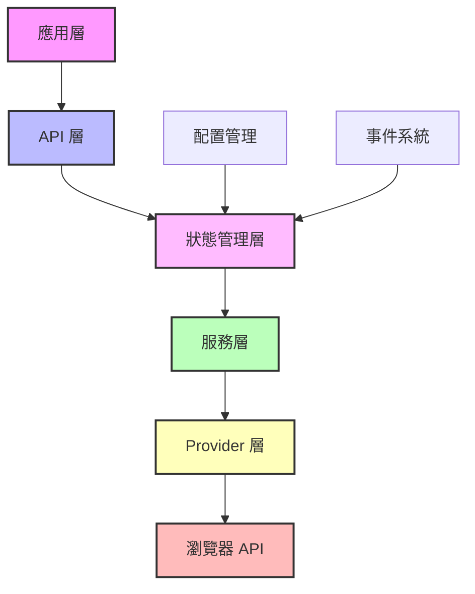
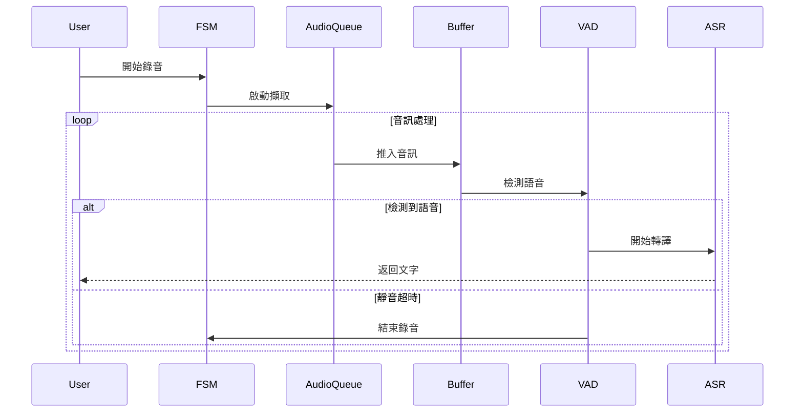

# 系統架構設計

## 設計理念

### 從 ASRHub 繼承的核心理念

1. **KISS 原則**
   - 簡單直接的 API 設計
   - 避免過度工程化
   - 清晰的責任劃分

2. **無狀態服務**
   - 每個服務獨立運作
   - 服務間無相互依賴
   - 易於測試和維護

3. **直接調用模式**
   - 避免不必要的抽象層
   - 服務直接暴露為模組級別的單例
   - 效果（Effects）直接調用服務

4. **音訊處理管線**
   ```
   Microphone/File → AudioQueue → Buffer → Enhance → Denoise → VAD → ASR Provider
   ```

## 前端環境適配

針對瀏覽器環境的特殊設計：

- **單一用戶場景**：移除多 session 管理
- **瀏覽器 API 優先**：充分利用原生 Web API
- **Web Worker 隔離**：CPU 密集型任務在 Worker 中執行
- **漸進式載入**：ML 模型按需載入，減少初始載入時間
- **固定模式**：初始化時檢測能力並選擇最適合模式，之後不再改變

## 技術棧選型

| 類別 | 技術選擇 | 理由 |
|------|----------|------|
| 狀態管理 | XState | 強大的 FSM 實現，TypeScript 支援完善 |
| 反應式系統 | SolidJS | 輕量級（~5KB），細粒度反應性，自動依賴追蹤 |
| 音訊處理 | Web Audio API + AudioWorklet | 低延遲、高性能音訊處理 |
| ML Runtime | ONNX Runtime Web | 跨平台 ML 模型執行 |
| 語音模型 | Transformers.js | Whisper 模型的 Web 版本 |
| 打包工具 | Vite/Rollup | ESM 優先，優秀的 Tree Shaking |
| 類型系統 | TypeScript | 完整的類型安全 |

## 模組架構

```
WebASRCore/
├── src/
│   ├── core/                 # 核心引擎
│   │   ├── fsm/              # 狀態機實現
│   │   │   ├── states.ts     # 狀態定義
│   │   │   ├── transitions.ts # 轉換規則
│   │   │   └── machine.ts    # XState 機器配置
│   │   ├── store/            # 狀態管理
│   │   │   ├── store.ts      # SolidJS Store
│   │   │   ├── actions.ts    # Action 定義
│   │   │   └── effects.ts    # Side Effects
│   │   ├── audio-queue/      # 音訊佇列
│   │   │   ├── queue.ts      # 佇列實現
│   │   │   └── types.ts      # 音訊數據類型
│   │   └── buffer/           # 緩衝管理
│   │       ├── manager.ts    # BufferManager
│   │       └── strategies.ts # Fixed/Sliding/Dynamic
│   │
│   ├── services/             # 無狀態服務
│   │   ├── microphone/       # 麥克風擷取
│   │   │   ├── capture.ts    # getUserMedia 封裝
│   │   │   └── processor.ts  # AudioWorklet 處理器
│   │   ├── vad/              # 語音活動檢測
│   │   │   ├── silero-vad.ts # Silero VAD ONNX
│   │   │   └── worker.ts     # VAD Web Worker
│   │   ├── wake-word/        # 喚醒詞檢測
│   │   │   ├── openwakeword.ts # OpenWakeWord ONNX
│   │   │   └── worker.ts     # Wake Word Worker
│   │   ├── denoise/          # 降噪處理
│   │   │   ├── rnnoise.ts    # RNNoise WASM
│   │   │   └── worker.ts     # Denoise Worker
│   │   └── timer/            # 計時器服務
│   │       └── timer.ts      # 倒數計時器
│   │
│   ├── providers/            # ASR 提供者
│   │   ├── base.ts           # Provider 介面
│   │   ├── webspeech/        # Web Speech API
│   │   │   └── provider.ts   # 原生 API 封裝
│   │   └── whisper/          # Whisper 模型
│   │       ├── provider.ts   # Transformers.js
│   │       └── worker.ts     # Whisper Worker
│   │
│   ├── config/               # 配置管理
│   │   ├── config.ts         # ConfigManager
│   │   ├── defaults.ts       # 預設配置
│   │   └── types.ts          # 配置介面
│   │
│   ├── utils/                # 工具函數
│   │   ├── audio-utils.ts    # 音訊工具
│   │   ├── worker-utils.ts   # Worker 管理
│   │   └── browser-detect.ts # 瀏覽器檢測
│   │
│   └── index.ts              # 主入口
│
├── models/                   # 預訓練模型
│   ├── vad/                  # VAD 模型
│   │   └── silero-vad.onnx
│   ├── wake-word/            # 喚醒詞模型
│   │   └── openwakeword.onnx
│   └── whisper/              # Whisper 模型
│       └── whisper-tiny.onnx
│
├── workers/                  # Web Workers
│   ├── vad.worker.js
│   ├── wake-word.worker.js
│   ├── denoise.worker.js
│   └── whisper.worker.js
│
└── worklets/                 # Audio Worklets
    └── audio-processor.worklet.js
```

## 分層架構



## 執行流程

