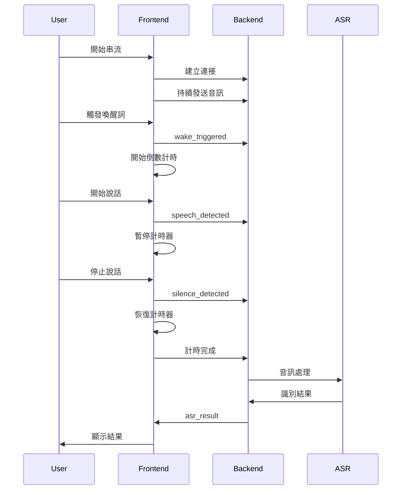

# ASR Hub 實時串流測試介面

這是一個完整的實時語音串流測試介面，支援持續音訊輸入、智慧語音檢測和自動錄音控制。

## 主要功能

### 🎤 音訊串流管理
- **持續音訊輸入**: 從麥克風持續捕獲音訊資料
- **實時處理**: 音訊資料即時傳送到後端
- **格式轉換**: 支援 16kHz 單聲道音訊格式
- **音訊視覺化**: 實時顯示音訊波形

### 🔊 喚醒詞檢測
- **自動檢測**: 支援 OpenWakeWord 模型自動檢測
- **手動觸發**: 提供手動喚醒按鈕
- **信心度監控**: 實時顯示檢測信心度
- **冷卻期管理**: 防止重複觸發

### 📊 VAD 語音活動檢測
- **實時檢測**: 使用 Silero VAD 模型檢測語音活動
- **機率顯示**: 顯示語音檢測機率值
- **閾值調整**: 可調整檢測閾值
- **狀態指示**: 視覺化語音/靜音狀態

### ⏰ 倒數計時器
- **自動觸發**: 喚醒詞檢測後自動開始倒數
- **智慧暫停**: VAD 檢測到語音時自動暫停
- **手動控制**: 支援暫停、恢復、取消操作
- **圓形進度條**: 視覺化倒數進度

### 📝 ASR 結果顯示
- **即時結果**: 顯示部分和最終識別結果
- **結果過濾**: 支援按關鍵字過濾結果
- **統計資訊**: 顯示識別統計數據
- **匯出功能**: 支援匯出識別結果

### 🔗 多協議支援
- **WebSocket**: 實時雙向通訊
- **Socket.IO**: 事件驅動通訊
- **HTTP SSE**: Server-Sent Events 單向推送

## 檔案結構

```
frontend/realtime-streaming/
├── index.html                          # 主要 HTML 頁面
├── styles.css                          # 自訂樣式
├── app.js                              # 主應用程式
├── modules/                            # JavaScript 模組
│   ├── audio-stream-manager.js         # 音訊串流管理
│   ├── wakeword-manager.js             # 喚醒詞管理
│   ├── vad-display.js                  # VAD 顯示管理
│   ├── countdown-timer.js              # 倒數計時器
│   ├── asr-result-display.js           # ASR 結果顯示
│   └── realtime-ui-manager.js          # UI 狀態管理
└── README.md                           # 此說明文件
```

## 核心模組說明

### AudioStreamManager
- 管理麥克風音訊捕獲和串流
- 使用 Web Audio API 進行實時音訊處理
- 支援音訊格式轉換和緩衝管理

### WakeWordManager
- 處理喚醒詞檢測邏輯和手動喚醒
- 管理檢測閾值和冷卻期
- 提供檢測歷史記錄

### VADDisplayManager
- 管理 VAD 視覺化顯示和狀態
- 平滑處理檢測機率
- 觸發語音開始/結束事件

### CountdownTimer
- 提供倒數計時功能
- 支援暫停/恢復/取消操作
- 圓形進度條視覺化

### ASRResultDisplay
- 顯示和管理 ASR 識別結果
- 支援結果過濾和統計
- 提供匯出功能

### RealTimeUIManager
- 統一管理 UI 狀態和視覺效果
- 音訊視覺化和狀態轉換
- 事件日誌和系統狀態顯示

### RealTimeStreamingApp
- 主應用程式類別，整合所有模組
- 管理協議連接和事件流程
- 協調模組間的通訊

## 使用方式

### 1. 啟動後端服務
確保 ASR Hub 後端服務正在運行，支援以下任一協議：
- WebSocket (ws://localhost:8765)
- Socket.IO (http://localhost:8766/asr)
- HTTP SSE (http://localhost:8000)

### 2. 開啟網頁介面
在瀏覽器中開啟 `index.html` 文件

### 3. 選擇協議
在介面頂部選擇要使用的通訊協議

### 4. 連接到後端
點擊「連接」按鈕建立與後端的連接

### 5. 開始串流
點擊「開始串流」按鈕開始音訊捕獲

### 6. 語音交互
- 說出喚醒詞或點擊手動喚醒
- 系統開始倒數計時
- 說話時計時器會暫停
- 靜音時計時器恢復
- 計時結束後自動完成錄音

## 事件流程



## 技術特點

### 模組化架構
- 每個功能模組獨立實現
- 統一的回調機制
- 易於擴展和維護

### 智慧狀態管理
- 基於狀態的 UI 更新
- 事件驅動的模組通訊
- 完整的錯誤處理

### 性能優化
- 音訊緩衝管理
- 平滑的視覺效果
- 資源清理機制

### 用戶體驗
- 響應式設計
- 深色模式支援
- 即時視覺反饋

## 瀏覽器要求

- 支援 Web Audio API
- 支援 getUserMedia API
- 支援 ES6+ JavaScript
- 建議使用 Chrome、Firefox、Safari 最新版本

## 注意事項

1. **麥克風權限**: 首次使用需要授予麥克風權限
2. **HTTPS 要求**: 在 HTTPS 環境下運行以確保音訊 API 正常工作
3. **後端兼容**: 確保後端支援對應的通訊協議
4. **音訊格式**: 後端需支援 16kHz 單聲道 PCM 格式

## 開發說明

### 添加新功能模組
1. 在 `modules/` 目錄創建新的 JavaScript 文件
2. 實現標準的初始化、回調和清理方法
3. 在 `app.js` 中整合新模組
4. 在 `index.html` 中引入模組文件

### 自定義樣式
- 編輯 `styles.css` 添加自定義樣式
- 使用 Tailwind CSS 類別進行快速樣式調整
- 支援深色模式的樣式變數

### 協議擴展
- 基於現有的 `ProtocolAdapter` 抽象類
- 實現新協議的具體適配器
- 在工廠類中註冊新協議

這個實時串流介面提供了完整的語音交互體驗，整合了現代 Web 技術和人工智慧語音處理功能。