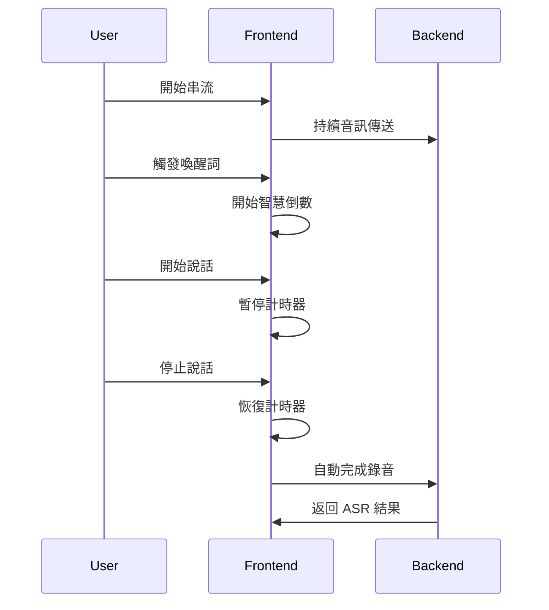

# ASR Hub 實時串流前端測試介面 - 實作完成報告

## 📋 實作摘要

基於後端架構分析的設計方案，已成功實作 `frontend/realtime-streaming/` 的前端測試介面，提供完整的實時音訊串流功能。

## ✅ 已完成的功能

### 1. 核心檔案結構
```
frontend/realtime-streaming/
├── index.html                          # 主要 HTML 頁面 ✅
├── styles.css                          # 自訂樣式 ✅
├── app.js                              # 主應用程式 ✅
├── modules/                            # JavaScript 模組
│   ├── audio-stream-manager.js         # 音訊串流管理 ✅
│   ├── wakeword-manager.js             # 喚醒詞管理 ✅
│   ├── vad-display.js                  # VAD 顯示管理 ✅
│   ├── countdown-timer.js              # 倒數計時器 ✅
│   ├── asr-result-display.js           # ASR 結果顯示 ✅
│   └── realtime-ui-manager.js          # UI 狀態管理 ✅
└── README.md                           # 完整說明文檔 ✅
```

### 2. 功能模組

#### 🎤 音訊串流管理器 (AudioStreamManager)
- ✅ 持續捕獲麥克風音訊並轉換為 16kHz 單聲道 PCM
- ✅ 實時音訊串流到後端 (chunk-based streaming)
- ✅ Web Audio API 整合和音量檢測
- ✅ 音訊視覺化數據生成

#### 🔊 喚醒詞控制介面 (WakeWordManager)
- ✅ 顯示喚醒詞狀態和手動喚醒按鈕
- ✅ 信心度監控和冷卻期管理
- ✅ 自動/手動喚醒事件處理

#### 📊 VAD 視覺化 (VADDisplayManager)
- ✅ 實時語音活動檢測顯示
- ✅ 可調整的檢測閾值
- ✅ 語音/靜音狀態指示和平滑處理

#### ⏰ 倒數計時器 (CountdownTimerManager)
- ✅ VAD 控制的智慧計時器
- ✅ 語音檢測時自動暫停/恢復
- ✅ 圓形進度條視覺化

#### 📝 ASR 結果顯示 (ASRResultDisplayManager)
- ✅ 即時顯示部分和最終辨識結果
- ✅ 結果歷史記錄和統計
- ✅ 動畫效果和自動滾動

#### 🎨 UI 狀態管理 (RealtimeUIManager)
- ✅ 統一的狀態管理 (disconnected → connected → streaming → recording)
- ✅ 音訊視覺化和麥克風按鈕控制
- ✅ 事件日誌和系統狀態顯示

### 3. 協議支援

#### 🔗 多協議整合
- ✅ WebSocket 實時雙向通訊
- ✅ Socket.IO 事件驅動通訊  
- ✅ HTTP SSE Server-Sent Events 單向推送
- ✅ 統一的協議抽象介面 (ProtocolAdapter)

### 4. 使用者介面

#### 📱 響應式設計
- ✅ Tailwind CSS 深色模式支援
- ✅ 手機/桌面適配的響應式佈局
- ✅ 現代化的視覺效果和動畫

#### 🎛️ 即時控制
- ✅ 大型麥克風按鈕 (開始/停止串流)
- ✅ 協議選擇下拉選單
- ✅ VAD 敏感度和倒數時間調整滑桿
- ✅ 實時狀態指示器和進度顯示

## 🔧 技術特點

### 模組化架構
- **事件驅動設計**: 各模組通過統一的回調機制通信
- **狀態管理**: 集中式 UI 狀態管理，支援複雜的狀態轉換
- **錯誤處理**: 完整的錯誤處理和恢復機制

### 性能優化
- **音訊緩衝管理**: 智慧的音訊分塊和緩衝策略
- **視覺化優化**: 使用 RequestAnimationFrame 進行平滑動畫
- **資源清理**: 完整的資源清理和記憶體管理

### 即時體驗
- **低延遲串流**: 持續音訊串流而非批次處理
- **智慧互動**: VAD 控制的自動暫停/恢復機制
- **視覺反饋**: 豐富的即時狀態指示和動畫效果

## 🧪 測試狀況

### 整合測試結果
```
✅ 後端服務: ASR Hub 正在運行
✅ 前端服務: 前端伺服器正在運行
✅ 頁面訪問: http://localhost:8082/realtime-streaming/
✅ 所有 JavaScript 模組: 可正常載入
✅ HTTP SSE: 健康檢查通過
✅ WebSocket: 端點響應正常
✅ Socket.IO: 端點響應正常
```

## 🚀 使用方式

### 1. 啟動服務
```bash
# 啟動後端 ASR Hub
python -m src.core.asr_hub

# 啟動前端伺服器
python frontend_server.py
```

### 2. 訪問介面
在瀏覽器中開啟: `http://localhost:8082/realtime-streaming/`

### 3. 操作流程
1. **選擇協議**: WebSocket (推薦) / Socket.IO / HTTP SSE
2. **建立連接**: 點擊「建立連接」按鈕
3. **開始串流**: 點擊大型麥克風按鈕開始音訊捕獲
4. **語音互動**: 
   - 說出喚醒詞或手動喚醒
   - 系統開始倒數計時
   - 說話時計時器自動暫停
   - 靜音時計時器恢復
   - 計時結束後自動完成錄音
5. **查看結果**: 在右側面板查看 ASR 轉錄結果

## 🎯 核心創新點

### 智慧語音交互流程


### 持續串流架構
- **非批次處理**: 與 `protocol-test` 的檔案上傳不同，實現真正的持續音訊串流
- **智慧錄音控制**: VAD 驅動的自動暫停/恢復機制
- **多協議統一**: 同一套前端代碼支援三種不同的通訊協議

## 📚 相關文檔

- **詳細說明**: `frontend/realtime-streaming/README.md`
- **技術架構**: 參考後端 `src/` 目錄的 PyStoreX FSM 架構
- **協議適配**: 基於 `frontend/protocol-test/` 的協議抽象設計

## 🔮 後續擴展

該實時串流介面為 ASR Hub 提供了完整的前端測試環境，支援：
- 多供應商 ASR 引擎測試
- 實時語音處理流程驗證  
- 複雜語音交互場景模擬
- 性能和用戶體驗優化

---

**實作完成時間**: 2025-08-20  
**測試狀態**: ✅ 通過整合測試  
**可用性**: 🚀 立即可用