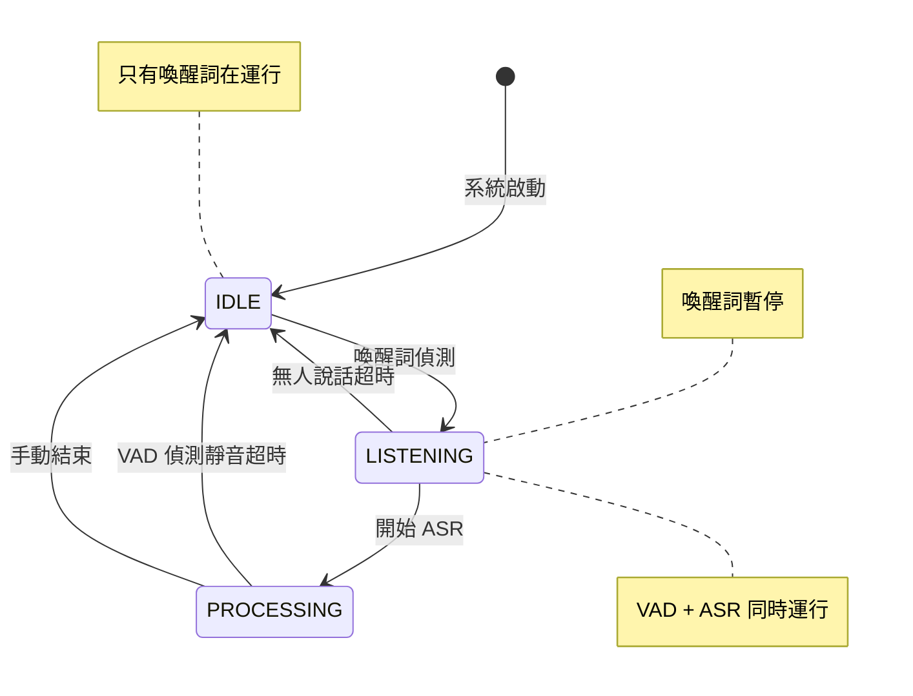

# ASR Hub 音訊流處理架構設計

## 概述

本文件描述 ASR Hub 的音訊流處理架構，特別是喚醒詞偵測、VAD（語音活動偵測）和 ASR（自動語音識別）之間的協作關係。

## Session-Based 架構

### 核心概念

ASR Hub 採用 **Session-Based** 架構，每個連線/用戶都有獨立的 Session，包含：

- **獨立的 FSM 狀態機**：每個 Session 維護自己的狀態（IDLE/LISTENING/BUSY）
- **獨立的處理器實例**：喚醒詞、VAD、ASR 都是 per-session 的
- **獨立的配置和資源**：可以為不同 Session 設定不同參數

```python
class Session:
    def __init__(self, session_id: str):
        self.session_id = session_id
        
        # 每個 Session 都有自己的狀態機
        self.fsm = StateMachine(initial_state=State.IDLE)
        
        # 每個 Session 都有自己的處理器實例
        self.wakeword_operator = OpenWakeWordOperator()
        self.vad_operator = SileroVADOperator()
        self.asr_provider = None  # 動態選擇
        
        # Session 專屬的音訊緩衝
        self.audio_buffer = AudioBuffer()
        
        # Session 狀態
        self.created_at = datetime.now()
        self.last_activity = datetime.now()
```

### 多 Session 並行處理

```
┌─────────────┐     ┌──────────────────────────┐
│   Client A  │────▶│  Session A               │
└─────────────┘     │  - FSM: LISTENING       │
                    │  - VAD: Active          │
                    │  - ASR: Streaming       │
                    └──────────────────────────┘
                    
┌─────────────┐     ┌──────────────────────────┐
│   Client B  │────▶│  Session B               │
└─────────────┘     │  - FSM: IDLE            │
                    │  - WakeWord: Active     │
                    │  - VAD: Inactive        │
                    └──────────────────────────┘
                    
┌─────────────┐     ┌──────────────────────────┐
│   Client C  │────▶│  Session C               │
└─────────────┘     │  - FSM: BUSY            │
                    │  - ASR: Processing      │
                    │  - VAD: Monitoring      │
                    └──────────────────────────┘
```

## 核心設計理念

### 1. 階段性處理

音訊處理分為兩個主要階段：

#### 階段一：待機監聽（IDLE State）
- **只啟用**：喚醒詞偵測
- **目的**：最小化資源消耗，等待喚醒
- **音訊流向**：音訊 → 喚醒詞偵測器

#### 階段二：活躍聆聽（LISTENING State）
- **啟用**：VAD + ASR（同時運行）
- **暫停**：喚醒詞偵測（節省資源）
- **目的**：捕捉並轉譯用戶語音
- **音訊流向**：音訊 → VAD（檢測靜音）
              音訊 → ASR（轉譯文字）

### 2. 音訊流分配策略

```
待機時：
┌─────────┐     ┌──────────────┐
│ 音訊輸入 │ ──→ │ 喚醒詞偵測器  │
└─────────┘     └──────────────┘

喚醒後：
┌─────────┐     ┌─────┐
│         │ ──→ │ VAD │ (偵測靜音)
│ 音訊輸入 │     └─────┘
│         │     ┌─────┐
│         │ ──→ │ ASR │ (轉譯文字)
└─────────┘     └─────┘
```

## 詳細流程

### 1. 初始狀態（IDLE）

```python
# 系統啟動時
- 喚醒詞偵測器：啟用 ✓
- VAD：停用 ✗
- ASR：停用 ✗
```

**理由**：
- 節省計算資源
- 降低功耗
- 避免不必要的 ASR 調用（特別是雲端 API）

### 2. 喚醒觸發流程

當偵測到喚醒詞：

```python
1. 觸發 WAKE_WORD_DETECTED 事件
2. FSM 轉換：IDLE → LISTENING
3. 執行動作：
   - 暫停喚醒詞偵測器（釋放資源）
   - 啟動 VAD（開始監測語音活動）
   - 啟動 ASR（根據類型）：
     - Streaming ASR：立即開始串流處理
     - Non-streaming ASR：開始音訊緩衝
```

### 3. 並行處理架構

在 LISTENING 狀態下，VAD 和 ASR **同時處理**相同的音訊流：

```python
async def process_audio_in_listening(audio_chunk):
    # 並行處理
    vad_task = asyncio.create_task(vad_operator.process(audio_chunk))
    asr_task = asyncio.create_task(asr_provider.process(audio_chunk))
    
    # 等待兩者完成
    vad_result, asr_result = await asyncio.gather(vad_task, asr_task)
    
    # VAD 用於控制流程
    if vad_result["silence_duration"] > threshold:
        # 結束本輪對話
        await end_conversation()
    
    # ASR 用於獲取轉譯結果
    if asr_result["partial_transcript"]:
        # 發送部分結果給用戶
        await send_partial_result(asr_result)
```

### 4. ASR 類型處理差異

#### Streaming ASR
```python
# 特點：即時處理，持續回傳結果
1. 喚醒後立即開始串流
2. 每個音訊塊都送入 ASR
3. 持續接收部分轉譯結果
4. VAD 偵測到靜音後：
   - 發送結束信號給 ASR
   - 接收最終轉譯結果
   - 返回 IDLE 狀態
```

#### Non-Streaming ASR
```python
# 特點：批次處理，一次性回傳結果
1. 喚醒後開始緩衝音訊
2. 每個音訊塊都存入緩衝區
3. VAD 偵測到靜音後：
   - 停止錄音
   - 將完整音訊送入 ASR
   - 等待完整轉譯結果
   - 返回 IDLE 狀態
```

## VAD 的關鍵角色

### 1. 靜音超時檢測

VAD 從**喚醒後立即開始**計算靜音時間：

```python
class VADOperator:
    def __init__(self):
        self.silence_start = None
        self.silence_threshold = 1.5  # 秒
    
    async def process(self, audio_chunk):
        has_speech = self.detect_speech(audio_chunk)
        
        if has_speech:
            # 重置靜音計時
            self.silence_start = None
            return {"speech_detected": True, "silence_duration": 0}
        else:
            # 累計靜音時間
            if self.silence_start is None:
                self.silence_start = time.time()
            
            silence_duration = time.time() - self.silence_start
            return {
                "speech_detected": False,
                "silence_duration": silence_duration
            }
```

### 2. 對話結束判定

- **不是**固定 3 秒超時
- **而是**檢測「連續靜音」時長
- 用戶說話會重置計時器
- 更自然的對話體驗

## 狀態轉換圖



## Session 管理詳解

### 1. SessionManager 的角色

```python
class SessionManager:
    """管理所有 Session 的生命週期"""
    
    def __init__(self):
        self.sessions = {}  # session_id -> Session
        self.max_sessions = 1000
        
    async def create_session(self, client_id: str, config: dict) -> Session:
        """為新連線創建 Session"""
        session_id = self.generate_session_id()
        
        # 創建獨立的 Session
        session = Session(session_id)
        session.client_id = client_id
        
        # 初始化 Session 的處理器
        await session.initialize_processors(config)
        
        self.sessions[session_id] = session
        return session
    
    async def process_audio(self, session_id: str, audio_data: bytes):
        """處理特定 Session 的音訊"""
        session = self.sessions.get(session_id)
        if not session:
            raise ValueError(f"Session {session_id} not found")
        
        # 根據 Session 的 FSM 狀態決定處理方式
        if session.fsm.is_idle():
            # IDLE: 只處理喚醒詞
            await session.wakeword_operator.process(audio_data)
        
        elif session.fsm.is_listening():
            # LISTENING: 並行處理 VAD 和 ASR
            await asyncio.gather(
                session.vad_operator.process(audio_data),
                session.asr_provider.process(audio_data)
            )
```

### 2. Session 隔離性

每個 Session 完全獨立，互不影響：

```python
# Session A 正在轉譯
session_a.fsm.current_state  # LISTENING
session_a.asr_provider.transcribing  # True

# Session B 仍在待機
session_b.fsm.current_state  # IDLE
session_b.wakeword_operator.active  # True

# 一個 Session 的狀態變化不影響其他 Session
await session_a.end_conversation()  # A 結束對話
session_a.fsm.current_state  # IDLE
session_b.fsm.current_state  # IDLE (B 不受影響)
```

### 3. 資源池化（可選）

對於資源密集的處理器（如 ASR），可以使用池化：

```python
class ProcessorPool:
    """處理器池，多個 Session 共享"""
    
    def __init__(self, processor_class, min_size=2, max_size=10):
        self.processor_class = processor_class
        self.available = []
        self.in_use = {}  # session_id -> processor
        
    async def acquire(self, session_id: str):
        """為 Session 獲取處理器實例"""
        if self.available:
            processor = self.available.pop()
        else:
            processor = await self._create_processor()
        
        self.in_use[session_id] = processor
        return processor
    
    async def release(self, session_id: str):
        """Session 釋放處理器"""
        processor = self.in_use.pop(session_id, None)
        if processor:
            await processor.reset()  # 重置狀態
            self.available.append(processor)
```

### 4. Session 生命週期

```python
class Session:
    async def lifecycle(self):
        """Session 的完整生命週期"""
        
        # 1. 創建階段
        await self.initialize()
        
        # 2. 待機循環
        while self.is_active:
            if self.fsm.is_idle():
                # 等待喚醒
                await self.wait_for_wake()
            
            elif self.fsm.is_listening():
                # 處理對話
                await self.handle_conversation()
            
            elif self.fsm.is_busy():
                # 處理 ASR 結果
                await self.process_results()
        
        # 3. 清理階段
        await self.cleanup()
```

## 實作要點

### 1. 資源管理

```python
class SystemListener:
    async def on_wake_detected(self):
        # 1. 暫停喚醒詞（節省資源）
        await self.wakeword_operator.pause()
        
        # 2. 啟動 VAD 和 ASR
        await asyncio.gather(
            self.vad_operator.start(),
            self.asr_provider.start()
        )
    
    async def on_conversation_end(self):
        # 1. 停止 VAD 和 ASR
        await asyncio.gather(
            self.vad_operator.stop(),
            self.asr_provider.stop()
        )
        
        # 2. 恢復喚醒詞偵測
        await self.wakeword_operator.resume()
```

### 2. 音訊分發器

```python
class AudioDispatcher:
    """智能分發音訊到不同處理器"""
    
    def __init__(self):
        self.active_processors = set()
    
    async def dispatch(self, audio_chunk):
        # 並行發送到所有活躍的處理器
        tasks = [
            processor.process(audio_chunk)
            for processor in self.active_processors
        ]
        
        if tasks:
            await asyncio.gather(*tasks)
```

### 3. 緩衝區管理（Non-streaming ASR）

```python
class AudioBuffer:
    def __init__(self, max_duration=30.0, sample_rate=16000):
        self.buffer = []
        self.max_samples = int(max_duration * sample_rate)
        
    def append(self, audio_chunk):
        self.buffer.append(audio_chunk)
        
        # 防止緩衝區過大
        total_samples = sum(len(chunk) for chunk in self.buffer)
        if total_samples > self.max_samples:
            # 移除最舊的數據
            self.buffer.pop(0)
```

## 配置範例

```yaml
# 系統行為配置
system:
  # 音訊處理模式
  audio_routing:
    idle_processors: ["wakeword"]  # IDLE 時只有喚醒詞
    listening_processors: ["vad", "asr"]  # LISTENING 時 VAD+ASR
    
  # 資源優化
  resource_optimization:
    pause_wakeword_on_listening: true  # 聆聽時暫停喚醒詞
    
# VAD 配置
vad:
  model: "silero"
  silence_threshold: 1.5  # 1.5 秒靜音判定結束
  speech_confidence: 0.5
  
# 行為配置
behavior:
  # 自動根據 Provider 能力選擇模式
  asr_mode: "auto"  # auto | streaming | buffered
  
  # 超時設定
  initial_silence_timeout: 5.0  # 喚醒後最大等待時間
  max_recording_duration: 30.0  # 最長錄音時間
```

## Session-Based 架構的實際應用

### API 層面的 Session 管理

不同的 API 協議有不同的 Session 管理方式：

```python
# HTTP SSE
class SSEHandler:
    async def handle_connection(self, request):
        # 每個 SSE 連線創建一個 Session
        session = await session_manager.create_session(
            client_id=request.client_id,
            config=request.config
        )
        
        # 音訊處理綁定到特定 Session
        async for audio_chunk in request.audio_stream:
            await session_manager.process_audio(
                session.session_id, 
                audio_chunk
            )

# WebSocket
class WebSocketHandler:
    async def on_connect(self, websocket):
        # WebSocket 連線時創建 Session
        session = await session_manager.create_session(
            client_id=websocket.client_id,
            config=websocket.config
        )
        websocket.session_id = session.session_id
    
    async def on_audio(self, websocket, audio_data):
        # 音訊綁定到 WebSocket 的 Session
        await session_manager.process_audio(
            websocket.session_id,
            audio_data
        )
```

### Session 狀態同步

每個 Session 的狀態變化都是獨立的：

```python
# Session A: 用戶說 "嗨，高醫"
session_a.fsm.trigger(Event.WAKE_WORD_DETECTED)  # IDLE → LISTENING
session_a.wakeword_operator.pause()  # 暫停 A 的喚醒詞
session_a.vad_operator.start()  # 啟動 A 的 VAD

# Session B: 仍在待機
session_b.fsm.current_state  # 仍是 IDLE
session_b.wakeword_operator.is_active  # True，B 的喚醒詞仍在運行

# Session C: 正在處理另一個對話
session_c.fsm.current_state  # BUSY
session_c.asr_provider.is_processing  # True
```

## 優勢總結

### 1. **Session 級別的資源優化**
   - 每個 Session 根據自己的狀態優化資源使用
   - IDLE 的 Session 只運行喚醒詞
   - LISTENING 的 Session 暫停喚醒詞，運行 VAD+ASR
   - 不同 Session 互不干擾

### 2. **完全的隔離性**
   - 每個用戶有獨立的對話狀態
   - 一個用戶的喚醒不會影響其他用戶
   - 每個 Session 可以有不同的配置（如不同的 ASR provider）

### 3. **靈活的並發處理**
   - 支援大量並發 Session
   - 每個 Session 內部的 VAD 和 ASR 並行處理
   - Session 之間完全並行，無阻塞

### 4. **自然的多用戶體驗**
   - 每個用戶有自己的對話節奏
   - VAD 基於每個 Session 的實際語音活動
   - 不會因為其他用戶而中斷

### 5. **可擴展性**
   - 輕鬆支援不同的 API 協議（SSE、WebSocket、gRPC）
   - 可以為不同類型的客戶端定制 Session 行為
   - 支援動態的資源池化和負載均衡

## 未來擴展

1. **多喚醒詞支援**
   - 不同喚醒詞觸發不同行為
   - 優先級管理

2. **上下文感知**
   - 根據對話內容調整 VAD 靈敏度
   - 智能預測對話結束

3. **多模態整合**
   - 結合視覺信號判斷對話意圖
   - 手勢控制整合