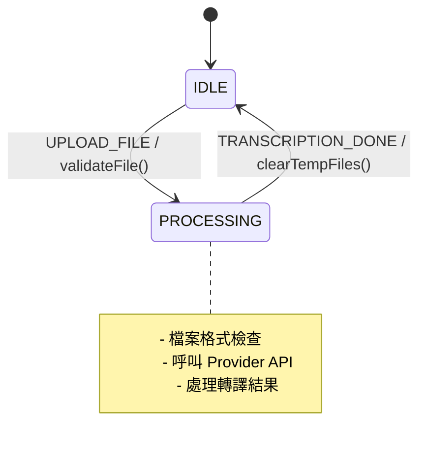
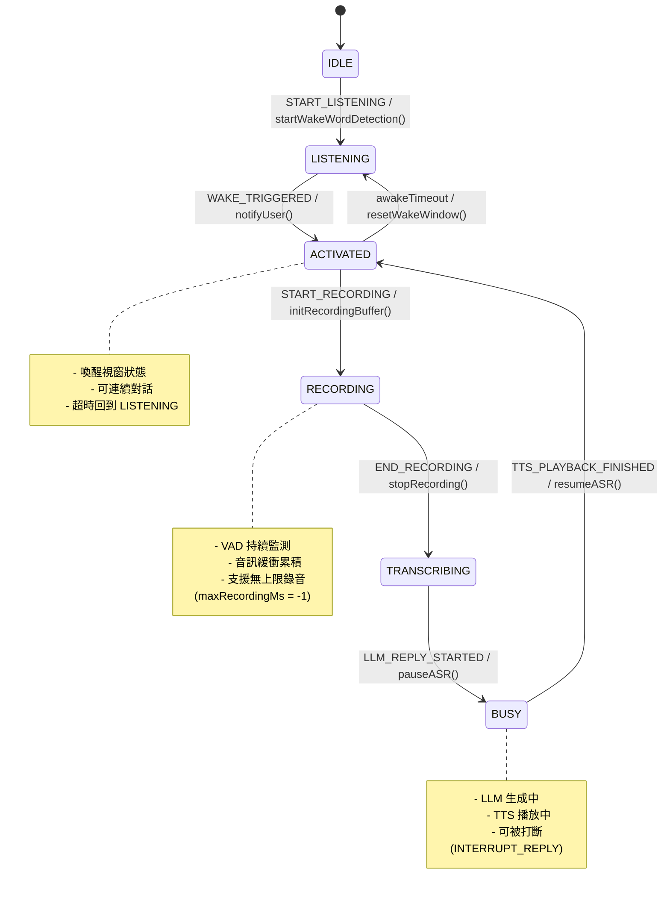
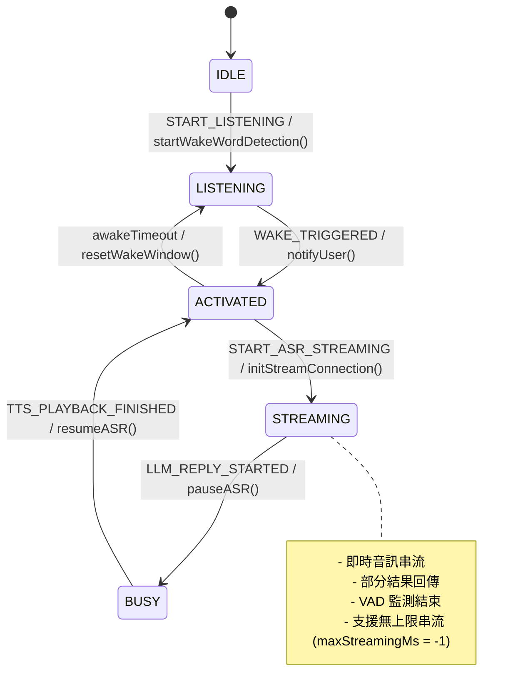
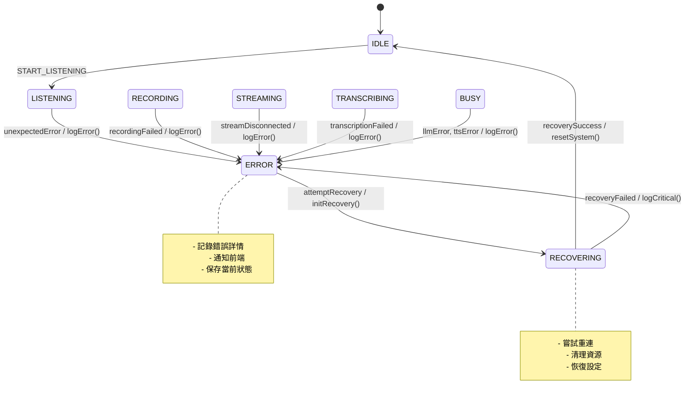

# 實時語音處理架構 - 整合版本

*版本：v2.0（2025-08-12）*

## 概述

本文檔整合 ASR Hub 實時語音處理的完整架構，包括持續音訊流處理、喚醒詞檢測、VAD（語音活動檢測）整合，支援不同 ASR Provider 的串流與非串流模式，並加入 BUSY 狀態與 INTERRUPT_REPLY 機制，支援「回覆可被打斷」、保持喚醒視窗（連續對話）、以及 LLM/TTS 分散式接手的等待機制。

## 工作流程

### 1. 持續音訊流處理工作流

```
[音訊輸入] → [格式檢查/轉換] → [循環緩衝區]
                                     ↓
                             [並行處理分支]
                             ↙            ↘
                   [喚醒詞檢測]          [VAD 檢測]
                        ↓                    ↓
                  [狀態轉換]  ←→  [靜音計時器]
                        ↓
                [錄音/串流處理]
                        ↓
                   [ASR 轉譯]
                        ↓
                [LLM 處理/TTS 播放]
```

### 2. 三種操作模式

#### 模式 1：批次處理（Batch Mode）
- **特點**：一次性上傳完整音訊檔案
- **流程**：上傳 → 轉譯 → 返回結果
- **適用場景**：檔案轉譯、離線處理

#### 模式 2：非串流實時處理（Non-Streaming Realtime）
- **特點**：需要錄音緩衝（如 Whisper）
- **流程**：喚醒詞 → 開始錄音 → VAD 檢測結束 → 轉譯完整片段 → LLM/TTS 處理
- **適用場景**：不支援串流的 Provider

#### 模式 3：串流實時處理（Streaming Realtime）
- **特點**：即時串流轉譯（如 Google STT、Vosk、FunASR）
- **流程**：喚醒詞 → 直接串流轉譯 → VAD 檢測結束 → LLM/TTS 處理
- **適用場景**：支援串流的 ASR Provider

### 3. FCM 狀態轉移圖（Mermaid 格式）

#### 🔷 模式一：**批次處理（Batch Mode）**



#### 🔶 模式二：**非串流實時處理（Non-Streaming Realtime）**



#### 🔴 模式三：**串流實時處理（Streaming Realtime）**



#### 🚨 錯誤處理流程



## 現有組件分析

### ✅ 已具備的組件

1. **Pipeline 系統** (`src/pipeline/`)
   - VAD Operator：`operators/vad/silero_vad.py`
   - 喚醒詞 Operator：`operators/wakeword/openwakeword.py`
   - 音訊格式轉換：`operators/audio_format/`
   - 錄音 Operator：`operators/recording/recording_operator.py`

2. **API 協議層** (`src/api/`)
   - WebSocket：支援二進制和 JSON 音訊流
   - Socket.io：事件驅動的實時通訊
   - HTTP SSE：Server-Sent Events 串流

3. **音訊處理** (`src/stream/`, `src/utils/`)
   - 串流控制器：`stream_controller.py`
   - 音訊轉換工具：`audio_converter.py`

4. **ASR Provider** (`src/providers/`)
   - 批次模式：Whisper、FunASR
   - 串流模式：Google STT、Vosk（待實現）

### ❌ 需要新增或擴展的組件

#### 1. 統一的 FCM（Finite Control Machine）狀態機設計

##### 統一狀態定義（FCM States）

```python
# 擴展 src/core/fsm.py
from enum import Enum, auto

class FCMState(Enum):
    IDLE = auto()                 # 閒置等待
    LISTENING = auto()           # 等待喚醒詞
    ACTIVATED = auto()           # 喚醒視窗（原 WAKE_WORD_DETECTED）
    RECORDING = auto()           # 錄音中（非串流）
    STREAMING = auto()           # 串流中（串流模式）
    TRANSCRIBING = auto()        # 錄音完成 → 轉譯中（非串流）
    PROCESSING = auto()          # 批次處理中（batch mode）
    BUSY = auto()                # 系統回覆中（LLM 生成/TTS 播放）
    ERROR = auto()               # 錯誤狀態
    RECOVERING = auto()          # 恢復中
```

##### 統一事件定義（FCM Events）

```python
class FCMEvent(Enum):
    # Core Events
    START_LISTENING = auto()        # 進入 LISTENING 狀態
    WAKE_TRIGGERED = auto()         # 喚醒成功（語音/按鍵/視覺）
    START_RECORDING = auto()        # 開始錄音（非串流）
    END_RECORDING = auto()          # 錄音結束（VAD/按鍵/視覺）
    BEGIN_TRANSCRIPTION = auto()    # 進入轉譯
    START_ASR_STREAMING = auto()    # 開始 ASR 串流
    END_ASR_STREAMING = auto()      # 結束 ASR 串流（VAD/按鍵/視覺）
    UPLOAD_FILE = auto()            # 批次上傳
    TRANSCRIPTION_DONE = auto()     # 轉譯完成
    
    # LLM/TTS Events (Inbound)
    LLM_REPLY_STARTED = auto()      # LLM 開始生成回覆
    LLM_REPLY_FINISHED = auto()     # LLM 完成生成
    TTS_PLAYBACK_STARTED = auto()   # TTS 開始播放
    TTS_PLAYBACK_FINISHED = auto()  # TTS 播放完成
    
    # Interrupt Event
    INTERRUPT_REPLY = auto()        # 打斷回覆事件
    
    # System Events
    TIMEOUT = auto()                # 各種超時
    RESET = auto()                  # 重置到 IDLE
    ERROR = auto()                  # 錯誤事件
    RECOVER = auto()                # 恢復事件
```

##### 觸發來源類型

```python
class FCMEndTrigger(Enum):
    VAD_TIMEOUT = auto()     # VAD 檢測到靜音超時
    BUTTON = auto()          # 使用者按鈕
    VISION = auto()          # 視覺觸發（未來擴展）
    TIMEOUT = auto()         # 超時觸發

class FCMWakeTrigger(Enum):
    WAKE_WORD = auto()       # 喚醒詞觸發
    BUTTON = auto()          # 使用者按鈕
    VISION = auto()          # 視覺觸發（未來擴展）

class InterruptSource(Enum):
    UI = auto()              # UI 介面觸發
    VISION = auto()          # 視覺檢測觸發
    VOICE = auto()           # 語音檢測觸發

class InterruptTarget(Enum):
    TTS = auto()             # 僅停止 TTS
    LLM = auto()             # 僅停止 LLM
    BOTH = auto()            # 停止 LLM 和 TTS
```

##### 事件方向定義

```python
class EventDirection(Enum):
    INBOUND = auto()         # 外部 → FSM
    INTERNAL = auto()        # ASRHub 內部
    OUTBOUND = auto()        # FSM → 外部

# 事件方向映射
EVENT_DIRECTIONS = {
    # Inbound Events
    FCMEvent.LLM_REPLY_STARTED: EventDirection.INBOUND,
    FCMEvent.LLM_REPLY_FINISHED: EventDirection.INBOUND,
    FCMEvent.TTS_PLAYBACK_STARTED: EventDirection.INBOUND,
    FCMEvent.TTS_PLAYBACK_FINISHED: EventDirection.INBOUND,
    FCMEvent.INTERRUPT_REPLY: EventDirection.INBOUND,
    
    # Internal Events
    FCMEvent.WAKE_TRIGGERED: EventDirection.INTERNAL,
    FCMEvent.START_RECORDING: EventDirection.INTERNAL,
    FCMEvent.START_ASR_STREAMING: EventDirection.INTERNAL,
    FCMEvent.END_RECORDING: EventDirection.INTERNAL,
    FCMEvent.END_ASR_STREAMING: EventDirection.INTERNAL,
    FCMEvent.TRANSCRIPTION_DONE: EventDirection.INTERNAL,
    
    # System Events
    FCMEvent.RESET: EventDirection.INTERNAL,
    FCMEvent.ERROR: EventDirection.INTERNAL,
    FCMEvent.RECOVER: EventDirection.INTERNAL,
}

# Outbound Event Types
class OutboundEvent(Enum):
    ASR_CAPTURE_STARTED = auto()    # ASR 開始擷取
    ASR_CAPTURE_ENDED = auto()      # ASR 結束擷取
    STATE_CHANGED = auto()          # 狀態變更通知
```

##### FCM 策略模式架構（增強版）

```python
# 主控制器（加入狀態 Hook 和通用規則支援）
from collections import defaultdict
import asyncio
from typing import Optional
from src.config import ConfigManager

class FCMController:
    def __init__(self, strategy: FCMStrategy):
        self.state = FCMState.IDLE
        self.strategy = strategy
        self.event_dispatcher = None
        
        # 從 ConfigManager 獲取配置
        self.config = ConfigManager()
        
        # 狀態轉換 Hook
        self.state_hooks = defaultdict(lambda: {'enter': [], 'exit': []})
        
        # 計時器管理
        self.timers = {}
        
        # 會話狀態
        self.session_data = {}

    async def add_hook(self, state: FCMState, hook_type: str, callback):
        """添加狀態鉤子（enter/exit）"""
        if hook_type in ['enter', 'exit']:
            self.state_hooks[state][hook_type].append(callback)

    async def handle_event(self, event: FCMEvent, **kwargs):
        """處理事件（加入通用規則）"""
        old_state = self.state
        
        try:
            # 1. 先處理通用規則（優先序）
            new_state = await self._apply_common_rules(event, **kwargs)
            
            # 2. 如果通用規則沒有處理，則使用策略
            if new_state is None:
                new_state = await self.strategy.transition(self.state, event, **kwargs)
            
            # 3. 執行狀態轉換
            if new_state and new_state != old_state:
                await self._run_hooks(old_state, new_state)
                self.state = new_state
                
                # 4. 發送狀態變更事件
                if self.event_dispatcher:
                    await self.event_dispatcher.dispatch(OutboundEvent.STATE_CHANGED, {
                        'old_state': old_state.name,
                        'new_state': new_state.name,
                        'event': event.name,
                        'session_id': kwargs.get('session_id')
                    })
                    
        except Exception as e:
            self.logger.error(f"狀態轉換錯誤: {e}")
            raise
        
        return self.state

    async def _apply_common_rules(self, event: FCMEvent, **kwargs) -> Optional[FCMState]:
        """套用通用轉換規則"""
        current = self.state
        
        # RESET 最高優先級
        if event == FCMEvent.RESET:
            return FCMState.IDLE
        
        # ERROR/RECOVER
        if event == FCMEvent.ERROR:
            return FCMState.ERROR
        if event == FCMEvent.RECOVER and current == FCMState.ERROR:
            return FCMState.RECOVERING
        
        # TIMEOUT 處理
        if event == FCMEvent.TIMEOUT:
            if current == FCMState.ACTIVATED:
                return FCMState.LISTENING
            elif current in [FCMState.RECORDING, FCMState.STREAMING]:
                # 超時結束錄音/串流
                return FCMState.TRANSCRIBING if current == FCMState.RECORDING else FCMState.IDLE
        
        # LLM/TTS 回覆開始 → BUSY
        if event in [FCMEvent.LLM_REPLY_STARTED, FCMEvent.TTS_PLAYBACK_STARTED]:
            if current not in [FCMState.ERROR, FCMState.RECOVERING]:
                return FCMState.BUSY
        
        # BUSY 狀態收斂
        if current == FCMState.BUSY:
            if event == FCMEvent.INTERRUPT_REPLY:
                # 打斷回覆
                target = kwargs.get('target', InterruptTarget.BOTH)
                await self._handle_interrupt(target, **kwargs)
                
                # 如果是語音打斷且已檢測到說話，可直接跳到錄音/串流
                if kwargs.get('source') == InterruptSource.VOICE and kwargs.get('speech_detected'):
                    if self.strategy.__class__.__name__ == 'NonStreamingStrategy':
                        return FCMState.RECORDING
                    elif self.strategy.__class__.__name__ == 'StreamingStrategy':
                        return FCMState.STREAMING
                
                return FCMState.ACTIVATED
            
            elif event == FCMEvent.TTS_PLAYBACK_FINISHED:
                if self.config.realtime.fcm.keepAwakeAfterReply:
                    return FCMState.ACTIVATED
                else:
                    return FCMState.LISTENING
            
            elif event == FCMEvent.LLM_REPLY_FINISHED:
                # 等待 TTS 接手（由計時器處理）
                await self._start_timer('tts_claim', self.config.realtime.fcm.ttsClaimTtl)
                return None  # 保持 BUSY 狀態
        
        return None  # 沒有通用規則適用
    
    async def _handle_interrupt(self, target: InterruptTarget, **kwargs):
        """處理打斷邏輯"""
        if target in [InterruptTarget.TTS, InterruptTarget.BOTH]:
            # 停止 TTS
            await self._stop_tts(**kwargs)
        
        if target in [InterruptTarget.LLM, InterruptTarget.BOTH]:
            # 取消 LLM 串流
            await self._cancel_llm_stream(**kwargs)
    
    async def _stop_tts(self, **kwargs):
        """停止 TTS 播放"""
        # 實際實現會調用 TTS 服務
        pass
    
    async def _cancel_llm_stream(self, **kwargs):
        """取消 LLM 串流"""
        # 實際實現會調用 LLM 服務
        pass
    
    async def _start_timer(self, timer_name: str, timeout_ms: int):
        """啟動計時器"""
        if timer_name in self.timers:
            self.timers[timer_name].cancel()
        
        async def timeout_handler():
            await asyncio.sleep(timeout_ms / 1000)
            await self.handle_event(FCMEvent.TIMEOUT, timer=timer_name)
        
        self.timers[timer_name] = asyncio.create_task(timeout_handler())
    
    async def _run_hooks(self, old_state: FCMState, new_state: FCMState):
        """執行 Hook，錯誤不影響主流程"""
        # 執行退出鉤子
        for callback in self.state_hooks[old_state]['exit']:
            try:
                await callback(old_state, new_state)
            except Exception as e:
                self.logger.error(f"Exit hook 錯誤 ({old_state.name}): {e}")
        
        # 執行進入鉤子
        for callback in self.state_hooks[new_state]['enter']:
            try:
                await callback(old_state, new_state)
            except Exception as e:
                self.logger.error(f"Enter hook 錯誤 ({new_state.name}): {e}")

# 抽象策略接口
from abc import ABC, abstractmethod

class FCMStrategy(ABC):
    @abstractmethod
    async def transition(self, state: FCMState, event: FCMEvent, **kwargs) -> Optional[FCMState]:
        pass

# 批次模式策略
class BatchModeStrategy(FCMStrategy):
    async def transition(self, state: FCMState, event: FCMEvent, **kwargs) -> Optional[FCMState]:
        transitions = {
            (FCMState.IDLE, FCMEvent.UPLOAD_FILE): FCMState.PROCESSING,
            (FCMState.PROCESSING, FCMEvent.TRANSCRIPTION_DONE): FCMState.IDLE,
        }
        return transitions.get((state, event))

# 非串流實時模式策略（增強版）
class NonStreamingStrategy(FCMStrategy):
    async def transition(self, state: FCMState, event: FCMEvent, **kwargs) -> Optional[FCMState]:
        transitions = {
            (FCMState.IDLE, FCMEvent.START_LISTENING): FCMState.LISTENING,
            (FCMState.LISTENING, FCMEvent.WAKE_TRIGGERED): FCMState.ACTIVATED,
            (FCMState.ACTIVATED, FCMEvent.START_RECORDING): FCMState.RECORDING,
            (FCMState.RECORDING, FCMEvent.END_RECORDING): FCMState.TRANSCRIBING,
            (FCMState.TRANSCRIBING, FCMEvent.TRANSCRIPTION_DONE): FCMState.ACTIVATED,
            # BUSY 狀態轉換由通用規則處理
        }
        return transitions.get((state, event))

# 串流實時模式策略（增強版）
class StreamingStrategy(FCMStrategy):
    async def transition(self, state: FCMState, event: FCMEvent, **kwargs) -> Optional[FCMState]:
        transitions = {
            (FCMState.IDLE, FCMEvent.START_LISTENING): FCMState.LISTENING,
            (FCMState.LISTENING, FCMEvent.WAKE_TRIGGERED): FCMState.ACTIVATED,
            (FCMState.ACTIVATED, FCMEvent.START_ASR_STREAMING): FCMState.STREAMING,
            (FCMState.STREAMING, FCMEvent.END_ASR_STREAMING): FCMState.ACTIVATED,
            # BUSY 狀態轉換由通用規則處理
        }
        return transitions.get((state, event))
```

#### 2. 音訊緩衝區管理器（與 FCM 整合）

```python
# 新增 src/stream/buffer_manager.py
class AudioBufferManager:
    def __init__(self, ring_buffer_size: int = 30, fcm_controller: FCMController = None):
        self.ring_buffer = RingBuffer(ring_buffer_size)  # 30秒循環緩衝
        self.recording_buffer = []
        self.wake_word_window = SlidingWindow(size=3)  # 3秒滑動窗口
        self.fcm = fcm_controller
        self.logger = logger
        
    def add_chunk(self, chunk: AudioChunk):
        # 添加到循環緩衝區
        self.ring_buffer.append(chunk)
        
        # 更新喚醒詞窗口
        self.wake_word_window.update(chunk)
        
        # 根據 FCM 狀態決定是否錄音
        if self.should_buffer_for_recording():
            self.recording_buffer.append(chunk)
    
    def should_buffer_for_recording(self) -> bool:
        """根據 FCM 狀態判斷是否需要緩衝錄音"""
        return self.fcm and self.fcm.state == FCMState.RECORDING
    
    def should_stream(self) -> bool:
        """根據 FCM 狀態判斷是否需要串流"""
        return self.fcm and self.fcm.state == FCMState.STREAMING
    
    def should_pause_for_reply(self) -> bool:
        """根據 FCM 狀態判斷是否需要暫停（半雙工）"""
        return self.fcm and self.fcm.state == FCMState.BUSY
    
    def get_wake_word_buffer(self) -> bytes:
        """獲取喚醒詞檢測窗口的音訊"""
        return self.wake_word_window.get_audio()
    
    def get_recording_buffer(self) -> bytes:
        """獲取完整的錄音緩衝"""
        return b''.join([chunk.data for chunk in self.recording_buffer])
    
    def clear_recording_buffer(self):
        """清空錄音緩衝"""
        self.recording_buffer.clear()
```

#### 3. 計時器服務（整合版）

```python
# 新增 src/core/timer_service.py
from src.config import ConfigManager

class TimerService:
    def __init__(self, fcm_controller: FCMController = None):
        self.fcm = fcm_controller
        self.timers = {}
        self.config = ConfigManager()
        
    async def start_awake_timer(self):
        """喚醒視窗計時器"""
        timeout = self.config.realtime.fcm.awakeTimeoutMs
        if timeout > 0:
            await self._start_timer('awake', timeout, FCMEvent.TIMEOUT)
    
    async def start_llm_claim_timer(self):
        """LLM 接手等待計時器"""
        timeout = self.config.realtime.fcm.llmClaimTtl
        await self._start_timer('llm_claim', timeout, self._handle_llm_timeout)
    
    async def start_tts_claim_timer(self):
        """TTS 接手等待計時器"""
        timeout = self.config.realtime.fcm.ttsClaimTtl
        await self._start_timer('tts_claim', timeout, self._handle_tts_timeout)
    
    async def start_recording_timer(self):
        """錄音上限計時器"""
        timeout = self.config.realtime.fcm.maxRecordingMs
        if timeout > 0:
            await self._start_timer('recording', timeout, FCMEvent.END_RECORDING)
    
    async def start_streaming_timer(self):
        """串流上限計時器"""
        timeout = self.config.realtime.fcm.maxStreamingMs
        if timeout > 0:
            await self._start_timer('streaming', timeout, FCMEvent.END_ASR_STREAMING)
    
    async def start_session_idle_timer(self):
        """會話閒置計時器"""
        timeout = self.config.realtime.fcm.sessionIdleTimeoutMs
        if timeout > 0:
            await self._start_timer('session_idle', timeout, FCMEvent.RESET)
    
    async def _start_timer(self, name: str, timeout_ms: int, handler):
        """通用計時器啟動"""
        if name in self.timers:
            self.timers[name].cancel()
        
        async def timer_task():
            await asyncio.sleep(timeout_ms / 1000)
            if callable(handler):
                await handler()
            else:
                await self.fcm.handle_event(handler, timer=name)
        
        self.timers[name] = asyncio.create_task(timer_task())
    
    async def _handle_llm_timeout(self):
        """LLM 超時處理"""
        if self.fcm.state == FCMState.TRANSCRIBING:
            # 沒有 LLM 接手，回到 ACTIVATED
            await self.fcm.handle_event(FCMEvent.TIMEOUT, timer='llm_claim')
    
    async def _handle_tts_timeout(self):
        """TTS 超時處理"""
        if self.fcm.state == FCMState.BUSY:
            # 沒有 TTS 接手，回到 ACTIVATED
            await self.fcm.handle_event(FCMEvent.TIMEOUT, timer='tts_claim')
    
    def cancel_timer(self, name: str):
        """取消計時器"""
        if name in self.timers:
            self.timers[name].cancel()
            del self.timers[name]
    
    def cancel_all_timers(self):
        """取消所有計時器"""
        for timer in self.timers.values():
            timer.cancel()
        self.timers.clear()
```

#### 4. 實時 Pipeline 編排器（增強版）

```python
# 新增 src/pipeline/realtime_pipeline.py
class RealtimePipeline:
    def __init__(self, fcm_controller: FCMController, 
                 buffer_manager: AudioBufferManager,
                 timer_service: TimerService):
        self.fcm = fcm_controller
        self.buffer_manager = buffer_manager
        self.timer_service = timer_service
        
        # Pipeline 分支
        self.wake_word_branch = Branch([WakeWordOperator()])
        self.vad_branch = Branch([VADOperator()])
        self.format_branch = Branch([AudioFormatOperator()])
        
        # ASR 狀態
        self.asr_paused = False
        
    async def process_stream(self, audio_stream):
        """處理音訊流"""
        async for chunk in audio_stream:
            # 1. 格式檢查與轉換
            formatted_chunk = await self.format_branch.process(chunk)
            
            # 2. 加入緩衝區
            self.buffer_manager.add_chunk(formatted_chunk)
            
            # 3. 檢查是否需要暫停 ASR（半雙工）
            if self.buffer_manager.should_pause_for_reply():
                if not self.asr_paused:
                    await self._pause_asr()
                continue
            elif self.asr_paused:
                await self._resume_asr()
            
            # 4. 根據狀態決定處理邏輯
            if self.fcm.state == FCMState.LISTENING:
                await self._process_listening(formatted_chunk)
                
            elif self.fcm.state == FCMState.ACTIVATED:
                # 在喚醒視窗中，可能需要檢測是否已經開始說話
                await self._process_activated(formatted_chunk)
                
            elif self.fcm.state in [FCMState.RECORDING, FCMState.STREAMING]:
                await self._process_active(formatted_chunk)
    
    async def _process_listening(self, chunk: AudioChunk):
        """監聽狀態處理：檢測喚醒詞"""
        # 獲取喚醒詞檢測窗口
        wake_word_audio = self.buffer_manager.get_wake_word_buffer()
        
        # 檢測喚醒詞
        wake_word_result = await self.wake_word_branch.process(wake_word_audio)
        
        if wake_word_result.detected:
            await self.fcm.handle_event(
                FCMEvent.WAKE_TRIGGERED,
                trigger=FCMWakeTrigger.WAKE_WORD,
                confidence=wake_word_result.confidence,
                wake_word=wake_word_result.word
            )
    
    async def _process_activated(self, chunk: AudioChunk):
        """喚醒視窗處理：檢測是否開始說話"""
        # VAD 檢測是否已經開始說話
        vad_result = await self.vad_branch.process(chunk)
        
        if vad_result.speech_detected:
            # 檢測到語音，開始錄音/串流
            if self.fcm.strategy.__class__.__name__ == 'NonStreamingStrategy':
                await self.fcm.handle_event(FCMEvent.START_RECORDING)
            elif self.fcm.strategy.__class__.__name__ == 'StreamingStrategy':
                await self.fcm.handle_event(FCMEvent.START_ASR_STREAMING)
    
    async def _process_active(self, chunk: AudioChunk):
        """活躍狀態處理：VAD 檢測結束"""
        # VAD 檢測
        vad_result = await self.vad_branch.process(chunk)
        
        if not vad_result.speech_detected:
            # 檢測到靜音，可能需要結束錄音/串流
            silence_duration = vad_result.silence_duration
            threshold = self.fcm.config.realtime.vad.silence_duration
            
            if silence_duration >= threshold:
                if self.fcm.state == FCMState.RECORDING:
                    await self.fcm.handle_event(
                        FCMEvent.END_RECORDING,
                        trigger=FCMEndTrigger.VAD_TIMEOUT,
                        silence_duration=silence_duration
                    )
                elif self.fcm.state == FCMState.STREAMING:
                    await self.fcm.handle_event(
                        FCMEvent.END_ASR_STREAMING,
                        trigger=FCMEndTrigger.VAD_TIMEOUT,
                        silence_duration=silence_duration
                    )
    
    async def _pause_asr(self):
        """暫停 ASR 處理（半雙工）"""
        self.asr_paused = True
        # 發送暫停事件
        if self.fcm.event_dispatcher:
            await self.fcm.event_dispatcher.dispatch('asr_paused', {})
    
    async def _resume_asr(self):
        """恢復 ASR 處理"""
        self.asr_paused = False
        # 發送恢復事件
        if self.fcm.event_dispatcher:
            await self.fcm.event_dispatcher.dispatch('asr_resumed', {})
```

#### 5. 事件分發系統（增強版）

```python
# 擴展 src/api/message_router.py
class RealtimeEventDispatcher:
    def __init__(self, protocol: str, connection: Any):
        self.protocol = protocol
        self.connection = connection
        
        # 定義事件類型
        self.events = [
            # 狀態事件
            'state_changed',          # FCM 狀態變更
            
            # 喚醒事件
            'wake_word_detected',     # 檢測到喚醒詞
            
            # 錄音事件
            'recording_started',      # 開始錄音
            'recording_stopped',      # 停止錄音
            
            # 串流事件
            'streaming_started',      # 開始串流
            'streaming_stopped',      # 停止串流
            
            # VAD 事件
            'vad_speech_start',       # VAD 檢測到語音開始
            'vad_speech_end',         # VAD 檢測到語音結束
            
            # 轉譯事件
            'transcription_partial',  # 部分轉譯結果
            'transcription_final',    # 最終轉譯結果
            
            # LLM/TTS 事件
            'llm_reply_started',      # LLM 開始生成
            'llm_reply_finished',     # LLM 完成生成
            'tts_playback_started',   # TTS 開始播放
            'tts_playback_finished',  # TTS 播放完成
            
            # 打斷事件
            'reply_interrupted',      # 回覆被打斷
            
            # ASR 控制事件
            'asr_paused',            # ASR 暫停（半雙工）
            'asr_resumed',           # ASR 恢復
            
            # 計時器事件
            'silence_timeout',        # 靜音超時
            'awake_timeout',         # 喚醒視窗超時
            'session_timeout',       # 會話超時
            
            # 錯誤事件
            'error'                   # 錯誤事件
        ]
        
        # Outbound 事件映射
        self.outbound_events = {
            OutboundEvent.ASR_CAPTURE_STARTED: 'asr_capture_started',
            OutboundEvent.ASR_CAPTURE_ENDED: 'asr_capture_ended',
            OutboundEvent.STATE_CHANGED: 'state_changed',
        }
    
    async def dispatch(self, event_type, data: dict):
        """分發事件到前端"""
        # 處理 Outbound 事件
        if isinstance(event_type, OutboundEvent):
            event_type = self.outbound_events.get(event_type, str(event_type))
        
        # 處理字符串事件
        if isinstance(event_type, str) and event_type not in self.events:
            return
            
        message = {
            'type': event_type,
            'data': data,
            'timestamp': datetime.now().isoformat()
        }
        
        try:
            # 根據協議分發
            if self.protocol == 'websocket':
                await self.connection.send_json(message)
                
            elif self.protocol == 'socketio':
                await self.connection.emit(event_type, data)
                
            elif self.protocol == 'http_sse':
                await self.connection.send_sse(event_type, json.dumps(data))
                
        except Exception as e:
            # 記錄錯誤但不中斷系統
            self.logger.error(f"事件分發失敗 ({event_type}): {e}")
            # 重要事件記錄到系統日誌
            if event_type in ['error', 'state_changed']:
                self.logger.critical(f"重要事件未能分發: {message}")
    
    async def handle_fcm_event(self, event: FCMEvent, **kwargs):
        """處理 FCM 事件並分發相應的前端事件"""
        event_mapping = {
            FCMEvent.WAKE_TRIGGERED: 'wake_word_detected',
            FCMEvent.START_RECORDING: 'recording_started',
            FCMEvent.END_RECORDING: 'recording_stopped',
            FCMEvent.START_ASR_STREAMING: 'streaming_started',
            FCMEvent.END_ASR_STREAMING: 'streaming_stopped',
            FCMEvent.LLM_REPLY_STARTED: 'llm_reply_started',
            FCMEvent.LLM_REPLY_FINISHED: 'llm_reply_finished',
            FCMEvent.TTS_PLAYBACK_STARTED: 'tts_playback_started',
            FCMEvent.TTS_PLAYBACK_FINISHED: 'tts_playback_finished',
            FCMEvent.INTERRUPT_REPLY: 'reply_interrupted',
        }
        
        if event in event_mapping:
            await self.dispatch(event_mapping[event], kwargs)
    
    async def send_outbound_event(self, event: OutboundEvent, data: dict):
        """發送 Outbound 事件"""
        await self.dispatch(event, data)
```

## 實現優先級

### Phase 1：基礎架構
1. 擴展 FSM 支援三種模式 + BUSY/ACTIVATED 狀態
2. 實現音訊緩衝區管理器
3. 建立計時器服務（支援多種計時器）

### Phase 2：實時處理
1. 實現實時 Pipeline 編排器
2. 整合喚醒詞和 VAD 並行處理
3. 實現事件分發系統（包含 Inbound/Outbound）

### Phase 3：LLM/TTS 整合
1. 實現 LLM 接手等待機制
2. 實現 TTS 接手等待機制
3. 實現打斷回覆功能

### Phase 4：前端整合
1. 創建新的實時處理前端頁面
2. 實現 WebSocket/Socket.io 事件處理
3. 添加實時狀態顯示和音量視覺化
4. 實現連續對話介面

### Phase 5：Provider 整合
1. 為串流 Provider 實現串流模式
2. 優化非串流 Provider 的錄音模式
3. 實現自動模式選擇邏輯

## 配置需求

```yaml
realtime:
  # 喚醒詞配置
  wake_word:
    enabled: true
    model: "hey_jarvis"
    threshold: 0.5
    window_size: 3  # 秒
    
  # VAD 配置
  vad:
    enabled: true
    silence_threshold: 0.5
    silence_duration: 2.0  # 秒
    min_speech_duration: 0.5  # 秒
    
  # 緩衝區配置
  buffer:
    ring_buffer_size: 30  # 秒
    max_recording_duration: -1  # -1 表示無上限
    
  # 模式配置
  mode:
    auto_select: true  # 根據 Provider 自動選擇串流/非串流
    force_mode: null  # 可選: "streaming" | "non_streaming"
    
  # FCM 配置
  fcm:
    awakeTimeoutMs: 8000         # 喚醒視窗超時
    llmClaimTtl: 3000            # LLM 接手等待時間
    ttsClaimTtl: 3000            # TTS 接手等待時間
    keepAwakeAfterReply: true    # 回覆後保持喚醒狀態
    allowBargeIn: true           # 允許打斷
    maxRecordingMs: -1           # 錄音上限（-1 無上限）
    maxStreamingMs: -1           # 串流上限（-1 無上限）
    sessionIdleTimeoutMs: 600000 # 會話閒置超時
```

## 性能考量

1. **內存管理**
   - 循環緩衝區避免無限增長
   - 及時清理已處理的音訊數據
   - RingBuffer 滿時策略：丟棄最舊數據（FIFO）

2. **CPU 使用**
   - 喚醒詞和 VAD 並行處理
   - 使用異步 I/O 避免阻塞
   - 半雙工模式減少處理負載

3. **延遲優化**
   - 最小化喚醒詞檢測延遲（< 200ms）
   - VAD 響應時間（< 100ms）
   - 串流模式下的首字延遲（< 500ms）
   - LLM/TTS 切換延遲（< 100ms）

## 測試策略

### 1. 單元測試

```python
import pytest

# 狀態轉換測試（包含 BUSY 和 ACTIVATED）
@pytest.mark.parametrize("initial_state,event,expected_state", [
    # 基本流程
    (FCMState.IDLE, FCMEvent.START_LISTENING, FCMState.LISTENING),
    (FCMState.LISTENING, FCMEvent.WAKE_TRIGGERED, FCMState.ACTIVATED),
    
    # 非串流模式
    (FCMState.ACTIVATED, FCMEvent.START_RECORDING, FCMState.RECORDING),
    (FCMState.RECORDING, FCMEvent.END_RECORDING, FCMState.TRANSCRIBING),
    (FCMState.TRANSCRIBING, FCMEvent.TRANSCRIPTION_DONE, FCMState.ACTIVATED),
    
    # LLM/TTS 流程
    (FCMState.TRANSCRIBING, FCMEvent.LLM_REPLY_STARTED, FCMState.BUSY),
    (FCMState.BUSY, FCMEvent.TTS_PLAYBACK_FINISHED, FCMState.ACTIVATED),
    
    # 打斷流程
    (FCMState.BUSY, FCMEvent.INTERRUPT_REPLY, FCMState.ACTIVATED),
])
async def test_state_transitions(initial_state, event, expected_state):
    strategy = NonStreamingStrategy()
    controller = FCMController(strategy)
    controller.state = initial_state
    await controller.handle_event(event)
    assert controller.state == expected_state
```

### 2. 整合測試
- 完整工作流程測試（包含 LLM/TTS）
- Hook 執行順序測試
- 事件分發測試
- 打斷回覆測試
- 連續對話測試

### 3. 壓力測試
- 長時間運行和高頻率喚醒
- 記憶體洩漏檢測
- 並發 session 處理
- 無上限錄音/串流測試

### 4. 延遲測試
- 測量各階段處理時間
- 喚醒詞檢測延遲
- 首字回應時間
- LLM/TTS 切換延遲

## 驗收測試（最小集）

1. **自然回覆**：`TRANSCRIPTION_DONE → (LLM) BUSY → (TTS) BUSY → TTS_PLAYBACK_FINISHED → ACTIVATED`
2. **無 LLM**：`TRANSCRIPTION_DONE` + `llmClaimTtl` 逾時 → `ACTIVATED`
3. **無 TTS**：`LLM_REPLY_FINISHED` + `ttsClaimTtl` 逾時 → `ACTIVATED`
4. **打斷**：BUSY 中 `INTERRUPT_REPLY` → 停 TTS/取消 LLM → `ACTIVATED`（或 barge-in 直跳收音）
5. **喚醒視窗**：`ACTIVATED` 超時 → `LISTENING`；無上限錄音/串流時 watchdog 可告警收斂
6. **連續對話**：在 `ACTIVATED` 狀態直接說話，自動開始新一輪對話

## FCM 整合架構優勢

### 設計優點

1. **統一的狀態管理**：FCM 提供清晰的狀態定義和轉換邏輯
2. **策略模式**：三種模式可以獨立實現，易於擴展新模式
3. **事件驅動**：統一的事件系統使得各組件協作更清晰
4. **觸發器追蹤**：追蹤喚醒和結束原因提供更好的可觀察性
5. **連續對話支援**：ACTIVATED 狀態實現自然的多輪對話
6. **可打斷回覆**：BUSY 狀態和 INTERRUPT_REPLY 事件實現流暢互動

### 擴展性設計

| 元件 | 建議設計 |
| --- | --- |
| `FCMWakeTrigger` | 支援語音、按鈕、視覺三種喚醒方式 |
| `FCMEndTrigger` | 支援 VAD、按鈕、視覺、超時四種結束方式 |
| `FCMController` | 通用規則前置處理，不改動原有策略 |
| `BUSY` 狀態 | 統一處理 LLM/TTS 回覆期間的狀態管理 |
| `ACTIVATED` 狀態 | 喚醒視窗，支援連續對話 |
| 計時器系統 | 支援多種計時器，-1 表示無上限 |
| 錯誤處理 | ERROR 和 RECOVERING 狀態提供安全復原點 |

### 實際應用範例

```python
# 初始化系統（包含 LLM/TTS 支援）
async def initialize_realtime_system(provider_type: str, connection):
    # 選擇適當的策略
    strategy = select_strategy(provider_type)
    
    # 建立 FCM 控制器（配置從 ConfigManager 讀取）
    fcm = FCMController(strategy)
    
    # 設定狀態 Hook
    async def on_enter_busy(old_state, new_state):
        logger.info(f"進入 BUSY 狀態，暫停 ASR")
        # 暫停 ASR（半雙工）
        
    async def on_exit_busy(old_state, new_state):
        logger.info(f"離開 BUSY 狀態，恢復 ASR")
        # 恢復 ASR
    
    async def on_enter_activated(old_state, new_state):
        logger.info(f"進入喚醒視窗")
        # 啟動喚醒視窗計時器
        
    await fcm.add_hook(FCMState.BUSY, 'enter', on_enter_busy)
    await fcm.add_hook(FCMState.BUSY, 'exit', on_exit_busy)
    await fcm.add_hook(FCMState.ACTIVATED, 'enter', on_enter_activated)
    
    # 建立相關組件
    buffer_manager = AudioBufferManager(fcm_controller=fcm)
    timer_service = TimerService(fcm_controller=fcm)
    event_dispatcher = RealtimeEventDispatcher('websocket', connection)
    
    # 綁定事件分發器
    fcm.event_dispatcher = event_dispatcher
    
    # 建立實時 Pipeline
    pipeline = RealtimePipeline(fcm, buffer_manager, timer_service)
    
    return pipeline

# 處理打斷事件
async def handle_interrupt(pipeline: RealtimePipeline, source: str, target: str):
    """處理打斷回覆"""
    await pipeline.fcm.handle_event(
        FCMEvent.INTERRUPT_REPLY,
        source=InterruptSource[source.upper()],
        target=InterruptTarget[target.upper()],
        session_id=pipeline.fcm.session_data.get('session_id')
    )

# 處理 LLM/TTS 事件
async def handle_llm_events(pipeline: RealtimePipeline, event_type: str):
    """處理 LLM/TTS 相關事件"""
    event_map = {
        'llm_started': FCMEvent.LLM_REPLY_STARTED,
        'llm_finished': FCMEvent.LLM_REPLY_FINISHED,
        'tts_started': FCMEvent.TTS_PLAYBACK_STARTED,
        'tts_finished': FCMEvent.TTS_PLAYBACK_FINISHED,
    }
    
    if event_type in event_map:
        await pipeline.fcm.handle_event(event_map[event_type])
```

## 結論

這個整合版架構設計提供了：

1. **清晰的狀態管理**：通過 FCM 統一管理系統狀態，包含 BUSY 和 ACTIVATED 狀態
2. **靈活的模式切換**：策略模式允許根據 Provider 能力動態選擇
3. **完整的事件系統**：前端可以即時獲得系統狀態變化，包含 LLM/TTS 事件
4. **連續對話能力**：透過 ACTIVATED 狀態實現自然的多輪對話
5. **可打斷回覆**：支援從 UI、語音、視覺多種方式打斷系統回覆
6. **模塊化設計**：各組件職責明確，易於測試和維護
7. **無上限支援**：錄音和串流支援無上限模式，適合長對話場景

通過這個設計，ASR Hub 可以同時支援批次處理、非串流實時和串流實時三種模式，並提供完整的對話式互動能力，為未來的擴展（如視覺觸發、多模態輸入）預留了空間。