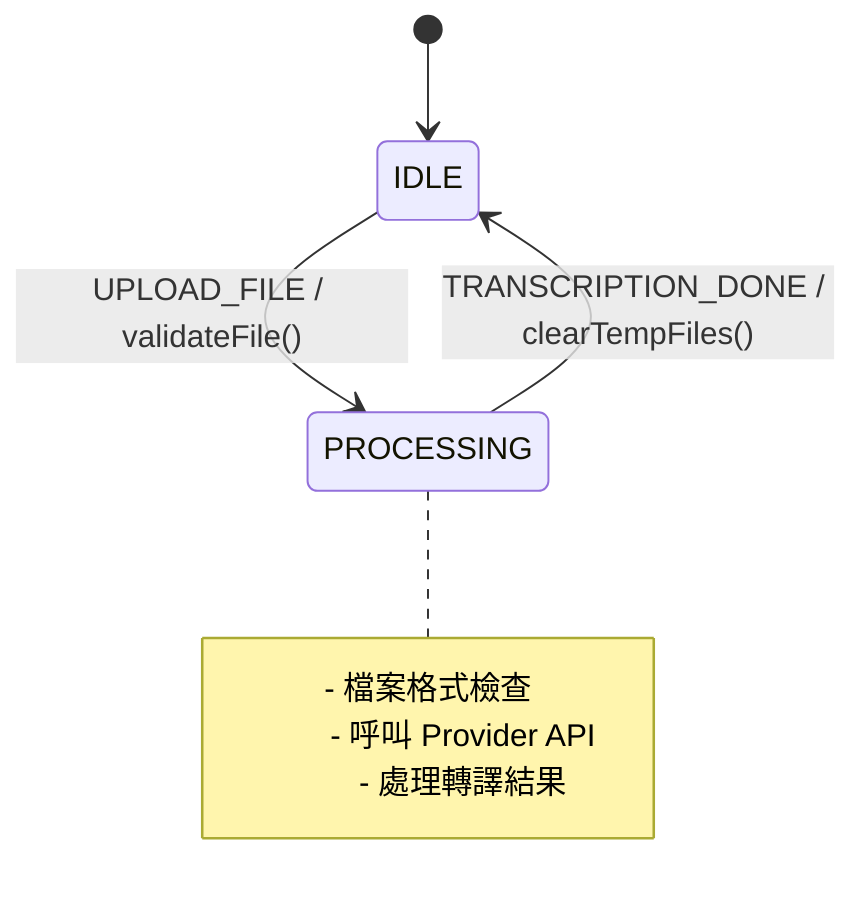
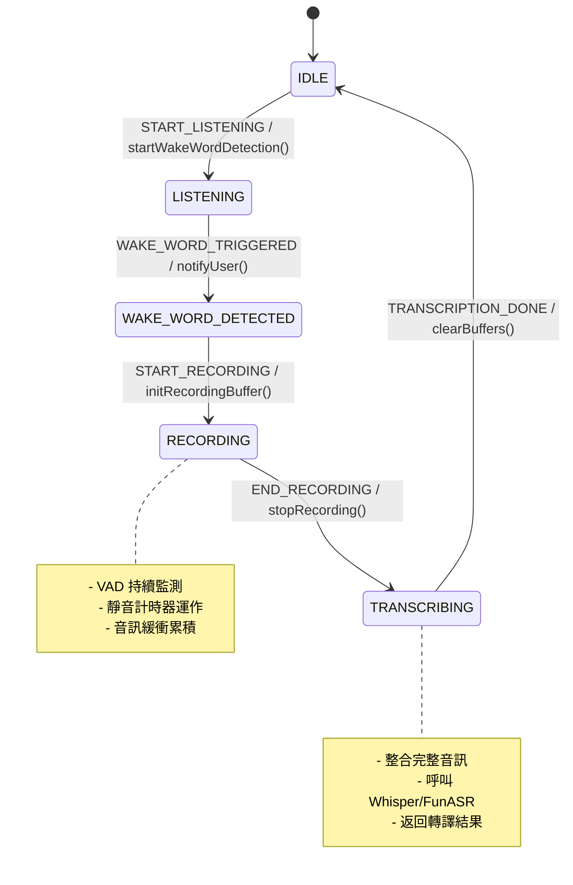
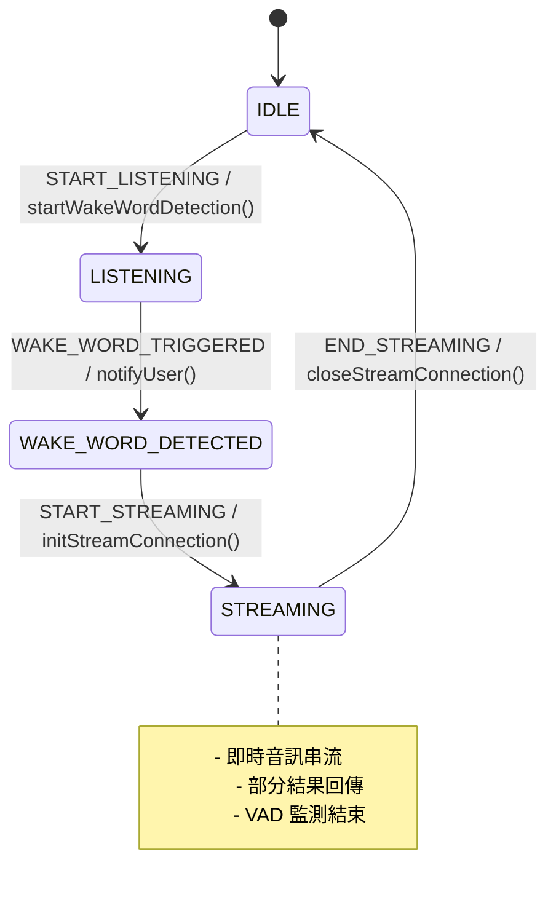
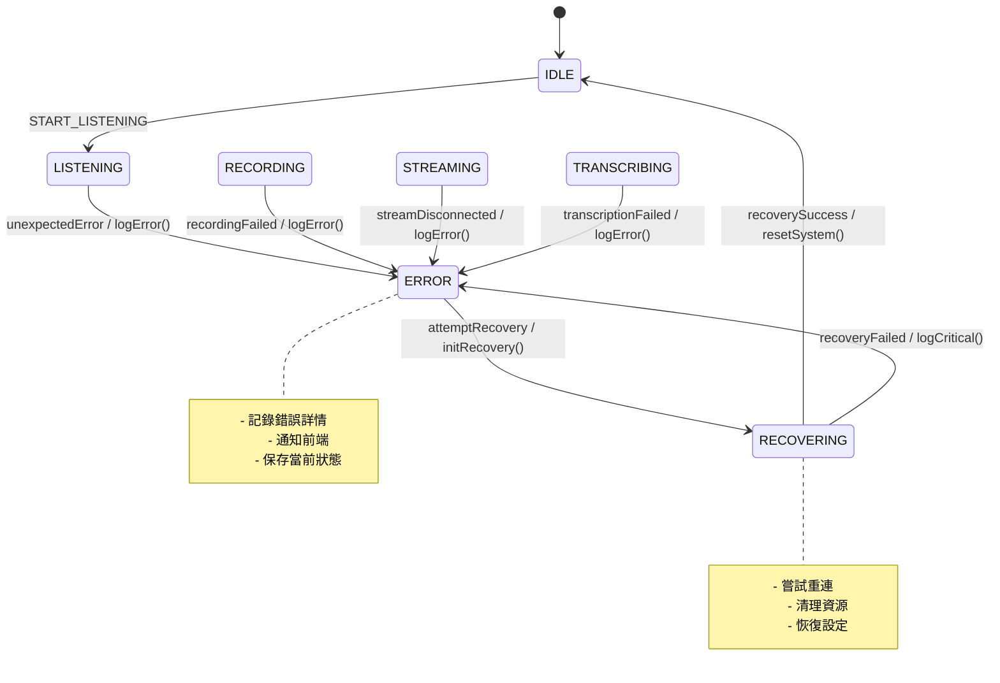

# 實時語音處理架構分析

## 概述

本文檔分析 ASR Hub 實時語音處理的架構需求，包括持續音訊流處理、喚醒詞檢測、VAD（語音活動檢測）整合，以及支援不同 ASR Provider 的串流與非串流模式。

## 工作流程

### 1. 持續音訊流處理工作流

```
[音訊輸入] → [格式檢查/轉換] → [循環緩衝區]
                                      ↓
                              [並行處理分支]
                              ↙            ↘
                    [喚醒詞檢測]          [VAD 檢測]
                         ↓                    ↓
                   [狀態轉換]  ←→  [靜音計時器]
                         ↓
                 [錄音/串流處理]
                         ↓
                    [ASR 轉譯]
```

### 2. 三種操作模式

#### 模式 1：批次處理（Batch Mode）
- **特點**：一次性上傳完整音訊檔案
- **流程**：上傳 → 轉譯 → 返回結果
- **適用場景**：檔案轉譯、離線處理

#### 模式 2：非串流實時處理（Non-Streaming Realtime）
- **特點**：需要錄音緩衝（如 Whisper）
- **流程**：喚醒詞 → 開始錄音 → VAD 檢測結束 → 轉譯完整片段
- **適用場景**：Whisper、FunASR 等不支援串流的 Provider

#### 模式 3：串流實時處理（Streaming Realtime）
- **特點**：即時串流轉譯（如 Google STT、Vosk）
- **流程**：喚醒詞 → 直接串流轉譯 → VAD 檢測結束
- **適用場景**：支援串流的 ASR Provider

### 3. FCM 狀態轉移圖（Mermaid 格式）

#### 🔷 模式一：**批次處理（Batch Mode）**



#### 🔶 模式二：**非串流實時處理（Non-Streaming Realtime）**



#### 🔴 模式三：**串流實時處理（Streaming Realtime）**



#### 🚨 錯誤處理流程



## 現有組件分析

### ✅ 已具備的組件

1. **Pipeline 系統** (`src/pipeline/`)
   - VAD Operator：`operators/vad/silero_vad.py`
   - 喚醒詞 Operator：`operators/wakeword/openwakeword.py`
   - 音訊格式轉換：`operators/audio_format/`
   - 錄音 Operator：`operators/recording/recording_operator.py`

2. **API 協議層** (`src/api/`)
   - WebSocket：支援二進制和 JSON 音訊流
   - Socket.io：事件驅動的實時通訊
   - HTTP SSE：Server-Sent Events 串流

3. **音訊處理** (`src/stream/`, `src/utils/`)
   - 串流控制器：`stream_controller.py`
   - 音訊轉換工具：`audio_converter.py`

4. **ASR Provider** (`src/providers/`)
   - 批次模式：Whisper、FunASR
   - 串流模式：Google STT、Vosk（待實現）

### ❌ 需要新增或擴展的組件

#### 1. 統一的 FCM（Finite Control Machine）狀態機設計

##### 統一狀態定義（FCM States）

```python
# 擴展 src/core/fsm.py
from enum import Enum, auto

class FCMState(Enum):
    IDLE = auto()                 # 閒置等待
    LISTENING = auto()           # 等待喚醒詞
    WAKE_WORD_DETECTED = auto()  # 喚醒後短暫過渡
    RECORDING = auto()           # 錄音中（非串流）
    STREAMING = auto()           # 串流中（串流模式）
    TRANSCRIBING = auto()        # 錄音完成 → 轉譯中（非串流）
    PROCESSING = auto()          # 批次處理中（batch mode）
    ERROR = auto()               # 錯誤狀態
    RECOVERING = auto()          # 恢復中
```

##### 統一事件定義（FCM Events）

```python
class FCMEvent(Enum):
    START_LISTENING = auto()        # 進入 LISTENING 狀態
    WAKE_WORD_TRIGGERED = auto()    # 喚醒成功（語音/按鍵/視覺）
    START_RECORDING = auto()        # 開始錄音（非串流）
    END_RECORDING = auto()          # 錄音結束（VAD/按鍵/視覺）
    BEGIN_TRANSCRIPTION = auto()    # 進入轉譯
    START_STREAMING = auto()        # 開始串流
    END_STREAMING = auto()          # 結束串流（VAD/按鍵/視覺）
    UPLOAD_FILE = auto()            # 批次上傳
    TRANSCRIPTION_DONE = auto()     # 轉譯完成
    TIMEOUT = auto()                # 各種超時
    RESET = auto()                  # 重置到 IDLE
```

##### 結束事件來源類型

```python
class FCMEndTrigger(Enum):
    VAD = auto()      # VAD 檢測到靜音
    BUTTON = auto()   # 使用者按鈕
    VISION = auto()   # 視覺觸發（未來擴展）
    TIMEOUT = auto()  # 超時觸發
```

##### FCM 策略模式架構

```python
# 主控制器（加入狀態 Hook 支援）
from collections import defaultdict

class FCMController:
    def __init__(self, strategy: FCMStrategy):
        self.state = FCMState.IDLE
        self.strategy = strategy
        self.event_dispatcher = None
        # 狀態轉換 Hook
        self.state_hooks = defaultdict(lambda: {'enter': [], 'exit': []})

    async def add_hook(self, state: FCMState, hook_type: str, callback):
        """添加狀態鉤子（enter/exit）"""
        if hook_type in ['enter', 'exit']:
            self.state_hooks[state][hook_type].append(callback)

    async def handle_event(self, event: FCMEvent, **kwargs):
        old_state = self.state
        try:
            new_state = await self.strategy.transition(self.state, event, **kwargs)
            
            if new_state and new_state != old_state:
                # Hook 錯誤不應影響狀態轉換
                await self._run_hooks(old_state, new_state)
                self.state = new_state
                
                # 發送狀態變更事件
                if self.event_dispatcher:
                    await self.event_dispatcher.dispatch('state_changed', {
                        'old_state': old_state.name,
                        'new_state': new_state.name,
                        'event': event.name
                    })
                    
        except Exception as e:
            self.logger.error(f"狀態轉換錯誤: {e}")
            # 記錄錯誤但不自動進入 ERROR 狀態，讓上層決定如何處理
            raise
        
        return self.state
    
    async def _run_hooks(self, old_state: FCMState, new_state: FCMState):
        """執行 Hook，錯誤不影響主流程"""
        # 執行退出鉤子
        for callback in self.state_hooks[old_state]['exit']:
            try:
                await callback(old_state, new_state)
            except Exception as e:
                self.logger.error(f"Exit hook 錯誤 ({old_state.name}): {e}")
        
        # 執行進入鉤子
        for callback in self.state_hooks[new_state]['enter']:
            try:
                await callback(old_state, new_state)
            except Exception as e:
                self.logger.error(f"Enter hook 錯誤 ({new_state.name}): {e}")

# 抽象策略接口
from abc import ABC, abstractmethod

class FCMStrategy(ABC):
    @abstractmethod
    async def transition(self, state: FCMState, event: FCMEvent, **kwargs) -> FCMState:
        pass

# 批次模式策略
class BatchModeStrategy(FCMStrategy):
    async def transition(self, state: FCMState, event: FCMEvent, **kwargs) -> FCMState:
        if state == FCMState.IDLE and event == FCMEvent.UPLOAD_FILE:
            return FCMState.PROCESSING
        if state == FCMState.PROCESSING and event == FCMEvent.TRANSCRIPTION_DONE:
            return FCMState.IDLE
        return state  # no transition

# 非串流實時模式策略
class NonStreamingStrategy(FCMStrategy):
    async def transition(self, state: FCMState, event: FCMEvent, **kwargs) -> FCMState:
        transitions = {
            (FCMState.IDLE, FCMEvent.START_LISTENING): FCMState.LISTENING,
            (FCMState.LISTENING, FCMEvent.WAKE_WORD_TRIGGERED): FCMState.WAKE_WORD_DETECTED,
            (FCMState.WAKE_WORD_DETECTED, FCMEvent.START_RECORDING): FCMState.RECORDING,
            (FCMState.RECORDING, FCMEvent.END_RECORDING): FCMState.TRANSCRIBING,
            (FCMState.TRANSCRIBING, FCMEvent.TRANSCRIPTION_DONE): FCMState.IDLE,
        }
        return transitions.get((state, event), state)

# 串流實時模式策略
class StreamingStrategy(FCMStrategy):
    async def transition(self, state: FCMState, event: FCMEvent, **kwargs) -> FCMState:
        transitions = {
            (FCMState.IDLE, FCMEvent.START_LISTENING): FCMState.LISTENING,
            (FCMState.LISTENING, FCMEvent.WAKE_WORD_TRIGGERED): FCMState.WAKE_WORD_DETECTED,
            (FCMState.WAKE_WORD_DETECTED, FCMEvent.START_STREAMING): FCMState.STREAMING,
            (FCMState.STREAMING, FCMEvent.END_STREAMING): FCMState.IDLE,
        }
        return transitions.get((state, event), state)
```

#### 2. 音訊緩衝區管理器（與 FCM 整合）

```python
# 新增 src/stream/buffer_manager.py
class AudioBufferManager:
    def __init__(self, ring_buffer_size: int = 30, fcm_controller: FCMController = None):
        self.ring_buffer = RingBuffer(ring_buffer_size)  # 30秒循環緩衝
        self.recording_buffer = []
        self.wake_word_window = SlidingWindow(size=3)  # 3秒滑動窗口
        self.fcm = fcm_controller
        self.logger = logger
        
    def add_chunk(self, chunk: AudioChunk):
        # 添加到循環緩衝區
        self.ring_buffer.append(chunk)
        
        # 更新喚醒詞窗口
        self.wake_word_window.update(chunk)
        
        # 根據 FCM 狀態決定是否錄音
        if self.should_buffer_for_recording():
            self.recording_buffer.append(chunk)
    
    def should_buffer_for_recording(self) -> bool:
        """根據 FCM 狀態判斷是否需要緩衝錄音"""
        return self.fcm and self.fcm.state == FCMState.RECORDING
    
    def should_stream(self) -> bool:
        """根據 FCM 狀態判斷是否需要串流"""
        return self.fcm and self.fcm.state == FCMState.STREAMING
    
    def get_wake_word_buffer(self) -> bytes:
        """獲取喚醒詞檢測窗口的音訊"""
        return self.wake_word_window.get_audio()
    
    def get_recording_buffer(self) -> bytes:
        """獲取完整的錄音緩衝"""
        return b''.join([chunk.data for chunk in self.recording_buffer])
    
    def clear_recording_buffer(self):
        """清空錄音緩衝"""
        self.recording_buffer.clear()
```

#### 3. 靜音計時器服務（與 FCM 整合）

```python
# 新增 src/core/silence_timer.py
class SilenceTimer:
    def __init__(self, timeout: float = 2.0, fcm_controller: FCMController = None):
        self.timeout = timeout
        self.timer = None
        self.fcm = fcm_controller
        self.start_time = None
        
    async def start(self):
        """開始計時"""
        self.start_time = time.time()
        if self.timer:
            self.timer.cancel()
        self.timer = asyncio.create_task(self._countdown())
        
    def reset(self):
        """重置計時器（檢測到語音）"""
        if self.timer:
            self.timer.cancel()
        self.timer = asyncio.create_task(self._countdown())
        
    async def _countdown(self):
        """倒數計時"""
        await asyncio.sleep(self.timeout)
        
        # 觸發結束事件
        if self.fcm:
            if self.fcm.state == FCMState.RECORDING:
                await self.fcm.handle_event(
                    FCMEvent.END_RECORDING,
                    trigger=FCMEndTrigger.VAD,
                    silence_duration=self.timeout
                )
            elif self.fcm.state == FCMState.STREAMING:
                await self.fcm.handle_event(
                    FCMEvent.END_STREAMING,
                    trigger=FCMEndTrigger.VAD,
                    silence_duration=self.timeout
                )
    
    def cancel(self):
        """取消計時器"""
        if self.timer:
            self.timer.cancel()
            self.timer = None
```

#### 4. 實時 Pipeline 編排器（與 FCM 整合）

```python
# 新增 src/pipeline/realtime_pipeline.py
class RealtimePipeline:
    def __init__(self, fcm_controller: FCMController, 
                 buffer_manager: AudioBufferManager,
                 silence_timer: SilenceTimer):
        self.fcm = fcm_controller
        self.buffer_manager = buffer_manager
        self.silence_timer = silence_timer
        
        # Pipeline 分支
        self.wake_word_branch = Branch([WakeWordOperator()])
        self.vad_branch = Branch([VADOperator()])
        self.format_branch = Branch([AudioFormatOperator()])
        
    async def process_stream(self, audio_stream):
        """處理音訊流"""
        async for chunk in audio_stream:
            # 1. 格式檢查與轉換
            formatted_chunk = await self.format_branch.process(chunk)
            
            # 2. 加入緩衝區
            self.buffer_manager.add_chunk(formatted_chunk)
            
            # 3. 根據狀態決定處理邏輯
            if self.fcm.state == FCMState.LISTENING:
                await self._process_listening(formatted_chunk)
                
            elif self.fcm.state in [FCMState.RECORDING, FCMState.STREAMING]:
                await self._process_active(formatted_chunk)
    
    async def _process_listening(self, chunk: AudioChunk):
        """監聽狀態處理：檢測喚醒詞"""
        # 獲取喚醒詞檢測窗口
        wake_word_audio = self.buffer_manager.get_wake_word_buffer()
        
        # 檢測喚醒詞
        wake_word_result = await self.wake_word_branch.process(wake_word_audio)
        
        if wake_word_result.detected:
            await self.fcm.handle_event(
                FCMEvent.WAKE_WORD_TRIGGERED,
                confidence=wake_word_result.confidence,
                wake_word=wake_word_result.word
            )
    
    async def _process_active(self, chunk: AudioChunk):
        """活躍狀態處理：VAD 檢測"""
        # VAD 檢測
        vad_result = await self.vad_branch.process(chunk)
        
        if vad_result.speech_detected:
            # 檢測到語音，重置靜音計時器
            self.silence_timer.reset()
        else:
            # 未檢測到語音，開始/繼續計時
            if not self.silence_timer.timer:
                await self.silence_timer.start()
```

#### 5. 事件分發系統（與 FCM 整合）

```python
# 擴展 src/api/message_router.py
class RealtimeEventDispatcher:
    def __init__(self, protocol: str, connection: Any):
        self.protocol = protocol
        self.connection = connection
        
        # 定義事件類型
        self.events = [
            'state_changed',          # FCM 狀態變更
            'wake_word_detected',     # 檢測到喚醒詞
            'recording_started',      # 開始錄音
            'recording_stopped',      # 停止錄音
            'streaming_started',      # 開始串流
            'streaming_stopped',      # 停止串流
            'vad_speech_start',       # VAD 檢測到語音開始
            'vad_speech_end',         # VAD 檢測到語音結束
            'transcription_partial',  # 部分轉譯結果
            'transcription_final',    # 最終轉譯結果
            'silence_timeout',        # 靜音超時
            'error'                   # 錯誤事件
        ]
    
    async def dispatch(self, event_type: str, data: dict):
        """分發事件到前端"""
        if event_type not in self.events:
            return
            
        message = {
            'type': event_type,
            'data': data,
            'timestamp': datetime.now().isoformat()
        }
        
        # 根據協議分發
        if self.protocol == 'websocket':
            await self.connection.send_json(message)
            
        elif self.protocol == 'socketio':
            await self.connection.emit(event_type, data)
            
        elif self.protocol == 'http_sse':
            await self.connection.send_sse(event_type, json.dumps(data))
    
    async def handle_fcm_event(self, event: FCMEvent, **kwargs):
        """處理 FCM 事件並分發相應的前端事件"""
        event_mapping = {
            FCMEvent.WAKE_WORD_TRIGGERED: 'wake_word_detected',
            FCMEvent.START_RECORDING: 'recording_started',
            FCMEvent.END_RECORDING: 'recording_stopped',
            FCMEvent.START_STREAMING: 'streaming_started',
            FCMEvent.END_STREAMING: 'streaming_stopped',
        }
        
        if event in event_mapping:
            await self.dispatch(event_mapping[event], kwargs)
```

## 實現優先級

### Phase 1：基礎架構
1. 擴展 FSM 支援三種模式
2. 實現音訊緩衝區管理器
3. 建立靜音計時器服務

### Phase 2：實時處理
1. 實現實時 Pipeline 編排器
2. 整合喚醒詞和 VAD 並行處理
3. 實現事件分發系統

### Phase 3：前端整合
1. 創建新的實時處理前端頁面
2. 實現 WebSocket/Socket.io 事件處理
3. 添加實時狀態顯示和音量視覺化

### Phase 4：Provider 整合
1. 為串流 Provider 實現串流模式
2. 優化非串流 Provider 的錄音模式
3. 實現自動模式選擇邏輯

## 配置需求

```yaml
realtime:
  wake_word:
    enabled: true
    model: "hey_jarvis"
    threshold: 0.5
    window_size: 3  # 秒
    
  vad:
    enabled: true
    silence_threshold: 0.5
    silence_duration: 2.0  # 秒
    min_speech_duration: 0.5  # 秒
    
  buffer:
    ring_buffer_size: 30  # 秒
    max_recording_duration: 60  # 秒
    
  mode:
    auto_select: true  # 根據 Provider 自動選擇串流/非串流
    force_mode: null  # 可選: "streaming" | "non_streaming"
```

## 性能考量

1. **內存管理**
   - 循環緩衝區避免無限增長
   - 及時清理已處理的音訊數據
   - RingBuffer 滿時策略：丟棄最舊數據（FIFO）

2. **CPU 使用**
   - 喚醒詞和 VAD 並行處理
   - 使用異步 I/O 避免阻塞

3. **延遲優化**
   - 最小化喚醒詞檢測延遲（< 200ms）
   - VAD 響應時間（< 100ms）
   - 串流模式下的首字延遲（< 500ms）

### 緩衝區實作注意事項

```python
# RingBuffer 簡單實作示例
class RingBuffer:
    def __init__(self, max_size_seconds: int):
        self.max_size = max_size_seconds
        self.buffer = deque()
        self.total_duration = 0
    
    def append(self, chunk: AudioChunk):
        """添加音訊片段，自動丟棄最舊數據"""
        chunk_duration = len(chunk.data) / chunk.sample_rate
        self.buffer.append(chunk)
        self.total_duration += chunk_duration
        
        # 保持緩衝區在限制內
        while self.total_duration > self.max_size:
            oldest = self.buffer.popleft()
            oldest_duration = len(oldest.data) / oldest.sample_rate
            self.total_duration -= oldest_duration
```

## 錯誤處理

### 基本錯誤處理策略

1. **網絡中斷**：自動重連和狀態恢復
2. **音訊格式錯誤**：自動轉換或拒絕
3. **Provider 故障**：自動切換備用 Provider
4. **內存溢出**：緩衝區大小限制和清理策略

### 事件分發錯誤處理

```python
class RealtimeEventDispatcher:
    async def dispatch(self, event_type: str, data: dict):
        """分發事件到前端（包含基本錯誤處理）"""
        if event_type not in self.events:
            return
            
        message = {
            'type': event_type,
            'data': data,
            'timestamp': datetime.now().isoformat()
        }
        
        try:
            # 根據協議分發
            if self.protocol == 'websocket':
                await self.connection.send_json(message)
            elif self.protocol == 'socketio':
                await self.connection.emit(event_type, data)
            elif self.protocol == 'http_sse':
                await self.connection.send_sse(event_type, json.dumps(data))
                
        except Exception as e:
            # 記錄錯誤但不中斷系統
            self.logger.error(f"事件分發失敗 ({event_type}): {e}")
            # 重要事件記錄到系統日誌
            if event_type in ['error', 'state_changed']:
                self.logger.critical(f"重要事件未能分發: {message}")
```

## 測試策略

### 1. 單元測試

#### 狀態轉換測試
```python
import pytest

@pytest.mark.parametrize("initial_state,event,expected_state", [
    (FCMState.IDLE, FCMEvent.START_LISTENING, FCMState.LISTENING),
    (FCMState.LISTENING, FCMEvent.WAKE_WORD_TRIGGERED, FCMState.WAKE_WORD_DETECTED),
    (FCMState.WAKE_WORD_DETECTED, FCMEvent.START_RECORDING, FCMState.RECORDING),
    (FCMState.RECORDING, FCMEvent.END_RECORDING, FCMState.TRANSCRIBING),
    (FCMState.TRANSCRIBING, FCMEvent.TRANSCRIPTION_DONE, FCMState.IDLE),
])
async def test_non_streaming_transitions(initial_state, event, expected_state):
    strategy = NonStreamingStrategy()
    result = await strategy.transition(initial_state, event)
    assert result == expected_state

@pytest.mark.parametrize("initial_state,event,expected_state", [
    (FCMState.IDLE, FCMEvent.START_LISTENING, FCMState.LISTENING),
    (FCMState.LISTENING, FCMEvent.WAKE_WORD_TRIGGERED, FCMState.WAKE_WORD_DETECTED),
    (FCMState.WAKE_WORD_DETECTED, FCMEvent.START_STREAMING, FCMState.STREAMING),
    (FCMState.STREAMING, FCMEvent.END_STREAMING, FCMState.IDLE),
])
async def test_streaming_transitions(initial_state, event, expected_state):
    strategy = StreamingStrategy()
    result = await strategy.transition(initial_state, event)
    assert result == expected_state
```

### 2. 整合測試
- 完整工作流程測試
- Hook 執行順序測試
- 事件分發測試

### 3. 壓力測試
- 長時間運行和高頻率喚醒
- 記憶體洩漏檢測
- 並發 session 處理

### 4. 延遲測試
- 測量各階段處理時間
- 喚醒詞檢測延遲
- 首字回應時間

## FCM 整合架構優勢

### 設計優點

1. **統一的狀態管理**：FCM 提供清晰的狀態定義和轉換邏輯
2. **策略模式**：三種模式可以獨立實現，易於擴展新模式
3. **事件驅動**：統一的事件系統使得各組件協作更清晰
4. **結束觸發器**：追蹤結束原因（VAD/按鍵/視覺）提供更好的可觀察性

### 擴展性設計

| 元件              | 建議設計                                                           |
| --------------- | -------------------------------------------------------------- |
| `FCMEndTrigger` | 可作為 `END_RECORDING`/`END_STREAMING` 事件的 context，用於記錄來源但不影響狀態轉移 |
| `FCMController` | 支援 `async` 和佇列處理，與語音處理流程整合時更穩定                         |
| 錯誤與中斷處理      | 包含 `ERROR` 和 `RECOVERING` 狀態，讓 UI/UX 有安全復原點              |
| 模式切換          | 可引入主策略 `ModeSelector` 根據 Provider 能力動態切換策略               |

### 實際應用範例

```python
# 策略選擇器（簡潔實用）
def select_strategy(provider_type: str) -> FCMStrategy:
    """根據 Provider 類型選擇策略"""
    if provider_type in ['whisper', 'funasr']:
        return NonStreamingStrategy()
    elif provider_type in ['google_stt', 'vosk']:
        return StreamingStrategy()
    else:
        return BatchModeStrategy()

# 初始化系統
async def initialize_realtime_system(provider_type: str, connection):
    # 選擇適當的策略
    strategy = select_strategy(provider_type)
    
    # 建立 FCM 控制器
    fcm = FCMController(strategy)
    
    # 設定狀態 Hook（資源管理）
    async def on_enter_recording(old_state, new_state):
        logger.info(f"開始錄音，從 {old_state.name} 進入 {new_state.name}")
        # 初始化錄音資源
        
    async def on_exit_recording(old_state, new_state):
        logger.info(f"結束錄音，從 {old_state.name} 進入 {new_state.name}")
        # 清理錄音資源
    
    await fcm.add_hook(FCMState.RECORDING, 'enter', on_enter_recording)
    await fcm.add_hook(FCMState.RECORDING, 'exit', on_exit_recording)
    
    # 建立相關組件
    buffer_manager = AudioBufferManager(fcm_controller=fcm)
    silence_timer = SilenceTimer(timeout=2.0, fcm_controller=fcm)
    event_dispatcher = RealtimeEventDispatcher('websocket', connection)
    
    # 綁定事件分發器
    fcm.event_dispatcher = event_dispatcher
    
    # 建立實時 Pipeline
    pipeline = RealtimePipeline(fcm, buffer_manager, silence_timer)
    
    return pipeline

# 處理音訊流（包含錯誤處理）
async def process_audio(pipeline: RealtimePipeline, audio_stream):
    try:
        # 開始監聽
        await pipeline.fcm.handle_event(FCMEvent.START_LISTENING)
        
        # 處理音訊流
        await pipeline.process_stream(audio_stream)
        
    except Exception as e:
        logger.error(f"音訊處理錯誤: {e}")
        # 嘗試恢復
        await pipeline.fcm.handle_event(FCMEvent.RESET)
        raise
```

## 結論

這個整合了 FCM 的架構設計提供了：

1. **清晰的狀態管理**：通過 FCM 統一管理系統狀態
2. **靈活的模式切換**：策略模式允許根據 Provider 能力動態選擇
3. **完整的事件系統**：前端可以即時獲得系統狀態變化
4. **模塊化設計**：各組件職責明確，易於測試和維護

通過這個設計，ASR Hub 可以同時支援批次處理、非串流實時和串流實時三種模式，並為未來的擴展（如視覺觸發、多模態輸入）預留了空間。