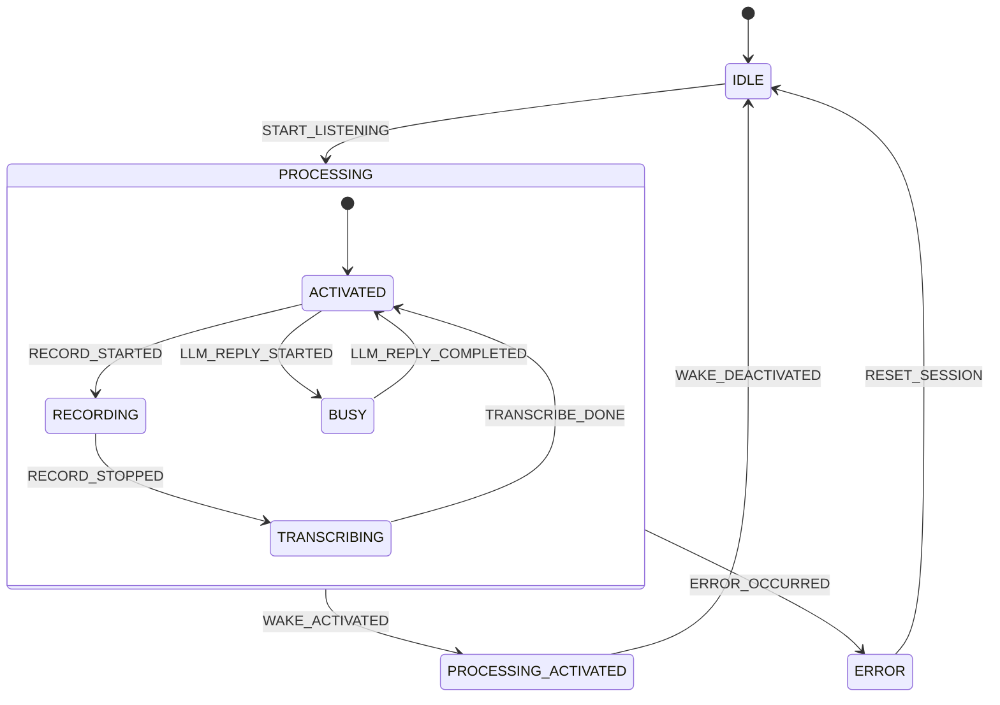

# FSM Transitions (狀態機轉換定義)

## 概述
FSM Transitions 模組定義了 ASRHub 系統中不同策略（Strategy）的狀態機。使用 Python transitions 庫實現分層狀態機（Hierarchical State Machine），支援三種主要策略：批次（Batch）、非串流（Non-Streaming）、串流（Streaming）。

## 核心概念

### 狀態機架構
- **分層設計** - IDLE/ERROR 為頂層，PROCESSING 包含子狀態
- **策略插件** - 每種策略定義自己的狀態和轉換
- **動態配置** - 根據配置啟用 LLM/TTS 相關狀態
- **視覺化** - 支援生成 Mermaid 狀態圖

### 三大策略
1. **Batch Strategy** - 批次處理上傳的音訊檔案
2. **Non-Streaming Strategy** - 錄音後轉譯（傳統模式）
3. **Streaming Strategy** - 即時串流轉譯

## 使用方式

### 基本使用
```python
from src.core.fsm_transitions import SessionFSM, StreamingPlugin

# 建立串流策略的狀態機
fsm = SessionFSM(StreamingPlugin)

# 檢查當前狀態
print(f"當前狀態: {fsm.state}")  # IDLE

# 觸發狀態轉換
fsm.trigger('START_LISTENING')
print(f"新狀態: {fsm.state}")  # PROCESSING

# 觸發喚醒詞
fsm.trigger('WAKE_ACTIVATED')
print(f"新狀態: {fsm.state}")  # PROCESSING_ACTIVATED
```

### 生成狀態圖
```bash
# 執行腳本生成 Mermaid 狀態圖
python -m src.core.fsm_transitions

# 輸出可貼到 Mermaid 編輯器查看
```

## 狀態定義

### 通用狀態
- **IDLE** - 閒置狀態，等待啟動
- **ERROR** - 錯誤狀態
- **PROCESSING** - 處理中（包含子狀態）

### Batch 策略狀態
```python
BatchPlugin = StrategyPlugin(
    states=[
        State.UPLOADING,      # 上傳中
        State.TRANSCRIBING    # 轉譯中
    ]
)
```

### Non-Streaming 策略狀態
```python
NonStreamingPlugin = StrategyPlugin(
    states=[
        State.ACTIVATED,      # 已喚醒
        State.RECORDING,      # 錄音中
        State.TRANSCRIBING,   # 轉譯中
        State.BUSY           # 忙碌（LLM/TTS）
    ]
)
```

### Streaming 策略狀態
```python
StreamingPlugin = StrategyPlugin(
    states=[
        State.ACTIVATED,      # 已喚醒
        State.TRANSCRIBING,   # 轉譯中
        State.BUSY           # 忙碌（LLM/TTS）
    ]
)
```

## 轉換規則

### 通用轉換
```python
# 任何狀態都可以回到 IDLE
make_transition(Action.SESSION_EXPIRED, "*", State.IDLE)
make_transition(Action.RESET_SESSION, "*", State.IDLE)

# 任何狀態都可能發生錯誤
make_transition(Action.ERROR_OCCURRED, "*", State.ERROR)
```

### Batch 策略轉換
```python
# 開始上傳
IDLE → PROCESSING (UPLOAD_STARTED)

# 上傳完成
PROCESSING → PROCESSING (UPLOAD_COMPLETED)

# 開始轉譯
PROCESSING → TRANSCRIBING (TRANSCRIBE_STARTED)

# 轉譯完成
TRANSCRIBING → IDLE (TRANSCRIBE_DONE)
```

### Non-Streaming 策略轉換
```python
# 啟動流程
IDLE → PROCESSING (START_LISTENING)
PROCESSING → ACTIVATED (WAKE_ACTIVATED)

# 錄音流程
ACTIVATED → RECORDING (RECORD_STARTED)
RECORDING → TRANSCRIBING (RECORD_STOPPED)
TRANSCRIBING → ACTIVATED (TRANSCRIBE_DONE)

# 停用
ACTIVATED → IDLE (WAKE_DEACTIVATED)
```

### Streaming 策略轉換
```python
# 啟動流程
IDLE → PROCESSING (START_LISTENING)
PROCESSING → ACTIVATED (WAKE_ACTIVATED)

# 串流轉譯
ACTIVATED → TRANSCRIBING (ASR_STREAM_STARTED)
TRANSCRIBING → ACTIVATED (ASR_STREAM_STOPPED)

# 停用
ACTIVATED → IDLE (WAKE_DEACTIVATED)
```

## 實際應用範例

### Session 狀態管理
```python
class SessionManager:
    def __init__(self, strategy="streaming"):
        # 選擇策略
        if strategy == "streaming":
            self.fsm = SessionFSM(StreamingPlugin)
        elif strategy == "non_streaming":
            self.fsm = SessionFSM(NonStreamingPlugin)
        else:
            self.fsm = SessionFSM(BatchPlugin)
    
    def start_session(self):
        """開始 session"""
        if self.fsm.state == State.IDLE:
            self.fsm.trigger(Action.START_LISTENING)
            return True
        return False
    
    def handle_wake_word(self):
        """處理喚醒詞"""
        if self.fsm.state == State.PROCESSING:
            self.fsm.trigger(Action.WAKE_ACTIVATED)
            return True
        return False
    
    def is_ready_for_audio(self):
        """檢查是否可接收音訊"""
        return self.fsm.state in [State.ACTIVATED, State.RECORDING]
```

### 狀態變化監聽
```python
class StateMonitor:
    def __init__(self, fsm):
        self.fsm = fsm
        # 註冊狀態變化回調
        self.fsm.machine.on_enter_IDLE = self.on_idle
        self.fsm.machine.on_enter_PROCESSING_ACTIVATED = self.on_activated
        self.fsm.machine.on_enter_ERROR = self.on_error
    
    def on_idle(self):
        logger.info("Session 進入閒置狀態")
        cleanup_resources()
    
    def on_activated(self):
        logger.info("Session 已啟動")
        start_audio_processing()
    
    def on_error(self):
        logger.error("Session 發生錯誤")
        send_error_notification()
```

### LLM/TTS 整合
```python
def setup_llm_tts_transitions(strategy_name: str):
    """根據配置啟用 LLM/TTS 相關轉換"""
    transitions = []
    
    if config.core.llm:
        # LLM 相關轉換
        transitions += [
            # 開始 LLM 回覆
            make_transition(
                Action.LLM_REPLY_STARTED,
                [State.ACTIVATED, State.TRANSCRIBING],
                State.BUSY
            ),
            # LLM 回覆完成
            make_transition(
                Action.LLM_REPLY_COMPLETED,
                State.BUSY,
                State.ACTIVATED
            )
        ]
    
    if config.core.tts:
        # TTS 相關轉換
        transitions += [
            # 開始播放 TTS
            make_transition(
                Action.TTS_PLAYBACK_STARTED,
                [State.ACTIVATED, State.TRANSCRIBING],
                State.BUSY
            ),
            # TTS 播放完成
            make_transition(
                Action.TTS_PLAYBACK_COMPLETED,
                State.BUSY,
                State.ACTIVATED
            )
        ]
    
    return transitions
```

### 狀態驗證
```python
class StateValidator:
    def __init__(self, fsm):
        self.fsm = fsm
    
    def can_start_recording(self):
        """檢查是否可開始錄音"""
        return (
            self.fsm.state == State.ACTIVATED and
            self.fsm.can('RECORD_STARTED')
        )
    
    def can_process_audio(self):
        """檢查是否可處理音訊"""
        valid_states = [
            State.ACTIVATED,
            State.RECORDING,
            State.TRANSCRIBING
        ]
        return self.fsm.state in valid_states
    
    def validate_transition(self, action):
        """驗證轉換是否合法"""
        try:
            # 檢查但不執行
            return self.fsm.may_trigger(action)
        except:
            return False
```

## Mermaid 狀態圖

生成的 Mermaid 語法範例：


## 配置整合

狀態機會根據 `config.yaml` 自動調整：
```yaml
core:
  llm: true    # 啟用 LLM 相關狀態
  tts: true    # 啟用 TTS 相關狀態
```

## 擴展指南

### 新增策略
```python
# 定義新策略插件
CustomPlugin = StrategyPlugin(
    name="custom",
    states=[State.CUSTOM_STATE1, State.CUSTOM_STATE2],
    transitions=[
        make_transition(Action.CUSTOM_ACTION, State.IDLE, State.CUSTOM_STATE1),
        # 更多轉換...
    ]
)

# 建立狀態機
custom_fsm = SessionFSM(CustomPlugin)
```

### 新增動作
```python
# 在 interface/action.py 定義新動作
class Action:
    CUSTOM_ACTION = "CUSTOM_ACTION"

# 在轉換中使用
make_transition(Action.CUSTOM_ACTION, source, target)
```

## 注意事項

1. **狀態一致性**: 確保狀態轉換符合業務邏輯
2. **錯誤處理**: 任何狀態都應能處理錯誤
3. **並發安全**: 狀態機本身不是執行緒安全的
4. **視覺化**: 定期生成狀態圖檢查邏輯
5. **測試**: 為每個轉換路徑編寫測試

## 設計理念

- **分層架構**: 清晰的狀態層次結構
- **策略模式**: 不同策略獨立定義
- **可視化**: 支援狀態圖生成便於理解
- **可擴展**: 易於新增策略和狀態